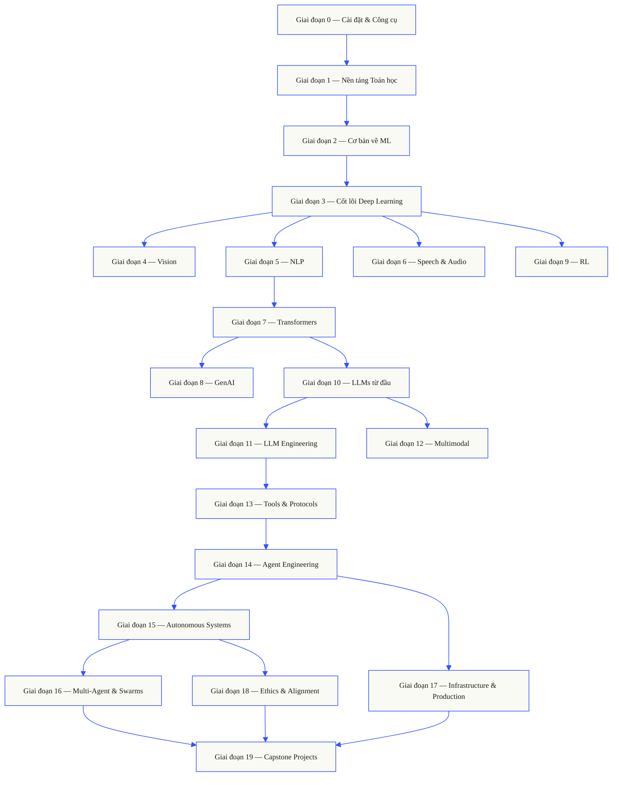
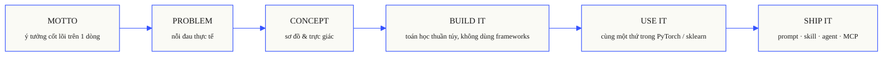

<p align="center">
  
</p>

<p align="center">
  <a href="LICENSE"></a>
  <a href="ROADMAP.md"></a>
  <a href="#contents"></a>
  <a href="https://github.com/rohitg00/ai-engineering-from-scratch/stargazers"></a>
  <a href="https://aiengineeringfromscratch.com"></a>
</p>

```
░░░▒▒▒░░░▒▒▒░░░▒▒▒░░░▒▒▒░░░▒▒▒░░░▒▒▒░░░▒▒▒░░░▒▒▒░░░▒▒▒░░░▒▒▒░░░▒▒▒░░░▒▒▒░░░▒▒▒░░░▒▒▒░░░▒▒▒
```

> **84% sinh viên đã sử dụng các công cụ AI. Chỉ 18% cảm thấy sẵn sàng để sử dụng chúng một cách chuyên nghiệp.** Giáo trình này thu hẹp khoảng cách đó.
>
> 473 bài học. 20 giai đoạn. ~320 giờ. Python, TypeScript, Rust, Julia. Mỗi bài học sẽ tạo ra một sản phẩm có thể tái sử dụng: một prompt, một skill, một agent, một MCP server. Miễn phí, mã nguồn mở, MIT.
>
> Bạn không chỉ học AI. Bạn còn xây dựng nó. Từ đầu đến cuối. Bằng chính tay mình.

## Cách hoạt động

Hầu hết các tài liệu về AI đều dạy những phần rời rạc. Một bài báo khoa học ở đây, một bài viết về fine-tuning ở kia, một bản demo agent hào nhoáng ở một nơi khác. Các phần này hiếm khi liên kết với nhau. Bạn triển khai một chatbot nhưng không thể giải thích đường cong loss curve của nó. Bạn gắn một function vào một agent nhưng không thể nói rõ cơ chế attention đang làm gì bên trong model khi nó gọi function đó.

Giáo trình này là xương sống. 20 giai đoạn, 473 bài học, bốn ngôn ngữ: Python, TypeScript, Rust, Julia. Đại số tuyến tính ở một đầu, autonomous swarms ở đầu kia. Mọi thuật toán đều được xây dựng từ toán học cơ bản trước tiên. Backprop. Tokenizer. Attention. Agent loop. Đến khi dùng PyTorch, bạn đã biết rõ nó đang làm gì ở bên dưới.

Mỗi bài học chạy cùng một vòng lặp: đọc bài toán, thiết lập công thức toán học, viết code, chạy test, lưu lại kết quả. Không có video 5 phút, không có triển khai kiểu copy-paste, không có cầm tay chỉ việc. Miễn phí, mã nguồn mở và được xây dựng để chạy trên chính laptop của bạn.

```
░░░▒▒▒░░░▒▒▒░░░▒▒▒░░░▒▒▒░░░▒▒▒░░░▒▒▒░░░▒▒▒░░░▒▒▒░░░▒▒▒░░░▒▒▒░░░▒▒▒░░░▒▒▒░░░▒▒▒░░░▒▒▒░░░▒▒▒
```

## Cấu trúc của giáo trình

Hai mươi giai đoạn xếp chồng lên nhau. Toán học là nền tảng. Agents và production là phần mái.
Hãy bỏ qua nếu bạn đã biết các lớp bên dưới, nhưng đừng bỏ qua rồi sau đó tự hỏi tại sao một thứ gì đó ở trên cùng lại bị lỗi.



```
░░░▒▒▒░░░▒▒▒░░░▒▒▒░░░▒▒▒░░░▒▒▒░░░▒▒▒░░░▒▒▒░░░▒▒▒░░░▒▒▒░░░▒▒▒░░░▒▒▒░░░▒▒▒░░░▒▒▒░░░▒▒▒░░░▒▒▒
```

## Cấu trúc của một bài học

Mỗi bài học nằm trong thư mục riêng biệt của nó, với cùng một cấu trúc trong toàn bộ giáo trình:

```
phases/<NN>-<phase-name>/<NN>-<lesson-name>/
├── code/      các bản triển khai có thể chạy được (Python, TypeScript, Rust, Julia)
├── docs/
│   └── en.md  nội dung thuyết minh bài học
└── outputs/   các prompts, skills, agents, hoặc MCP servers mà bài học này tạo ra
```

Mỗi bài học tuân theo sáu nhịp độ. Sự phân chia *Build It / Use It* (Xây dựng nó / Sử dụng nó) là phần xương sống — trước tiên bạn tự triển khai thuật toán từ đầu, sau đó chạy chính thuật toán đó thông qua production library. Bạn hiểu framework đang làm gì vì bạn đã tự viết một phiên bản thu nhỏ hơn.



## Bắt đầu

Có ba cách để bắt đầu. Hãy chọn một.

**Lựa chọn A — đọc.** Mở bất kỳ bài học nào đã hoàn thành trên
[aiengineeringfromscratch.com](https://aiengineeringfromscratch.com) hoặc mở rộng một giai đoạn trong
[Mục lục](#contents). Không cần cài đặt, không cần clone.

**Lựa chọn B — clone và chạy.**

```bash
git clone https://github.com/rohitg00/ai-engineering-from-scratch.git
cd ai-engineering-from-scratch
python phases/01-math-foundations/01-linear-algebra-intuition/code/vectors.py
```

**Lựa chọn C — tìm cấp độ của bạn *(khuyên dùng)*.** Bỏ qua thông minh. Bên trong Claude, Cursor, Codex, OpenClaw, Hermes, hoặc bất kỳ agent nào có cài đặt các curriculum skills:

```bash
/find-your-level
```

Mười câu hỏi. Ánh xạ kiến thức của bạn tới một giai đoạn khởi đầu, xây dựng lộ trình cá nhân hóa với thời gian ước tính. Sau mỗi giai đoạn:

```bash
/check-understanding 3        # tự kiểm tra về giai đoạn 3
ls phases/03-deep-learning-core/05-loss-functions/outputs/
# ├── prompt-loss-function-selector.md
# └── prompt-loss-debugger.md
```

### Điều kiện tiên quyết

- Bạn có thể viết code (bất kỳ ngôn ngữ nào; Python sẽ hữu ích).
- Bạn muốn hiểu AI **thực sự hoạt động** như thế nào, chứ không chỉ gọi APIs.

### Các agent skills có sẵn (Claude, Cursor, Codex, OpenClaw, Hermes)

| Skill | Chức năng |
|---|---|
| [`/find-your-level`](.claude/skills/find-your-level/SKILL.md) | Bài kiểm tra xếp lớp 10 câu. Ánh xạ kiến thức của bạn đến một giai đoạn khởi đầu và tạo ra lộ trình cá nhân hóa với ước lượng thời gian. |
| [`/check-understanding <phase>`](.claude/skills/check-understanding/SKILL.md) | Trắc nghiệm theo từng giai đoạn, tám câu hỏi, với phản hồi và các bài học cụ thể để xem lại. |

```
░░░▒▒▒░░░▒▒▒░░░▒▒▒░░░▒▒▒░░░▒▒▒░░░▒▒▒░░░▒▒▒░░░▒▒▒░░░▒▒▒░░░▒▒▒░░░▒▒▒░░░▒▒▒░░░▒▒▒░░░▒▒▒░░░▒▒▒
```

## Mỗi bài học đều xuất xưởng một thứ gì đó

Các giáo trình khác kết thúc bằng *"chúc mừng, bạn đã học được X."* Mỗi bài học ở đây kết thúc bằng một **công cụ có thể tái sử dụng** mà bạn có thể cài đặt hoặc dán vào quy trình làm việc hàng ngày của mình.

<table>
<tr>
<th align="left" width="25%"><br/><sub>FIG_001 · A</sub><br/><b>PROMPTS</b></th>
<th align="left" width="25%"><br/><sub>FIG_001 · B</sub><br/><b>SKILLS</b></th>
<th align="left" width="25%"><br/><sub>FIG_001 · C</sub><br/><b>AGENTS</b></th>
<th align="left" width="25%"><br/><sub>FIG_001 · D</sub><br/><b>MCP SERVERS</b></th>
</tr>
<tr>
<td valign="top">Dán vào bất kỳ trợ lý AI nào để được trợ giúp cấp chuyên gia cho một nhiệm vụ hẹp.</td>
<td valign="top">Thả vào Claude, Cursor, Codex, OpenClaw, Hermes, hoặc bất kỳ agent nào có thể đọc <code>SKILL.md</code>.</td>
<td valign="top">Triển khai như những worker tự động — bạn đã tự viết vòng lặp này trong Giai đoạn 14.</td>
<td valign="top">Cắm vào bất kỳ client nào tương thích với MCP. Được xây dựng từ đầu đến cuối trong Giai đoạn 13.</td>
</tr>
</table>

> Cài đặt toàn bộ bằng `python3 scripts/install_skills.py`. Công cụ thực sự, không phải bài tập về nhà.
> Đến cuối giáo trình, bạn có một portfolio gồm 473 artifacts mà bạn thực sự hiểu vì bạn đã tự tay xây dựng chúng.

### FIG_002 · Một mẫu hoạt động

Giai đoạn 14, bài 1: agent loop. Khoảng 120 dòng Python thuần túy, không có dependencies.

<table>
<tr>
<td valign="top" width="50%">

**`code/agent_loop.py`** &nbsp; <sub><i>build it</i></sub>

```python
def run(query, tools):
    history = [user(query)]
    for step in range(MAX_STEPS):
        msg = llm(history)
        if msg.tool_calls:
            for call in msg.tool_calls:
                result = tools[call.name](**call.args)
                history.append(tool_result(call.id, result))
            continue
        return msg.content
    raise StepLimitExceeded
```

</td>
<td valign="top" width="50%">

**`outputs/skill-agent-loop.md`** &nbsp; <sub><i>ship it</i></sub>

```markdown
---
name: agent-loop
description: ReAct-style loop for any tool list
phase: 14
lesson: 01
---

Implement a minimal agent loop that...
```

**`outputs/prompt-debug-agent.md`**

```markdown
You are an agent debugger. Given the trace
of an agent run, identify the step where
the agent went wrong and explain why...
```

</td>
</tr>
</table>

```
░░░▒▒▒░░░▒▒▒░░░▒▒▒░░░▒▒▒░░░▒▒▒░░░▒▒▒░░░▒▒▒░░░▒▒▒░░░▒▒▒░░░▒▒▒░░░▒▒▒░░░▒▒▒░░░▒▒▒░░░▒▒▒░░░▒▒▒
```

<a id="contents"></a>

## Mục lục

Hai mươi giai đoạn. Nhấp vào bất kỳ giai đoạn nào để mở rộng danh sách bài học của nó.

<a id="phase-0"></a>
### Giai đoạn 0: Cài đặt & Công cụ `12 bài học`
> Chuẩn bị sẵn sàng môi trường của bạn cho mọi thứ tiếp theo.

| # | Bài học | Loại | Ngôn ngữ |
|:---:|--------|:----:|------|
| 01 | [Môi trường Dev](phases/00-setup-and-tooling/01-dev-environment/) | Build | Python |
| 02 | [Git & Cộng tác](phases/00-setup-and-tooling/02-git-and-collaboration/) | Learn | — |
| 03 | [Thiết lập GPU & Đám mây](phases/00-setup-and-tooling/03-gpu-setup-and-cloud/) | Build | Python |
| 04 | [APIs & Keys](phases/00-setup-and-tooling/04-apis-and-keys/) | Build | Python |
| 05 | [Jupyter Notebooks](phases/00-setup-and-tooling/05-jupyter-notebooks/) | Build | Python |
| 06 | [Môi trường Python](phases/00-setup-and-tooling/06-python-environments/) | Build | Shell |
| 07 | [Docker cho AI](phases/00-setup-and-tooling/07-docker-for-ai/) | Build | Docker |
| 08 | [Cài đặt Editor](phases/00-setup-and-tooling/08-editor-setup/) | Build | — |
| 09 | [Quản lý Dữ liệu](phases/00-setup-and-tooling/09-data-management/) | Build | Python |
| 10 | [Terminal & Shell](phases/00-setup-and-tooling/10-terminal-and-shell/) | Learn | — |
| 11 | [Linux cho AI](phases/00-setup-and-tooling/11-linux-for-ai/) | Learn | — |
| 12 | [Debugging & Profiling](phases/00-setup-and-tooling/12-debugging-and-profiling/) | Build | Python |

<details id="phase-1">
<summary><b>Giai đoạn 1 — Nền tảng Toán học</b> &nbsp;<code>22 bài học</code>&nbsp; <em>Trực giác đằng sau mọi thuật toán AI, thông qua code.</em></summary>
<br/>

| # | Bài học | Loại | Ngôn ngữ |
|:---:|--------|:----:|------|
| 01 | [Trực giác Đại số tuyến tính](phases/01-math-foundations/01-linear-algebra-intuition/) | Learn | Python, Julia |
| 02 | [Vectors, Ma trận & Phép toán](phases/01-math-foundations/02-vectors-matrices-operations/) | Build | Python, Julia |
| 03 | [Phép biến đổi ma trận & Trị riêng](phases/01-math-foundations/03-matrix-transformations/) | Build | Python, Julia |
| 04 | [Giải tích cho ML: Đạo hàm & Gradients](phases/01-math-foundations/04-calculus-for-ml/) | Learn | Python |
| 05 | [Quy tắc chuỗi & Đạo hàm tự động](phases/01-math-foundations/05-chain-rule-and-autodiff/) | Build | Python |
| 06 | [Xác suất & Phân phối](phases/01-math-foundations/06-probability-and-distributions/) | Learn | Python |
| 07 | [Định lý Bayes & Tư duy thống kê](phases/01-math-foundations/07-bayes-theorem/) | Build | Python |
| 08 | [Tối ưu hóa: Họ Gradient Descent](phases/01-math-foundations/08-optimization/) | Build | Python |
| 09 | [Lý thuyết thông tin: Entropy, KL Divergence](phases/01-math-foundations/09-information-theory/) | Learn | Python |
| 10 | [Giảm chiều dữ liệu: PCA, t-SNE, UMAP](phases/01-math-foundations/10-dimensionality-reduction/) | Build | Python |
| 11 | [Phân tích suy biến (SVD)](phases/01-math-foundations/11-singular-value-decomposition/) | Build | Python, Julia |
| 12 | [Phép toán Tensor](phases/01-math-foundations/12-tensor-operations/) | Build | Python |
| 13 | [Độ ổn định số học](phases/01-math-foundations/13-numerical-stability/) | Build | Python |
| 14 | [Norms & Khoảng cách](phases/01-math-foundations/14-norms-and-distances/) | Build | Python |
| 15 | [Thống kê cho ML](phases/01-math-foundations/15-statistics-for-ml/) | Build | Python |
| 16 | [Phương pháp lấy mẫu](phases/01-math-foundations/16-sampling-methods/) | Build | Python |
| 17 | [Hệ phương trình tuyến tính](phases/01-math-foundations/17-linear-systems/) | Build | Python |
| 18 | [Tối ưu hóa lồi](phases/01-math-foundations/18-convex-optimization/) | Build | Python |
| 19 | [Số phức cho AI](phases/01-math-foundations/19-complex-numbers/) | Learn | Python |
| 20 | [Biến đổi Fourier](phases/01-math-foundations/20-fourier-transform/) | Build | Python |
| 21 | [Lý thuyết đồ thị cho ML](phases/01-math-foundations/21-graph-theory/) | Build | Python |
| 22 | [Quá trình ngẫu nhiên](phases/01-math-foundations/22-stochastic-processes/) | Learn | Python |

</details>

<details id="phase-2">
<summary><b>Giai đoạn 2 — Cơ bản về ML</b> &nbsp;<code>18 bài học</code>&nbsp; <em>ML cổ điển — vẫn là xương sống của hầu hết AI trong thực tế.</em></summary>
<br/>

| # | Bài học | Loại | Ngôn ngữ |
|:---:|--------|:----:|------|
| 01 | [Machine Learning là gì](phases/02-ml-fundamentals/01-what-is-machine-learning/) | Learn | Python |
| 02 | [Hồi quy tuyến tính từ đầu](phases/02-ml-fundamentals/02-linear-regression/) | Build | Python |
| 03 | [Hồi quy Logistic & Phân loại](phases/02-ml-fundamentals/03-logistic-regression/) | Build | Python |
| 04 | [Cây quyết định & Rừng ngẫu nhiên](phases/02-ml-fundamentals/04-decision-trees/) | Build | Python |
| 05 | [Máy Support Vector (SVM)](phases/02-ml-fundamentals/05-support-vector-machines/) | Build | Python |
| 06 | [KNN & Độ đo khoảng cách](phases/02-ml-fundamentals/06-knn-and-distances/) | Build | Python |
| 07 | [Học không giám sát: K-Means, DBSCAN](phases/02-ml-fundamentals/07-unsupervised-learning/) | Build | Python |
| 08 | [Kỹ thuật đặc trưng & Lựa chọn](phases/02-ml-fundamentals/08-feature-engineering/) | Build | Python |
| 09 | [Đánh giá mô hình: Số đo, Kiểm tra chéo](phases/02-ml-fundamentals/09-model-evaluation/) | Build | Python |
| 10 | [Bias, Variance & Learning Curve](phases/02-ml-fundamentals/10-bias-variance/) | Learn | Python |
| 11 | [Phương pháp Ensemble: Boosting, Bagging, Stacking](phases/02-ml-fundamentals/11-ensemble-methods/) | Build | Python |
| 12 | [Tinh chỉnh Hyperparameter](phases/02-ml-fundamentals/12-hyperparameter-tuning/) | Build | Python |
| 13 | [ML Pipelines & Theo dõi thí nghiệm](phases/02-ml-fundamentals/13-ml-pipelines/) | Build | Python |
| 14 | [Naive Bayes](phases/02-ml-fundamentals/14-naive-bayes/) | Build | Python |
| 15 | [Cơ bản về chuỗi thời gian](phases/02-ml-fundamentals/15-time-series/) | Build | Python |
| 16 | [Phát hiện bất thường](phases/02-ml-fundamentals/16-anomaly-detection/) | Build | Python |
| 17 | [Xử lý dữ liệu mất cân bằng](phases/02-ml-fundamentals/17-imbalanced-data/) | Build | Python |
| 18 | [Lựa chọn đặc trưng](phases/02-ml-fundamentals/18-feature-selection/) | Build | Python |

</details>

<details id="phase-3">
<summary><b>Giai đoạn 3 — Cốt lõi Deep Learning</b> &nbsp;<code>13 bài học</code>&nbsp; <em>Mạng nơ-ron từ những nguyên lý đầu tiên. Không dùng frameworks cho đến khi bạn tự xây dựng một cái.</em></summary>
<br/>

| # | Bài học | Loại | Ngôn ngữ |
|:---:|--------|:----:|------|
| 01 | [Perceptron: Nơi mọi thứ bắt đầu](phases/03-deep-learning-core/01-the-perceptron/) | Build | Python |
| 02 | [Mạng nhiều lớp & Lan truyền tiến](phases/03-deep-learning-core/02-multi-layer-networks/) | Build | Python |
| 03 | [Backpropagation từ đầu](phases/03-deep-learning-core/03-backpropagation/) | Build | Python |
| 04 | [Hàm kích hoạt: ReLU, Sigmoid, GELU & Tại sao](phases/03-deep-learning-core/04-activation-functions/) | Build | Python |
| 05 | [Hàm mất mát: MSE, Cross-Entropy, Contrastive](phases/03-deep-learning-core/05-loss-functions/) | Build | Python |
| 06 | [Optimizers: SGD, Momentum, Adam, AdamW](phases/03-deep-learning-core/06-optimizers/) | Build | Python |
| 07 | [Điều chuẩn: Dropout, Weight Decay, BatchNorm](phases/03-deep-learning-core/07-regularization/) | Build | Python |
| 08 | [Khởi tạo trọng số & Ổn định huấn luyện](phases/03-deep-learning-core/08-weight-initialization/) | Build | Python |
| 09 | [Lịch trình Learning Rate & Warmup](phases/03-deep-learning-core/09-learning-rate-schedules/) | Build | Python |
| 10 | [Xây dựng Mini Framework của riêng bạn](phases/03-deep-learning-core/10-mini-framework/) | Build | Python |
| 11 | [Giới thiệu PyTorch](phases/03-deep-learning-core/11-intro-to-pytorch/) | Build | Python |
| 12 | [Giới thiệu JAX](phases/03-deep-learning-core/12-intro-to-jax/) | Build | Python |
| 13 | [Gỡ lỗi Mạng nơ-ron](phases/03-deep-learning-core/13-debugging-neural-networks/) | Build | Python |

</details>

<details id="phase-4">
<summary><b>Giai đoạn 4 — Computer Vision</b> &nbsp;<code>28 bài học</code>&nbsp; <em>Từ điểm ảnh đến sự hiểu biết — hình ảnh, video, 3D, VLMs và world models.</em></summary>
<br/>

| # | Bài học | Loại | Ngôn ngữ |
|:---:|--------|:----:|------|
| 01 | [Cơ bản về ảnh: Điểm ảnh, Kênh màu, Không gian màu](phases/04-computer-vision/01-image-fundamentals/) | Learn | Python |
| 02 | [Tích chập từ đầu](phases/04-computer-vision/02-convolutions-from-scratch/) | Build | Python |
| 03 | [CNNs: Từ LeNet tới ResNet](phases/04-computer-vision/03-cnns-lenet-to-resnet/) | Build | Python |
| 04 | [Phân loại hình ảnh](phases/04-computer-vision/04-image-classification/) | Build | Python |
| 05 | [Học chuyển giao (Transfer Learning) & Fine-Tuning](phases/04-computer-vision/05-transfer-learning/) | Build | Python |
| 06 | [Phát hiện đối tượng — YOLO từ đầu](phases/04-computer-vision/06-object-detection-yolo/) | Build | Python |
| 07 | [Phân vùng ngữ nghĩa — U-Net](phases/04-computer-vision/07-semantic-segmentation-unet/) | Build | Python |
| 08 | [Phân vùng thực thể — Mask R-CNN](phases/04-computer-vision/08-instance-segmentation-mask-rcnn/) | Build | Python |
| 09 | [Sinh hình ảnh — GANs](phases/04-computer-vision/09-image-generation-gans/) | Build | Python |
| 10 | [Sinh hình ảnh — Mô hình khuếch tán](phases/04-computer-vision/10-image-generation-diffusion/) | Build | Python |
| 11 | [Stable Diffusion — Kiến trúc & Fine-Tuning](phases/04-computer-vision/11-stable-diffusion/) | Build | Python |
| 12 | [Hiểu Video — Mô hình hóa thời gian](phases/04-computer-vision/12-video-understanding/) | Build | Python |
| 13 | [Vision 3D: Đám mây điểm, NeRFs](phases/04-computer-vision/13-3d-vision-nerf/) | Build | Python |
| 14 | [Vision Transformers (ViT)](phases/04-computer-vision/14-vision-transformers/) | Build | Python |
| 15 | [Vision theo thời gian thực: Triển khai Edge](phases/04-computer-vision/15-real-time-edge/) | Build | Python |
| 16 | [Xây dựng quy trình Vision hoàn chỉnh](phases/04-computer-vision/16-vision-pipeline-capstone/) | Build | Python |
| 17 | [Self-Supervised Vision — SimCLR, DINO, MAE](phases/04-computer-vision/17-self-supervised-vision/) | Build | Python |
| 18 | [Open-Vocabulary Vision — CLIP](phases/04-computer-vision/18-open-vocab-clip/) | Build | Python |
| 19 | [OCR & Hiểu tài liệu](phases/04-computer-vision/19-ocr-document-understanding/) | Build | Python |
| 20 | [Truy xuất hình ảnh & Metric Learning](phases/04-computer-vision/20-image-retrieval-metric/) | Build | Python |
| 21 | [Phát hiện điểm chính & Ước lượng tư thế](phases/04-computer-vision/21-keypoint-pose/) | Build | Python |
| 22 | [3D Gaussian Splatting từ đầu](phases/04-computer-vision/22-3d-gaussian-splatting/) | Build | Python |
| 23 | [Diffusion Transformers & Rectified Flow](phases/04-computer-vision/23-diffusion-transformers-rectified-flow/) | Build | Python |
| 24 | [SAM 3 & Open-Vocabulary Segmentation](phases/04-computer-vision/24-sam3-open-vocab-segmentation/) | Build | Python |
| 25 | [Mô hình Vision-Language (ViT-MLP-LLM)](phases/04-computer-vision/25-vision-language-models/) | Build | Python |
| 26 | [Ước tính chiều sâu đơn nhãn & Hình học](phases/04-computer-vision/26-monocular-depth/) | Build | Python |
| 27 | [Theo dõi nhiều đối tượng & Bộ nhớ video](phases/04-computer-vision/27-multi-object-tracking/) | Build | Python |
| 28 | [World Models & Video Diffusion](phases/04-computer-vision/28-world-models-video-diffusion/) | Build | Python |

</details>

<details id="phase-5">
<summary><b>Giai đoạn 5 — NLP: Từ cơ bản tới nâng cao</b> &nbsp;<code>29 bài học</code>&nbsp; <em>Ngôn ngữ là giao diện của trí tuệ.</em></summary>
<br/>

| # | Bài học | Loại | Ngôn ngữ |
|:---:|--------|:----:|------|
| 01 | [Xử lý văn bản: Tokenization, Stemming, Lemmatization](phases/05-nlp-foundations-to-advanced/01-text-processing/) | Build | Python |
| 02 | [Bag of Words, TF-IDF & Biểu diễn văn bản](phases/05-nlp-foundations-to-advanced/02-bag-of-words-tfidf/) | Build | Python |
| 03 | [Nhúng từ: Word2Vec từ đầu](phases/05-nlp-foundations-to-advanced/03-word-embeddings-word2vec/) | Build | Python |
| 04 | [GloVe, FastText & Nhúng từ phụ](phases/05-nlp-foundations-to-advanced/04-glove-fasttext-subword/) | Build | Python |
| 05 | [Phân tích cảm xúc](phases/05-nlp-foundations-to-advanced/05-sentiment-analysis/) | Build | Python |
| 06 | [Nhận dạng thực thể có tên (NER)](phases/05-nlp-foundations-to-advanced/06-named-entity-recognition/) | Build | Python |
| 07 | [Gắn thẻ POS & Phân tích cú pháp](phases/05-nlp-foundations-to-advanced/07-pos-tagging-parsing/) | Build | Python |
| 08 | [Phân loại văn bản — CNNs & RNNs cho Text](phases/05-nlp-foundations-to-advanced/08-cnns-rnns-for-text/) | Build | Python |
| 09 | [Mô hình Sequence-to-Sequence](phases/05-nlp-foundations-to-advanced/09-sequence-to-sequence/) | Build | Python |
| 10 | [Cơ chế Attention — Sự đột phá](phases/05-nlp-foundations-to-advanced/10-attention-mechanism/) | Build | Python |
| 11 | [Dịch máy](phases/05-nlp-foundations-to-advanced/11-machine-translation/) | Build | Python |
| 12 | [Tóm tắt văn bản](phases/05-nlp-foundations-to-advanced/12-text-summarization/) | Build | Python |
| 13 | [Hệ thống Hỏi-Đáp](phases/05-nlp-foundations-to-advanced/13-question-answering/) | Build | Python |
| 14 | [Truy xuất thông tin & Tìm kiếm](phases/05-nlp-foundations-to-advanced/14-information-retrieval-search/) | Build | Python |
| 15 | [Mô hình hóa chủ đề: LDA, BERTopic](phases/05-nlp-foundations-to-advanced/15-topic-modeling/) | Build | Python |
| 16 | [Sinh văn bản](phases/05-nlp-foundations-to-advanced/16-text-generation-pre-transformer/) | Build | Python |
| 17 | [Chatbots: Từ dựa trên luật lệ đến Neural](phases/05-nlp-foundations-to-advanced/17-chatbots-rule-to-neural/) | Build | Python |
| 18 | [NLP Đa ngôn ngữ](phases/05-nlp-foundations-to-advanced/18-multilingual-nlp/) | Build | Python |
| 19 | [Tokenization Subword: BPE, WordPiece, Unigram, SentencePiece](phases/05-nlp-foundations-to-advanced/19-subword-tokenization/) | Learn | Python |
| 20 | [Đầu ra có cấu trúc & Giải mã có ràng buộc](phases/05-nlp-foundations-to-advanced/20-structured-outputs-constrained-decoding/) | Build | Python |
| 21 | [NLI & Kéo theo văn bản (Textual Entailment)](phases/05-nlp-foundations-to-advanced/21-nli-textual-entailment/) | Learn | Python |
| 22 | [Tìm hiểu sâu về mô hình nhúng](phases/05-nlp-foundations-to-advanced/22-embedding-models-deep-dive/) | Learn | Python |
| 23 | [Chiến lược Chunking cho RAG](phases/05-nlp-foundations-to-advanced/23-chunking-strategies-rag/) | Build | Python |
| 24 | [Đồng tham chiếu (Coreference Resolution)](phases/05-nlp-foundations-to-advanced/24-coreference-resolution/) | Learn | Python |
| 25 | [Liên kết & Gỡ rối thực thể](phases/05-nlp-foundations-to-advanced/25-entity-linking/) | Build | Python |
| 26 | [Trích xuất quan hệ & Xây dựng đồ thị tri thức](phases/05-nlp-foundations-to-advanced/26-relation-extraction-kg/) | Build | Python |
| 27 | [Đánh giá LLM: RAGAS, DeepEval, G-Eval](phases/05-nlp-foundations-to-advanced/27-llm-evaluation-frameworks/) | Build | Python |
| 28 | [Đánh giá ngữ cảnh dài: NIAH, RULER, LongBench, MRCR](phases/05-nlp-foundations-to-advanced/28-long-context-evaluation/) | Learn | Python |
| 29 | [Theo dõi trạng thái hội thoại](phases/05-nlp-foundations-to-advanced/29-dialogue-state-tracking/) | Build | Python |

</details>

<details id="phase-6">
<summary><b>Giai đoạn 6 — Speech & Audio</b> &nbsp;<code>17 bài học</code>&nbsp; <em>Nghe, hiểu, nói.</em></summary>
<br/>

| # | Bài học | Loại | Ngôn ngữ |
|:---:|--------|:----:|------|
| 01 | [Cơ bản về Audio: Dạng sóng, Lấy mẫu, FFT](phases/06-speech-and-audio/01-audio-fundamentals) | Learn | Python |
| 02 | [Biểu đồ phổ (Spectrograms), Thang Mel & Đặc trưng âm thanh](phases/06-speech-and-audio/02-spectrograms-mel-features) | Build | Python |
| 03 | [Phân loại âm thanh](phases/06-speech-and-audio/03-audio-classification) | Build | Python |
| 04 | [Nhận dạng giọng nói (ASR)](phases/06-speech-and-audio/04-speech-recognition-asr) | Build | Python |
| 05 | [Whisper: Kiến trúc & Fine-Tuning](phases/06-speech-and-audio/05-whisper-architecture-finetuning) | Build | Python |
| 06 | [Nhận dạng & Xác minh người nói](phases/06-speech-and-audio/06-speaker-recognition-verification) | Build | Python |
| 07 | [Text-to-Speech (TTS)](phases/06-speech-and-audio/07-text-to-speech) | Build | Python |
| 08 | [Nhân bản giọng nói & Chuyển đổi giọng nói](phases/06-speech-and-audio/08-voice-cloning-conversion) | Build | Python |
| 09 | [Sinh âm nhạc](phases/06-speech-and-audio/09-music-generation) | Build | Python |
| 10 | [Mô hình Audio-Language](phases/06-speech-and-audio/10-audio-language-models) | Build | Python |
| 11 | [Xử lý âm thanh thời gian thực](phases/06-speech-and-audio/11-real-time-audio-processing) | Build | Python |
| 12 | [Xây dựng đường ống Trợ lý giọng nói](phases/06-speech-and-audio/12-voice-assistant-pipeline) | Build | Python |
| 13 | [Bộ mã hóa âm thanh Neural — EnCodec, SNAC, Mimi, DAC](phases/06-speech-and-audio/13-neural-audio-codecs) | Learn | Python |
| 14 | [Phát hiện hoạt động giọng nói & Luân phiên giao tiếp](phases/06-speech-and-audio/14-voice-activity-detection-turn-taking) | Build | Python |
| 15 | [Truyền phát Speech-to-Speech — Moshi, Hibiki](phases/06-speech-and-audio/15-streaming-speech-to-speech-moshi-hibiki) | Learn | Python |
| 16 | [Chống giả mạo giọng nói & Watermarking âm thanh](phases/06-speech-and-audio/16-anti-spoofing-audio-watermarking) | Build | Python |
| 17 | [Đánh giá âm thanh — WER, MOS, MMAU, Bảng xếp hạng](phases/06-speech-and-audio/17-audio-evaluation-metrics) | Learn | Python |

</details>

<details id="phase-7">
<summary><b>Giai đoạn 7 — Tìm hiểu sâu về Transformers</b> &nbsp;<code>14 bài học</code>&nbsp; <em>Kiến trúc thay đổi mọi thứ.</em></summary>
<br/>

| # | Bài học | Loại | Ngôn ngữ |
|:---:|--------|:----:|------|
| 01 | [Tại sao lại là Transformers: Các vấn đề với RNNs](phases/07-transformers-deep-dive/01-why-transformers/) | Learn | Python |
| 02 | [Self-Attention từ đầu](phases/07-transformers-deep-dive/02-self-attention-from-scratch/) | Build | Python |
| 03 | [Multi-Head Attention](phases/07-transformers-deep-dive/03-multi-head-attention/) | Build | Python |
| 04 | [Mã hóa vị trí: Sinusoidal, RoPE, ALiBi](phases/07-transformers-deep-dive/04-positional-encoding/) | Build | Python |
| 05 | [Transformer đầy đủ: Encoder + Decoder](phases/07-transformers-deep-dive/05-full-transformer/) | Build | Python |
| 06 | [BERT — Masked Language Modeling](phases/07-transformers-deep-dive/06-bert-masked-language-modeling/) | Build | Python |
| 07 | [GPT — Causal Language Modeling](phases/07-transformers-deep-dive/07-gpt-causal-language-modeling/) | Build | Python |
| 08 | [T5, BART — Mô hình Encoder-Decoder](phases/07-transformers-deep-dive/08-t5-bart-encoder-decoder/) | Learn | Python |
| 09 | [Vision Transformers (ViT)](phases/07-transformers-deep-dive/09-vision-transformers/) | Build | Python |
| 10 | [Audio Transformers — Kiến trúc Whisper](phases/07-transformers-deep-dive/10-audio-transformers-whisper/) | Learn | Python |
| 11 | [Hỗn hợp chuyên gia (MoE)](phases/07-transformers-deep-dive/11-mixture-of-experts/) | Build | Python |
| 12 | [KV Cache, Flash Attention & Tối ưu hóa Inference](phases/07-transformers-deep-dive/12-kv-cache-flash-attention/) | Build | Python |
| 13 | [Quy luật tỷ lệ (Scaling Laws)](phases/07-transformers-deep-dive/13-scaling-laws/) | Learn | Python |
| 14 | [Xây dựng một Transformer từ đầu](phases/07-transformers-deep-dive/14-build-a-transformer-capstone/) | Build | Python |

</details>

<details id="phase-8">
<summary><b>Giai đoạn 8 — Generative AI</b> &nbsp;<code>14 bài học</code>&nbsp; <em>Tạo hình ảnh, video, âm thanh, 3D và hơn thế nữa.</em></summary>
<br/>

| # | Bài học | Loại | Ngôn ngữ |
|:---:|--------|:----:|------|
| 01 | [Mô hình sinh: Phân loại & Lịch sử](phases/08-generative-ai/01-generative-models-taxonomy-history/) | Learn | Python |
| 02 | [Autoencoders & VAE](phases/08-generative-ai/02-autoencoders-vae/) | Build | Python |
| 03 | [GANs: Generator vs Discriminator](phases/08-generative-ai/03-gans-generator-discriminator/) | Build | Python |
| 04 | [Conditional GANs & Pix2Pix](phases/08-generative-ai/04-conditional-gans-pix2pix/) | Build | Python |
| 05 | [StyleGAN](phases/08-generative-ai/05-stylegan/) | Build | Python |
| 06 | [Mô hình khuếch tán — DDPM từ đầu](phases/08-generative-ai/06-diffusion-ddpm-from-scratch/) | Build | Python |
| 07 | [Latent Diffusion & Stable Diffusion](phases/08-generative-ai/07-latent-diffusion-stable-diffusion/) | Build | Python |
| 08 | [ControlNet, LoRA & Điều kiện hóa](phases/08-generative-ai/08-controlnet-lora-conditioning/) | Build | Python |
| 09 | [Inpainting, Outpainting & Chỉnh sửa](phases/08-generative-ai/09-inpainting-outpainting-editing/) | Build | Python |
| 10 | [Sinh Video](phases/08-generative-ai/10-video-generation/) | Build | Python |
| 11 | [Sinh Audio](phases/08-generative-ai/11-audio-generation/) | Build | Python |
| 12 | [Sinh 3D](phases/08-generative-ai/12-3d-generation/) | Build | Python |
| 13 | [Flow Matching & Rectified Flows](phases/08-generative-ai/13-flow-matching-rectified-flows/) | Build | Python |
| 14 | [Đánh giá: FID, CLIP Score](phases/08-generative-ai/14-evaluation-fid-clip-score/) | Build | Python |

</details>

<details id="phase-9">
<summary><b>Giai đoạn 9 — Học tăng cường (Reinforcement Learning)</b> &nbsp;<code>12 bài học</code>&nbsp; <em>Nền tảng của RLHF và AI chơi game.</em></summary>
<br/>

| # | Bài học | Loại | Ngôn ngữ |
|:---:|--------|:----:|------|
| 01 | [MDPs, Trạng thái, Hành động & Phần thưởng](phases/09-reinforcement-learning/01-mdps-states-actions-rewards/) | Learn | Python |
| 02 | [Quy hoạch động](phases/09-reinforcement-learning/02-dynamic-programming/) | Build | Python |
| 03 | [Phương pháp Monte Carlo](phases/09-reinforcement-learning/03-monte-carlo-methods/) | Build | Python |
| 04 | [Q-Learning, SARSA](phases/09-reinforcement-learning/04-q-learning-sarsa/) | Build | Python |
| 05 | [Deep Q-Networks (DQN)](phases/09-reinforcement-learning/05-dqn/) | Build | Python |
| 06 | [Policy Gradients — REINFORCE](phases/09-reinforcement-learning/06-policy-gradients-reinforce/) | Build | Python |
| 07 | [Actor-Critic — A2C, A3C](phases/09-reinforcement-learning/07-actor-critic-a2c-a3c/) | Build | Python |
| 08 | [PPO](phases/09-reinforcement-learning/08-ppo/) | Build | Python |
| 09 | [Mô hình hóa phần thưởng & RLHF](phases/09-reinforcement-learning/09-reward-modeling-rlhf/) | Build | Python |
| 10 | [RL Multi-Agent](phases/09-reinforcement-learning/10-multi-agent-rl/) | Build | Python |
| 11 | [Chuyển giao Sim-to-Real](phases/09-reinforcement-learning/11-sim-to-real-transfer/) | Build | Python |
| 12 | [RL cho Trò chơi](phases/09-reinforcement-learning/12-rl-for-games/) | Build | Python |

</details>

<details id="phase-10">
<summary><b>Giai đoạn 10 — LLMs từ đầu</b> &nbsp;<code>22 bài học</code>&nbsp; <em>Xây dựng, huấn luyện và thấu hiểu các mô hình ngôn ngữ lớn.</em></summary>
<br/>

| # | Bài học | Loại | Ngôn ngữ |
|:---:|--------|:----:|------|
| 01 | [Tokenizers: BPE, WordPiece, SentencePiece](phases/10-llms-from-scratch/01-tokenizers/) | Build | Python, Rust |
| 02 | [Xây dựng Tokenizer từ đầu](phases/10-llms-from-scratch/02-building-a-tokenizer/) | Build | Python |
| 03 | [Quy trình Dữ liệu cho Tiền huấn luyện](phases/10-llms-from-scratch/03-data-pipelines/) | Build | Python |
| 04 | [Tiền huấn luyện Mini GPT (124M)](phases/10-llms-from-scratch/04-pre-training-mini-gpt/) | Build | Python |
| 05 | [Huấn luyện phân tán, FSDP, DeepSpeed](phases/10-llms-from-scratch/05-scaling-distributed/) | Build | Python |
| 06 | [Tuning Chỉ thị — SFT](phases/10-llms-from-scratch/06-instruction-tuning-sft/) | Build | Python |
| 07 | [RLHF — Reward Model + PPO](phases/10-llms-from-scratch/07-rlhf/) | Build | Python |
| 08 | [DPO — Tối ưu hóa sở thích trực tiếp](phases/10-llms-from-scratch/08-dpo/) | Build | Python |
| 09 | [AI Lập hiến & Tự cải thiện](phases/10-llms-from-scratch/09-constitutional-ai-self-improvement/) | Build | Python |
| 10 | [Đánh giá — Benchmarks, Evals](phases/10-llms-from-scratch/10-evaluation/) | Build | Python |
| 11 | [Lượng tử hóa: INT8, GPTQ, AWQ, GGUF](phases/10-llms-from-scratch/11-quantization/) | Build | Python |
| 12 | [Tối ưu hóa Inference](phases/10-llms-from-scratch/12-inference-optimization/) | Build | Python |
| 13 | [Xây dựng Quy trình LLM Hoàn chỉnh](phases/10-llms-from-scratch/13-building-complete-llm-pipeline/) | Build | Python |
| 14 | [Các mô hình mở: Đi sâu vào Kiến trúc](phases/10-llms-from-scratch/14-open-models-architecture-walkthroughs/) | Learn | Python |
| 15 | [Giải mã suy đoán và EAGLE-3](phases/10-llms-from-scratch/15-speculative-decoding-eagle3/) | Build | Python |
| 16 | [Differential Attention (V2)](phases/10-llms-from-scratch/16-differential-attention-v2/) | Build | Python |
| 17 | [Native Sparse Attention (DeepSeek NSA)](phases/10-llms-from-scratch/17-native-sparse-attention/) | Build | Python |
| 18 | [Dự đoán Đa Token (MTP)](phases/10-llms-from-scratch/18-multi-token-prediction/) | Build | Python |
| 19 | [DualPipe Parallelism](phases/10-llms-from-scratch/19-dualpipe-parallelism/) | Learn | Python |
| 20 | [Kiến trúc DeepSeek-V3](phases/10-llms-from-scratch/20-deepseek-v3-walkthrough/) | Learn | Python |
| 21 | [Jamba — Hybrid SSM-Transformer](phases/10-llms-from-scratch/21-jamba-hybrid-ssm-transformer/) | Learn | Python |
| 22 | [Inference Bất đồng bộ và Hogwild!](phases/10-llms-from-scratch/22-async-hogwild-inference/) | Build | Python |

</details>

<details id="phase-11">
<summary><b>Giai đoạn 11 — LLM Engineering</b> &nbsp;<code>17 bài học</code>&nbsp; <em>Đưa LLMs vào làm việc thực tế.</em></summary>
<br/>

| # | Bài học | Loại | Ngôn ngữ |
|:---:|--------|:----:|------|
| 01 | [Prompt Engineering: Kỹ thuật & Mẫu](phases/11-llm-engineering/01-prompt-engineering/) | Build | Python |
| 02 | [Few-Shot, CoT, Tree-of-Thought](phases/11-llm-engineering/02-few-shot-cot/) | Build | Python |
| 03 | [Đầu ra có cấu trúc](phases/11-llm-engineering/03-structured-outputs/) | Build | Python |
| 04 | [Embeddings & Biểu diễn Vector](phases/11-llm-engineering/04-embeddings/) | Build | Python |
| 05 | [Kỹ thuật ngữ cảnh](phases/11-llm-engineering/05-context-engineering/) | Build | Python |
| 06 | [RAG: Tạo văn bản tăng cường truy xuất](phases/11-llm-engineering/06-rag/) | Build | Python |
| 07 | [RAG Nâng cao: Chunking, Reranking](phases/11-llm-engineering/07-advanced-rag/) | Build | Python |
| 08 | [Fine-Tuning với LoRA & QLoRA](phases/11-llm-engineering/08-fine-tuning-lora/) | Build | Python |
| 09 | [Function Calling & Sử dụng Tool](phases/11-llm-engineering/09-function-calling/) | Build | Python |
| 10 | [Đánh giá & Kiểm thử](phases/11-llm-engineering/10-evaluation/) | Build | Python |
| 11 | [Bộ đệm (Caching), Giới hạn tỷ lệ & Chi phí](phases/11-llm-engineering/11-caching-cost/) | Build | Python |
| 12 | [Lan can an toàn (Guardrails) & An toàn](phases/11-llm-engineering/12-guardrails/) | Build | Python |
| 13 | [Xây dựng Ứng dụng LLM Production](phases/11-llm-engineering/13-production-app/) | Build | Python |
| 14 | [Model Context Protocol (MCP)](phases/11-llm-engineering/14-model-context-protocol/) | Build | Python |
| 15 | [Prompt Caching & Caching Ngữ cảnh](phases/11-llm-engineering/15-prompt-caching/) | Build | Python |
| 16 | [LangGraph: Máy trạng thái cho Agent](phases/11-llm-engineering/16-langgraph-state-machines/) | Build | Python |
| 17 | [Sự đánh đổi trong các Framework Agent](phases/11-llm-engineering/17-agent-framework-tradeoffs/) | Learn | Python |

</details>

<details id="phase-12">
<summary><b>Giai đoạn 12 — Multimodal AI</b> &nbsp;<code>25 bài học</code>&nbsp; <em>Nhìn, nghe, đọc và suy luận qua nhiều thể thức — từ ViT patches tới các agents sử dụng máy tính.</em></summary>
<br/>

| # | Bài học | Loại | Ngôn ngữ |
|:---:|--------|:----:|------|
| 01 | [Vision Transformers và Patch-Token](phases/12-multimodal-ai/01-vision-transformer-patch-tokens/) | Learn | Python |
| 02 | [CLIP và Tiền huấn luyện Vision-Language Contrastive](phases/12-multimodal-ai/02-clip-contrastive-pretraining/) | Build | Python |
| 03 | [BLIP-2 Q-Former như cầu nối thể thức](phases/12-multimodal-ai/03-blip2-qformer-bridge/) | Build | Python |
| 04 | [Flamingo và Gated Cross-Attention](phases/12-multimodal-ai/04-flamingo-gated-cross-attention/) | Learn | Python |
| 05 | [LLaVA và Visual Instruction Tuning](phases/12-multimodal-ai/05-llava-visual-instruction-tuning/) | Build | Python |
| 06 | [Vision mọi độ phân giải — Patch-n'-Pack và NaFlex](phases/12-multimodal-ai/06-any-resolution-patch-n-pack/) | Build | Python |
| 07 | [Bí kíp Open-Weight VLM: Những gì thực sự quan trọng](phases/12-multimodal-ai/07-open-weight-vlm-recipes/) | Learn | Python |
| 08 | [LLaVA-OneVision: Đơn lẻ, Đa phương tiện, Video](phases/12-multimodal-ai/08-llava-onevision-single-multi-video/) | Build | Python |
| 09 | [Họ Qwen-VL và Video FPS động](phases/12-multimodal-ai/09-qwen-vl-family-dynamic-fps/) | Learn | Python |
| 10 | [Tiền huấn luyện Multimodal Native InternVL3](phases/12-multimodal-ai/10-internvl3-native-multimodal/) | Learn | Python |
| 11 | [Chameleon Early-Fusion Token-Only](phases/12-multimodal-ai/11-chameleon-early-fusion-tokens/) | Build | Python |
| 12 | [Emu3 Next-Token Prediction để Sinh tự động](phases/12-multimodal-ai/12-emu3-next-token-for-generation/) | Learn | Python |
| 13 | [Transfusion Tự hồi quy + Khuếch tán (Autoregressive + Diffusion)](phases/12-multimodal-ai/13-transfusion-autoregressive-diffusion/) | Build | Python |
| 14 | [Show-o Discrete-Diffusion Unified](phases/12-multimodal-ai/14-show-o-discrete-diffusion-unified/) | Learn | Python |
| 15 | [Janus-Pro Decoupled Encoders](phases/12-multimodal-ai/15-janus-pro-decoupled-encoders/) | Build | Python |
| 16 | [MIO Any-to-Any Streaming](phases/12-multimodal-ai/16-mio-any-to-any-streaming/) | Learn | Python |
| 17 | [Video-Language Temporal Grounding](phases/12-multimodal-ai/17-video-language-temporal-grounding/) | Build | Python |
| 18 | [Long-Video ở Context Triệu Token](phases/12-multimodal-ai/18-long-video-million-token/) | Build | Python |
| 19 | [Mô hình Audio-Language: Từ Whisper tới AF3](phases/12-multimodal-ai/19-audio-language-whisper-to-af3/) | Build | Python |
| 20 | [Mô hình Omni: Thinker-Talker Streaming](phases/12-multimodal-ai/20-omni-models-thinker-talker/) | Build | Python |
| 21 | [Embodied VLAs: RT-2, OpenVLA, π0, GR00T](phases/12-multimodal-ai/21-embodied-vlas-openvla-pi0-groot/) | Learn | Python |
| 22 | [Hiểu Tài liệu và Sơ đồ](phases/12-multimodal-ai/22-document-diagram-understanding/) | Build | Python |
| 23 | [ColPali Vision-Native Document RAG](phases/12-multimodal-ai/23-colpali-vision-native-rag/) | Build | Python |
| 24 | [Multimodal RAG và Truy xuất chéo](phases/12-multimodal-ai/24-multimodal-rag-cross-modal/) | Build | Python |
| 25 | [Agents Đa phương tiện và Sử dụng Máy tính (Capstone)](phases/12-multimodal-ai/25-multimodal-agents-computer-use/) | Build | Python |

</details>

<details id="phase-13">
<summary><b>Giai đoạn 13 — Công cụ & Giao thức</b> &nbsp;<code>23 bài học</code>&nbsp; <em>Các giao diện giữa AI và thế giới thực.</em></summary>
<br/>

| # | Bài học | Loại | Ngôn ngữ |
|:---:|--------|:----:|------|
| 01 | [Giao diện Công cụ (The Tool Interface)](phases/13-tools-and-protocols/01-the-tool-interface/) | Learn | Python |
| 02 | [Phân tích sâu về Function Calling](phases/13-tools-and-protocols/02-function-calling-deep-dive/) | Build | Python |
| 03 | [Gọi Công cụ Song song và Luồng (Streaming)](phases/13-tools-and-protocols/03-parallel-and-streaming-tool-calls/) | Build | Python |
| 04 | [Đầu ra có cấu trúc (Structured Output)](phases/13-tools-and-protocols/04-structured-output/) | Build | Python |
| 05 | [Thiết kế Lược đồ Công cụ (Tool Schema Design)](phases/13-tools-and-protocols/05-tool-schema-design/) | Learn | Python |
| 06 | [Cơ bản về MCP](phases/13-tools-and-protocols/06-mcp-fundamentals/) | Learn | Python |
| 07 | [Xây dựng Máy chủ MCP](phases/13-tools-and-protocols/07-building-an-mcp-server/) | Build | Python |
| 08 | [Xây dựng Máy khách MCP](phases/13-tools-and-protocols/08-building-an-mcp-client/) | Build | Python |
| 09 | [Các kênh Truyền tải MCP (MCP Transports)](phases/13-tools-and-protocols/09-mcp-transports/) | Learn | Python |
| 10 | [Tài nguyên và Prompts MCP](phases/13-tools-and-protocols/10-mcp-resources-and-prompts/) | Build | Python |
| 11 | [MCP Sampling](phases/13-tools-and-protocols/11-mcp-sampling/) | Build | Python |
| 12 | [MCP Roots và Elicitation](phases/13-tools-and-protocols/12-mcp-roots-and-elicitation/) | Build | Python |
| 13 | [Nhiệm vụ Bất đồng bộ MCP](phases/13-tools-and-protocols/13-mcp-async-tasks/) | Build | Python |
| 14 | [Ứng dụng MCP](phases/13-tools-and-protocols/14-mcp-apps/) | Build | Python |
| 15 | [Bảo mật MCP I — Nhiễm độc Công cụ (Tool Poisoning)](phases/13-tools-and-protocols/15-mcp-security-tool-poisoning/) | Learn | Python |
| 16 | [Bảo mật MCP II — OAuth 2.1](phases/13-tools-and-protocols/16-mcp-security-oauth-2-1/) | Build | Python |
| 17 | [MCP Gateways và Registries](phases/13-tools-and-protocols/17-mcp-gateways-and-registries/) | Learn | Python |
| 18 | [Xác thực MCP trong Thực tế — DCR + JWKS trên iii](phases/13-tools-and-protocols/18-mcp-auth-production/) | Build | Python |
| 19 | [Giao thức A2A](phases/13-tools-and-protocols/19-a2a-protocol/) | Build | Python |
| 20 | [OpenTelemetry GenAI](phases/13-tools-and-protocols/20-opentelemetry-genai/) | Build | Python |
| 21 | [Lớp định tuyến LLM (LLM Routing Layer)](phases/13-tools-and-protocols/21-llm-routing-layer/) | Learn | Python |
| 22 | [Kỹ năng (Skills) và SDK cho Agent](phases/13-tools-and-protocols/22-skills-and-agent-sdks/) | Learn | Python |
| 23 | [Capstone — Hệ sinh thái Công cụ](phases/13-tools-and-protocols/23-capstone-tool-ecosystem/) | Build | Python |

</details>

<details id="phase-14">
<summary><b>Giai đoạn 14 — Kỹ thuật Agent (Agent Engineering)</b> &nbsp;<code>42 bài học</code>&nbsp; <em>Xây dựng agents từ các nguyên lý cơ bản — vòng lặp, bộ nhớ, lập kế hoạch, frameworks, benchmarks, production, workbench.</em></summary>
<br/>

| # | Bài học | Loại | Ngôn ngữ |
|:---:|--------|:----:|------|
| 01 | [Vòng lặp Agent (The Agent Loop)](phases/14-agent-engineering/01-the-agent-loop/) | Build | Python |
| 02 | [ReWOO và Lên kế hoạch-và-Thực thi](phases/14-agent-engineering/02-rewoo-plan-and-execute/) | Build | Python |
| 03 | [Reflexion và Học tăng cường bằng Lời nói](phases/14-agent-engineering/03-reflexion-verbal-rl/) | Build | Python |
| 04 | [Cây suy nghĩ (Tree of Thoughts) và LATS](phases/14-agent-engineering/04-tree-of-thoughts-lats/) | Build | Python |
| 05 | [Self-Refine và CRITIC](phases/14-agent-engineering/05-self-refine-and-critic/) | Build | Python |
| 06 | [Sử dụng Công cụ và Gọi Hàm](phases/14-agent-engineering/06-tool-use-and-function-calling/) | Build | Python |
| 07 | [Bộ nhớ — Ngữ cảnh Ảo và MemGPT](phases/14-agent-engineering/07-memory-virtual-context-memgpt/) | Build | Python |
| 08 | [Khối bộ nhớ và Tính toán trong thời gian ngủ](phases/14-agent-engineering/08-memory-blocks-sleep-time-compute/) | Build | Python |
| 09 | [Bộ nhớ lai (Hybrid Memory) — Mem0 Vector + Graph + KV](phases/14-agent-engineering/09-hybrid-memory-mem0/) | Build | Python |
| 10 | [Thư viện Kỹ năng và Học tập suốt đời — Voyager](phases/14-agent-engineering/10-skill-libraries-voyager/) | Build | Python |
| 11 | [Lập kế hoạch với HTN và Tìm kiếm tiến hóa](phases/14-agent-engineering/11-planning-htn-and-evolutionary/) | Build | Python |
| 12 | [Các mẫu quy trình làm việc (Workflow Patterns) của Anthropic](phases/14-agent-engineering/12-anthropic-workflow-patterns/) | Build | Python |
| 13 | [LangGraph — Stateful Graphs và Thực thi bền vững](phases/14-agent-engineering/13-langgraph-stateful-graphs/) | Build | Python |
| 14 | [AutoGen v0.4 — Mô hình Actor](phases/14-agent-engineering/14-autogen-actor-model/) | Build | Python |
| 15 | [CrewAI — Đội ngũ và Luồng dựa trên vai trò](phases/14-agent-engineering/15-crewai-role-based-crews/) | Build | Python |
| 16 | [OpenAI Agents SDK — Bàn giao, Guardrails, Truy vết](phases/14-agent-engineering/16-openai-agents-sdk/) | Build | Python |
| 17 | [Claude Agent SDK — Subagents và Session Store](phases/14-agent-engineering/17-claude-agent-sdk/) | Build | Python |
| 18 | [Agno và Mastra — Môi trường chạy Production](phases/14-agent-engineering/18-agno-and-mastra-runtimes/) | Learn | Python |
| 19 | [Benchmarks — SWE-bench, GAIA, AgentBench](phases/14-agent-engineering/19-benchmarks-swebench-gaia/) | Learn | Python |
| 20 | [Benchmarks — WebArena và OSWorld](phases/14-agent-engineering/20-benchmarks-webarena-osworld/) | Learn | Python |
| 21 | [Sử dụng Máy tính (Computer Use) — Claude, OpenAI CUA, Gemini](phases/14-agent-engineering/21-computer-use-agents/) | Build | Python |
| 22 | [Agents Giọng nói — Pipecat và LiveKit](phases/14-agent-engineering/22-voice-agents-pipecat-livekit/) | Build | Python |
| 23 | [Quy ước Ngữ nghĩa OpenTelemetry GenAI](phases/14-agent-engineering/23-otel-genai-conventions/) | Build | Python |
| 24 | [Quan sát Agent (Observability) — Langfuse, Phoenix, Opik](phases/14-agent-engineering/24-agent-observability-platforms/) | Learn | Python |
| 25 | [Tranh luận và Cộng tác Multi-Agent](phases/14-agent-engineering/25-multi-agent-debate/) | Build | Python |
| 26 | [Chế độ Lỗi — Tại sao Agents bị hỏng](phases/14-agent-engineering/26-failure-modes-agentic/) | Build | Python |
| 27 | [Prompt Injection và Phòng thủ PVE](phases/14-agent-engineering/27-prompt-injection-defense/) | Build | Python |
| 28 | [Các mẫu Điều phối (Orchestration Patterns) — Cấp trên, Bầy đàn, Phân cấp](phases/14-agent-engineering/28-orchestration-patterns/) | Build | Python |
| 29 | [Runtimes Production — Queue, Event, Cron](phases/14-agent-engineering/29-production-runtimes/) | Learn | Python |
| 30 | [Phát triển Agent dựa trên Đánh giá (Eval-Driven)](phases/14-agent-engineering/30-eval-driven-agent-development/) | Build | Python |
| 31 | [Bàn làm việc Agent (Workbench): Tại sao các mô hình có năng lực vẫn thất bại](phases/14-agent-engineering/31-agent-workbench-why-models-fail/) | Learn | Python |
| 32 | [Bàn làm việc Agent Tối giản](phases/14-agent-engineering/32-minimal-agent-workbench/) | Build | Python |
| 33 | [Hướng dẫn Agent dưới dạng Ràng buộc có thể thực thi](phases/14-agent-engineering/33-instructions-as-executable-constraints/) | Build | Python |
| 34 | [Bộ nhớ Repo và Trạng thái bền vững](phases/14-agent-engineering/34-repo-memory-and-state/) | Build | Python |
| 35 | [Scripts Khởi tạo cho Agents](phases/14-agent-engineering/35-initialization-scripts/) | Build | Python |
| 36 | [Hợp đồng Phạm vi và Ranh giới Nhiệm vụ](phases/14-agent-engineering/36-scope-contracts/) | Build | Python |
| 37 | [Vòng lặp Phản hồi Thời gian chạy](phases/14-agent-engineering/37-runtime-feedback-loops/) | Build | Python |
| 38 | [Các cổng Xác minh (Verification Gates)](phases/14-agent-engineering/38-verification-gates/) | Build | Python |
| 39 | [Agent Người đánh giá: Tách biệt Người xây dựng khỏi Người chấm điểm](phases/14-agent-engineering/39-reviewer-agent/) | Build | Python |
| 40 | [Bàn giao Nhiều Phiên (Multi-Session Handoff)](phases/14-agent-engineering/40-multi-session-handoff/) | Build | Python |
| 41 | [Bàn làm việc (Workbench) trên Repo Thực](phases/14-agent-engineering/41-workbench-for-real-repos/) | Build | Python |
| 42 | [Capstone: Triển khai một gói Bàn làm việc Agent có thể tái sử dụng](phases/14-agent-engineering/42-agent-workbench-capstone/) | Build | Python |

Mỗi bài học về bàn làm việc của Giai đoạn 14 (31-42) đều có một tài liệu `mission.md` tóm tắt nhiệm vụ cho agent trước khi nó mở tài liệu chi tiết của bài học.

</details>

<details id="phase-15">
<summary><b>Giai đoạn 15 — Hệ thống Tự trị (Autonomous Systems)</b> &nbsp;<code>22 bài học</code>&nbsp; <em>Agents dài hạn, tự cải thiện và ngăn xếp an toàn năm 2026.</em></summary>
<br/>

| # | Bài học | Loại | Ngôn ngữ |
|:---:|--------|:----:|------|
| 01 | [Từ Chatbots đến Agents Dài hạn (METR)](phases/15-autonomous-systems/01-long-horizon-agents/) | Learn | Python |
| 02 | [STaR, V-STaR, Quiet-STaR: Suy luận Tự học](phases/15-autonomous-systems/02-star-family-reasoning/) | Learn | Python |
| 03 | [AlphaEvolve: Coding Agents Tiến hóa](phases/15-autonomous-systems/03-alphaevolve-evolutionary-coding/) | Learn | Python |
| 04 | [Cỗ máy Darwin Gödel: Agents Tự sửa đổi](phases/15-autonomous-systems/04-darwin-godel-machine/) | Learn | Python |
| 05 | [AI Scientist v2: Nghiên cứu cấp độ Hội thảo](phases/15-autonomous-systems/05-ai-scientist-v2/) | Learn | Python |
| 06 | [Nghiên cứu Alignment Tự động (Anthropic AAR)](phases/15-autonomous-systems/06-automated-alignment-research/) | Learn | Python |
| 07 | [Tự cải thiện đệ quy: Năng lực vs Alignment](phases/15-autonomous-systems/07-recursive-self-improvement/) | Learn | Python |
| 08 | [Các thiết kế Tự cải thiện có Giới hạn](phases/15-autonomous-systems/08-bounded-self-improvement/) | Learn | Python |
| 09 | [Bức tranh Autonomous Coding Agent (SWE-bench, CodeAct)](phases/15-autonomous-systems/09-coding-agent-landscape/) | Learn | Python |
| 10 | [Các chế độ Quyền (Permission) và Chế độ Tự động (Auto Mode) của Claude Code](phases/15-autonomous-systems/10-claude-code-permission-modes/) | Learn | Python |
| 11 | [Browser Agents và Prompt Injection Gián tiếp](phases/15-autonomous-systems/11-browser-agents/) | Learn | Python |
| 12 | [Thực thi Bền vững cho Agents chạy dài hạn](phases/15-autonomous-systems/12-durable-execution/) | Learn | Python |
| 13 | [Ngân sách Hành động, Giới hạn Vòng lặp, Bộ điều chỉnh Chi phí](phases/15-autonomous-systems/13-cost-governors/) | Learn | Python |
| 14 | [Công tắc diệt (Kill Switches), Cầu dao, Canary Tokens](phases/15-autonomous-systems/14-kill-switches-canaries/) | Learn | Python |
| 15 | [HITL: Đề xuất-Rồi-Cam kết (Propose-Then-Commit)](phases/15-autonomous-systems/15-propose-then-commit/) | Learn | Python |
| 16 | [Điểm kiểm tra (Checkpoints) và Khôi phục (Rollback)](phases/15-autonomous-systems/16-checkpoints-rollback/) | Learn | Python |
| 17 | [AI Lập hiến và Ghi đè Quy tắc](phases/15-autonomous-systems/17-constitutional-ai/) | Learn | Python |
| 18 | [Llama Guard và Phân loại Đầu vào/Đầu ra](phases/15-autonomous-systems/18-llama-guard/) | Learn | Python |
| 19 | [Chính sách Quy mô Trách nhiệm Anthropic v3.0 (RSP)](phases/15-autonomous-systems/19-anthropic-rsp/) | Learn | Python |
| 20 | [Khung Chuẩn bị của OpenAI và DeepMind FSF](phases/15-autonomous-systems/20-openai-preparedness-deepmind-fsf/) | Learn | Python |
| 21 | [Đường chân trời thời gian METR và Đánh giá bên ngoài](phases/15-autonomous-systems/21-metr-external-evaluation/) | Learn | Python |
| 22 | [CAIS, CAISI, và Rủi ro Quy mô Xã hội](phases/15-autonomous-systems/22-cais-caisi-societal-risk/) | Learn | Python |

</details>

<details id="phase-16">
<summary><b>Giai đoạn 16 — Multi-Agent & Swarms</b> &nbsp;<code>25 bài học</code>&nbsp; <em>Phối hợp, tính đột phá và trí tuệ tập thể.</em></summary>
<br/>

| # | Bài học | Loại | Ngôn ngữ |
|:---:|--------|:----:|------|
| 01 | [Tại sao lại dùng Multi-Agent](phases/16-multi-agent-and-swarms/01-why-multi-agent/) | Learn | TypeScript |
| 02 | [Di sản FIPA-ACL và Speech Acts](phases/16-multi-agent-and-swarms/02-fipa-acl-heritage/) | Learn | Python |
| 03 | [Các giao thức Giao tiếp](phases/16-multi-agent-and-swarms/03-communication-protocols/) | Build | TypeScript |
| 04 | [Mô hình Đa Agent Nguyên thủy](phases/16-multi-agent-and-swarms/04-primitive-model/) | Learn | Python |
| 05 | [Mẫu Người Giám sát (Supervisor) / Bộ điều phối-Người lao động (Orchestrator-Worker)](phases/16-multi-agent-and-swarms/05-supervisor-orchestrator-pattern/) | Build | Python |
| 06 | [Kiến trúc Phân cấp và Sự trôi dạt Phân rã (Decomposition Drift)](phases/16-multi-agent-and-swarms/06-hierarchical-architecture/) | Learn | Python |
| 07 | [Xã hội Tâm trí (Society of Mind) và Tranh luận Multi-Agent](phases/16-multi-agent-and-swarms/07-society-of-mind-debate/) | Build | Python |
| 08 | [Chuyên môn hóa Vai trò — Người lên kế hoạch / Nhà phê bình / Người thực thi / Người xác minh](phases/16-multi-agent-and-swarms/08-role-specialization/) | Build | Python |
| 09 | [Swarm Song song và Kiến trúc Mạng (Networked)](phases/16-multi-agent-and-swarms/09-parallel-swarm-networks/) | Build | Python |
| 10 | [Chat nhóm và Chọn người nói](phases/16-multi-agent-and-swarms/10-group-chat-speaker-selection/) | Build | Python |
| 11 | [Bàn giao và Quy trình (Điều phối Phi trạng thái - Stateless)](phases/16-multi-agent-and-swarms/11-handoffs-and-routines/) | Build | Python |
| 12 | [A2A — Giao thức Agent-to-Agent](phases/16-multi-agent-and-swarms/12-a2a-protocol/) | Build | Python |
| 13 | [Bộ nhớ Chia sẻ và Các mẫu Blackboard](phases/16-multi-agent-and-swarms/13-shared-memory-blackboard/) | Build | Python |
| 14 | [Đồng thuận và Khả năng chịu lỗi Byzantine](phases/16-multi-agent-and-swarms/14-consensus-and-bft/) | Build | Python |
| 15 | [Bỏ phiếu, Tính tự nhất quán và Cấu trúc Tranh luận (Debate Topology)](phases/16-multi-agent-and-swarms/15-voting-debate-topology/) | Build | Python |
| 16 | [Đàm phán và Thương lượng](phases/16-multi-agent-and-swarms/16-negotiation-bargaining/) | Build | Python |
| 17 | [Agents Sinh (Generative Agents) và Mô phỏng Đột phá (Emergent Simulation)](phases/16-multi-agent-and-swarms/17-generative-agents-simulation/) | Build | Python |
| 18 | [Thuyết Tâm trí (Theory of Mind) và Phối hợp Đột phá](phases/16-multi-agent-and-swarms/18-theory-of-mind-coordination/) | Build | Python |
| 19 | [Tối ưu hóa Bầy đàn (PSO, ACO)](phases/16-multi-agent-and-swarms/19-swarm-optimization-pso-aco/) | Build | Python |
| 20 | [MARL — MADDPG, QMIX, MAPPO](phases/16-multi-agent-and-swarms/20-marl-maddpg-qmix-mappo/) | Learn | Python |
| 21 | [Kinh tế Agent, Ưu đãi Token, Danh tiếng](phases/16-multi-agent-and-swarms/21-agent-economies/) | Learn | Python |
| 22 | [Mở rộng Quy mô Production — Queues, Checkpoints, Durability](phases/16-multi-agent-and-swarms/22-production-scaling-queues-checkpoints/) | Build | Python |
| 23 | [Các chế độ lỗi — MAST, Suy nghĩ tập thể (Groupthink), Độc canh (Monoculture)](phases/16-multi-agent-and-swarms/23-failure-modes-mast-groupthink/) | Learn | Python |
| 24 | [Benchmarks về Đánh giá và Phối hợp](phases/16-multi-agent-and-swarms/24-evaluation-coordination-benchmarks/) | Learn | Python |
| 25 | [Các nghiên cứu điển hình và State of the Art năm 2026](phases/16-multi-agent-and-swarms/25-case-studies-2026-sota/) | Learn | Python |

</details>

<details id="phase-17">
<summary><b>Giai đoạn 17 — Hạ tầng & Production</b> &nbsp;<code>28 bài học</code>&nbsp; <em>Triển khai AI ra thế giới thực.</em></summary>
<br/>
| 01 | [Nền tảng LLM được quản lý — Bedrock, Azure OpenAI, Vertex AI](phases/17-infrastructure-and-production/01-managed-llm-platforms/) | Learn | Python |
| 02 | [Kinh tế Nền tảng Inference — Fireworks, Together, Baseten, Modal](phases/17-infrastructure-and-production/02-inference-platform-economics/) | Learn | Python |
| 03 | [Tự động thay đổi quy mô GPU (Autoscaling) trên Kubernetes — Karpenter, KAI Scheduler](phases/17-infrastructure-and-production/03-gpu-autoscaling-kubernetes/) | Learn | Python |
| 04 | [Nội bộ Việc Phục vụ của vLLM — PagedAttention, Continuous Batching, Chunked Prefill](phases/17-infrastructure-and-production/04-vllm-serving-internals/) | Learn | Python |
| 05 | [Giải mã Suy đoán EAGLE-3 trong Production](phases/17-infrastructure-and-production/05-eagle3-speculative-decoding/) | Learn | Python |
| 06 | [SGLang và RadixAttention cho Khối lượng công việc nhiều Tiền tố (Prefix-Heavy)](phases/17-infrastructure-and-production/06-sglang-radixattention/) | Learn | Python |
| 07 | [TensorRT-LLM trên Blackwell với FP8 và NVFP4](phases/17-infrastructure-and-production/07-tensorrt-llm-blackwell/) | Learn | Python |
| 08 | [Các số đo Inference — TTFT, TPOT, ITL, Goodput, P99](phases/17-infrastructure-and-production/08-inference-metrics-goodput/) | Learn | Python |
| 09 | [Lượng tử hóa Production — AWQ, GPTQ, GGUF, FP8, NVFP4](phases/17-infrastructure-and-production/09-production-quantization/) | Learn | Python |
| 10 | [Giảm nhẹ Khởi động lạnh (Cold Start) cho Serverless LLMs](phases/17-infrastructure-and-production/10-cold-start-mitigation/) | Learn | Python |
| 11 | [Phục vụ LLM Đa khu vực (Multi-Region) và Tính cục bộ KV Cache](phases/17-infrastructure-and-production/11-multi-region-kv-locality/) | Learn | Python |
| 12 | [Edge Inference — ANE, Hexagon, WebGPU, Jetson](phases/17-infrastructure-and-production/12-edge-inference/) | Learn | Python |
| 13 | [Lựa chọn Ngăn xếp Quan sát (Observability Stack) LLM](phases/17-infrastructure-and-production/13-llm-observability/) | Learn | Python |
| 14 | [Prompt Caching và Kinh tế học Semantic Caching](phases/17-infrastructure-and-production/14-prompt-semantic-caching/) | Learn | Python |
| 15 | [Batch APIs — Giảm giá 50% như là Tiêu chuẩn Công nghiệp](phases/17-infrastructure-and-production/15-batch-apis/) | Learn | Python |
| 16 | [Định tuyến Mô hình (Model Routing) như một Nguyên thủy Giảm chi phí](phases/17-infrastructure-and-production/16-model-routing/) | Learn | Python |
| 17 | [Tách biệt Prefill/Decode — NVIDIA Dynamo và llm-d](phases/17-infrastructure-and-production/17-disaggregated-prefill-decode/) | Learn | Python |
| 18 | [Ngăn xếp vLLM Production với Offloading KV LMCache](phases/17-infrastructure-and-production/18-vllm-production-stack-lmcache/) | Learn | Python |
| 19 | [Cổng (Gateways) AI — LiteLLM, Portkey, Kong, Bifrost](phases/17-infrastructure-and-production/19-ai-gateways/) | Learn | Python |
| 20 | [Triển khai Shadow, Canary và Triển khai Tiến bộ (Progressive Deployment)](phases/17-infrastructure-and-production/20-shadow-canary-progressive/) | Learn | Python |
| 21 | [Thử nghiệm A/B Tính năng LLM — GrowthBook và Statsig](phases/17-infrastructure-and-production/21-ab-testing-llm-features/) | Learn | Python |
| 22 | [Load Testing (Kiểm tra tải) API LLM — k6, LLMPerf, GenAI-Perf](phases/17-infrastructure-and-production/22-load-testing-llm-apis/) | Build | Python |
| 23 | [SRE cho AI — Phản ứng Sự cố Multi-Agent](phases/17-infrastructure-and-production/23-sre-for-ai/) | Learn | Python |
| 24 | [Kỹ thuật Hỗn loạn (Chaos Engineering) cho LLM Production](phases/17-infrastructure-and-production/24-chaos-engineering-llm/) | Learn | Python |
| 25 | [Bảo mật — Bí mật (Secrets), Xóa PII, Nhật ký Kiểm toán (Audit Logs)](phases/17-infrastructure-and-production/25-security-secrets-audit/) | Learn | Python |
| 26 | [Tuân thủ — SOC 2, HIPAA, GDPR, Đạo luật AI của EU, ISO 42001](phases/17-infrastructure-and-production/26-compliance-frameworks/) | Learn | Python |
| 27 | [FinOps cho LLMs — Kinh tế Đơn vị (Unit Economics) và Phân bổ Đa khách thuê (Multi-Tenant)](phases/17-infrastructure-and-production/27-finops-llms/) | Learn | Python |
| 28 | [Lựa chọn Phục vụ Tự lưu trữ (Self-Hosted Serving) — llama.cpp, Ollama, TGI, vLLM, SGLang](phases/17-infrastructure-and-production/28-self-hosted-serving-selection/) | Learn | Python |

</details>

<details id="phase-18">
<summary><b>Giai đoạn 18 — Đạo đức, An toàn & Đồng chỉnh (Ethics, Safety & Alignment)</b> &nbsp;<code>30 bài học</code>&nbsp; <em>Xây dựng AI giúp ích cho nhân loại. Bắt buộc phải làm.</em></summary>
<br/>

| # | Bài học | Loại | Ngôn ngữ |
|:---:|--------|:----:|------|
| 01 | [Làm theo Chỉ thị (Instruction-Following) như là Tín hiệu Alignment](phases/18-ethics-safety-alignment/01-instruction-following-alignment-signal/) | Learn | Python |
| 02 | [Hack Phần thưởng (Reward Hacking) & Định luật Goodhart](phases/18-ethics-safety-alignment/02-reward-hacking-goodhart/) | Learn | Python |
| 03 | [Họ Tối ưu hóa Sở thích Trực tiếp (DPO Family)](phases/18-ethics-safety-alignment/03-direct-preference-optimization-family/) | Learn | Python |
| 04 | [Hành vi Nịnh hót (Sycophancy) như sự Khuếch đại RLHF](phases/18-ethics-safety-alignment/04-sycophancy-rlhf-amplification/) | Learn | Python |
| 05 | [AI Lập hiến & RLAIF](phases/18-ethics-safety-alignment/05-constitutional-ai-rlaif/) | Learn | Python |
| 06 | [Tối ưu hóa Bàn cờ (Mesa-Optimization) & Căn chỉnh Đánh lừa (Deceptive Alignment)](phases/18-ethics-safety-alignment/06-mesa-optimization-deceptive-alignment/) | Learn | Python |
| 07 | [Sleeper Agents — Sự lừa dối dai dẳng](phases/18-ethics-safety-alignment/07-sleeper-agents-persistent-deception/) | Learn | Python |
| 08 | [Lên kế hoạch trong Ngữ cảnh (In-Context Scheming) trong các Mô hình Biên (Frontier Models)](phases/18-ethics-safety-alignment/08-in-context-scheming-frontier-models/) | Learn | Python |
| 09 | [Giả mạo Alignment](phases/18-ethics-safety-alignment/09-alignment-faking/) | Learn | Python |
| 10 | [Kiểm soát AI — An toàn Bất chấp sự Lật đổ](phases/18-ethics-safety-alignment/10-ai-control-subversion/) | Learn | Python |
| 11 | [Giám sát Mở rộng (Scalable Oversight) & Yếu-tới-Mạnh (Weak-to-Strong)](phases/18-ethics-safety-alignment/11-scalable-oversight-weak-to-strong/) | Learn | Python |
| 12 | [Đội Đỏ (Red-Teaming): PAIR & Tấn công tự động](phases/18-ethics-safety-alignment/12-red-teaming-pair-automated-attacks/) | Build | Python |
| 13 | [Jailbreaking Nhiều Lần (Many-Shot Jailbreaking)](phases/18-ethics-safety-alignment/13-many-shot-jailbreaking/) | Learn | Python |
| 14 | [Jailbreaks Bằng Nghệ thuật ASCII & Hình ảnh](phases/18-ethics-safety-alignment/14-ascii-art-visual-jailbreaks/) | Build | Python |
| 15 | [Prompt Injection Gián tiếp](phases/18-ethics-safety-alignment/15-indirect-prompt-injection/) | Build | Python |
| 16 | [Công cụ Đội Đỏ: Garak, Llama Guard, PyRIT](phases/18-ethics-safety-alignment/16-red-team-tooling-garak-llamaguard-pyrit/) | Build | Python |
| 17 | [WMDP & Đánh giá Năng lực Sử dụng Kép](phases/18-ethics-safety-alignment/17-wmdp-dual-use-evaluation/) | Learn | Python |
| 18 | [Khung An toàn Tiền tuyến (Frontier) — RSP, PF, FSF](phases/18-ethics-safety-alignment/18-frontier-safety-frameworks-rsp-pf-fsf/) | Learn | Python |
| 19 | [Nghiên cứu Phúc lợi Mô hình](phases/18-ethics-safety-alignment/19-model-welfare-research/) | Learn | Python |
| 20 | [Định kiến (Bias) & Tổn hại Đặc trưng (Representational Harm)](phases/18-ethics-safety-alignment/20-bias-representational-harm/) | Build | Python |
| 21 | [Tiêu chí Công bằng: Nhóm, Cá nhân, Phản thực tế (Counterfactual)](phases/18-ethics-safety-alignment/21-fairness-criteria-group-individual-counterfactual/) | Learn | Python |
| 22 | [Bảo mật Vi phân (Differential Privacy) cho LLMs](phases/18-ethics-safety-alignment/22-differential-privacy-for-llms/) | Build | Python |
| 23 | [Đóng dấu Bản quyền (Watermarking): SynthID, Stable Signature, C2PA](phases/18-ethics-safety-alignment/23-watermarking-synthid-stable-signature-c2pa/) | Build | Python |
| 24 | [Khung Pháp lý: EU, US, UK, Hàn Quốc](phases/18-ethics-safety-alignment/24-regulatory-frameworks-eu-us-uk-korea/) | Learn | Python |
| 25 | [EchoLeak & CVEs cho AI](phases/18-ethics-safety-alignment/25-echoleak-cves-for-ai/) | Learn | Python |
| 26 | [Thẻ Mô hình, Hệ thống & Tập dữ liệu](phases/18-ethics-safety-alignment/26-model-system-dataset-cards/) | Build | Python |
| 27 | [Nguồn gốc Dữ liệu & Quản trị Dữ liệu Huấn luyện](phases/18-ethics-safety-alignment/27-data-provenance-training-governance/) | Learn | Python |
| 28 | [Hệ sinh thái Nghiên cứu Alignment: MATS, Redwood, Apollo, METR](phases/18-ethics-safety-alignment/28-alignment-research-ecosystem/) | Learn | Python |
| 29 | [Hệ thống Điều duyệt (Moderation Systems): OpenAI, Perspective, Llama Guard](phases/18-ethics-safety-alignment/29-moderation-systems-openai-perspective-llamaguard/) | Build | Python |
| 30 | [Rủi ro Sử dụng Kép: Mạng, Sinh, Hóa, Hạt nhân](phases/18-ethics-safety-alignment/30-dual-use-risk-cyber-bio-chem-nuclear/) | Learn | Python |

</details>

<details id="phase-19">
<summary><b>Giai đoạn 19 — Dự án Capstone</b> &nbsp;<code>55 bài học</code>&nbsp; <em>17 sản phẩm đầu cuối + 4 nhóm bài học xây dựng chuyên sâu. 20-40 giờ mỗi dự án; 4-12 bài học mỗi nhóm.</em></summary>
<br/>

| # | Dự án | Kết hợp | Ngôn ngữ |
|:---:|---------|----------|------|
| 01 | [Terminal-Native Coding Agent](phases/19-capstone-projects/01-terminal-native-coding-agent/) | P0 P5 P7 P10 P11 P13 P14 P15 P17 P18 | Python |
| 02 | [RAG trên Codebase (Tìm kiếm Ngữ nghĩa Xuyên Repo)](phases/19-capstone-projects/02-rag-over-codebase/) | P5 P7 P11 P13 P17 | Python |
| 03 | [Trợ lý Giọng nói Thời gian thực (ASR → LLM → TTS)](phases/19-capstone-projects/03-realtime-voice-assistant/) | P6 P7 P11 P13 P14 P17 | Python |
| 04 | [QA Tài liệu Đa phương thức (Ưu tiên Hình ảnh)](phases/19-capstone-projects/04-multimodal-document-qa/) | P4 P5 P7 P11 P12 P17 | Python |
| 05 | [Agent Nghiên cứu Tự trị (Lớp AI-Scientist)](phases/19-capstone-projects/05-autonomous-research-agent/) | P0 P2 P3 P7 P10 P14 P15 P16 P18 | Python |
| 06 | [Agent Khắc phục sự cố DevOps cho Kubernetes](phases/19-capstone-projects/06-devops-troubleshooting-agent/) | P11 P13 P14 P15 P17 P18 | Python |
| 07 | [Quy trình Fine-Tuning Đầu cuối (End-to-End)](phases/19-capstone-projects/07-end-to-end-fine-tuning-pipeline/) | P2 P3 P7 P10 P11 P17 P18 | Python |
| 08 | [Production RAG Chatbot (Ngành Quản lý)](phases/19-capstone-projects/08-production-rag-chatbot/) | P5 P7 P11 P12 P17 P18 | Python |
| 09 | [Agent Di chuyển Code (Nâng cấp cấp độ Repo)](phases/19-capstone-projects/09-code-migration-agent/) | P5 P7 P11 P13 P14 P15 P17 | Python |
| 10 | [Đội ngũ Kỹ thuật Phần mềm Multi-Agent](phases/19-capstone-projects/10-multi-agent-software-team/) | P11 P13 P14 P15 P16 P17 | Python |
| 11 | [Dashboard Quan sát & Đánh giá LLM](phases/19-capstone-projects/11-llm-observability-dashboard/) | P11 P13 P17 P18 | Python |
| 12 | [Quy trình Hiểu Video (Cảnh → QA)](phases/19-capstone-projects/12-video-understanding-pipeline/) | P4 P6 P7 P11 P12 P17 | Python |
| 13 | [Máy chủ MCP với Registry và Governance](phases/19-capstone-projects/13-mcp-server-with-registry/) | P11 P13 P14 P17 P18 | Python |
| 14 | [Máy chủ Inference Giải mã Suy đoán](phases/19-capstone-projects/14-speculative-decoding-server/) | P3 P7 P10 P17 | Python |
| 15 | [Harness An toàn Lập hiến + Red-Team Range](phases/19-capstone-projects/15-constitutional-safety-harness/) | P10 P11 P13 P14 P18 | Python |
| 16 | [Agent Tự động Từ Issue GitHub tới PR](phases/19-capstone-projects/16-github-issue-to-pr-agent/) | P11 P13 P14 P15 P17 | Python |
| 17 | [Gia sư AI Cá nhân (Thích ứng, Đa phương thức)](phases/19-capstone-projects/17-personal-ai-tutor/) | P5 P6 P11 P12 P14 P17 P18 | Python |

**Nhóm xây dựng chuyên sâu** — loạt bài học nhiều phần để xây dựng một hệ thống con hoàn chỉnh từ đầu.

| # | Dự án | Kết hợp | Ngôn ngữ |
|:---:|---------|----------|------|
| 20 | [Hợp đồng Vòng lặp Agent Harness](phases/19-capstone-projects/20-agent-harness-loop-contract/) | A. Agent harness | Python |
| 21 | [Tool Registry với Xác thực Lược đồ (Schema Validation)](phases/19-capstone-projects/21-tool-registry-schema-validation/) | A. Agent harness | Python |
| 22 | [JSON-RPC 2.0 Qua Stdio Phân tách bằng Dòng mới](phases/19-capstone-projects/22-jsonrpc-stdio-transport/) | A. Agent harness | Python |
| 23 | [Bộ điều phối Gọi hàm (Function Call Dispatcher)](phases/19-capstone-projects/23-function-call-dispatcher/) | A. Agent harness | Python |
| 24 | [Luồng Điều khiển Lên Kế hoạch-Thực thi](phases/19-capstone-projects/24-plan-execute-control-flow/) | A. Agent harness | Python |
| 25 | [Các cổng Xác minh và Ngân sách Quan sát](phases/19-capstone-projects/25-verification-gates-observation-budget/) | A. Agent harness | Python |
| 26 | [Trình chạy Sandbox với Danh sách đen và Path Jail](phases/19-capstone-projects/26-sandbox-runner-denylist/) | A. Agent harness | Python |
| 27 | [Eval Harness với Các nhiệm vụ Fixture](phases/19-capstone-projects/27-eval-harness-fixture-tasks/) | A. Agent harness | Python |
| 28 | [Observability với OTel GenAI Spans và Chỉ số Prometheus](phases/19-capstone-projects/28-observability-otel-traces/) | A. Agent harness | Python |
| 29 | [Coding Agent Đầu cuối (End-to-End) trên Harness](phases/19-capstone-projects/29-end-to-end-coding-task-demo/) | A. Agent harness | Python |
| 30 | [BPE Tokenizer Từ đầu](phases/19-capstone-projects/30-bpe-tokenizer-from-scratch/) | B. NLP LLM | Python |
| 31 | [Tập dữ liệu được Token hóa với Cửa sổ trượt (Sliding Window)](phases/19-capstone-projects/31-tokenized-dataset-sliding-window/) | B. NLP LLM | Python |
| 32 | [Token Embeddings và Positional Embeddings](phases/19-capstone-projects/32-token-positional-embeddings/) | B. NLP LLM | Python |
| 33 | [Multi-Head Self-Attention](phases/19-capstone-projects/33-multihead-self-attention/) | B. NLP LLM | Python |
| 34 | [Khối Transformer Từ đầu](phases/19-capstone-projects/34-transformer-block/) | B. NLP LLM | Python |
| 35 | [Lắp ráp Mô hình GPT](phases/19-capstone-projects/35-gpt-model-assembly/) | B. NLP LLM | Python |
| 36 | [Vòng lặp Huấn luyện và Đánh giá](phases/19-capstone-projects/36-training-loop-eval/) | B. NLP LLM | Python |
| 37 | [Tải Trọng số Đã huấn luyện trước](phases/19-capstone-projects/37-loading-pretrained-weights/) | B. NLP LLM | Python |
| 38 | [Fine-Tuning Bộ phân loại bằng Cách Hoán đổi Head](phases/19-capstone-projects/38-classifier-finetuning/) | B. NLP LLM | Python |
| 39 | [Tuning Chỉ thị bằng Fine-Tuning Có giám sát (SFT)](phases/19-capstone-projects/39-instruction-tuning-sft/) | B. NLP LLM | Python |
| 40 | [Tối ưu hóa Sở thích Trực tiếp (DPO) Từ đầu](phases/19-capstone-projects/40-dpo-from-scratch/) | B. NLP LLM | Python |
| 41 | [Quy trình Đánh giá Đầy đủ](phases/19-capstone-projects/41-eval-pipeline/) | B. NLP LLM | Python |
| 42 | [Trình Tải xuống Tập dữ liệu Lớn (Large Corpus Downloader)](phases/19-capstone-projects/42-large-corpus-downloader/) | C. Train end-to-end | Python |
| 43 | [Tập dữ liệu được Token hóa với HDF5](phases/19-capstone-projects/43-hdf5-tokenized-corpus/) | C. Train end-to-end | Python |
| 44 | [Cosine LR với Khởi động Tuyến tính (Linear Warmup)](phases/19-capstone-projects/44-cosine-lr-warmup/) | C. Train end-to-end | Python |
| 45 | [Cắt Gradient (Gradient Clipping) và Độ chính xác Hỗn hợp (Mixed Precision)](phases/19-capstone-projects/45-gradient-clipping-amp/) | C. Train end-to-end | Python |
| 46 | [Tích lũy Gradient (Gradient Accumulation)](phases/19-capstone-projects/46-gradient-accumulation/) | C. Train end-to-end | Python |
| 47 | [Lưu Checkpoint và Tiếp tục](phases/19-capstone-projects/47-checkpoint-save-resume/) | C. Train end-to-end | Python |
| 48 | [Dữ liệu Phân tán Song song và FSDP Từ đầu](phases/19-capstone-projects/48-distributed-fsdp-ddp/) | C. Train end-to-end | Python |
| 49 | [Đánh giá Harness cho Mô hình Ngôn ngữ](phases/19-capstone-projects/49-lm-eval-harness/) | C. Train end-to-end | Python |
| 50 | [Trình tạo Giả thuyết (Hypothesis Generator)](phases/19-capstone-projects/50-hypothesis-generator/) | D. Auto research | Python |
| 51 | [Truy xuất Tài liệu (Literature Retrieval)](phases/19-capstone-projects/51-literature-retrieval/) | D. Auto research | Python |
| 52 | [Trình Chạy Thí nghiệm (Experiment Runner)](phases/19-capstone-projects/52-experiment-runner/) | D. Auto research | Python |
| 53 | [Người đánh giá Kết quả (Result Evaluator)](phases/19-capstone-projects/53-result-evaluator/) | D. Auto research | Python |
| 54 | [Người viết Báo cáo (Paper Writer)](phases/19-capstone-projects/54-paper-writer/) | D. Auto research | Python |
| 55 | [Vòng lặp Nhà phê bình (Critic Loop)](phases/19-capstone-projects/55-critic-loop/) | D. Auto research | Python |
| 56 | [Bộ lên Lịch Lặp lại (Iteration Scheduler)](phases/19-capstone-projects/56-iteration-scheduler/) | D. Auto research | Python |
| 57 | [Demo Nghiên cứu Đầu cuối (End-to-End)](phases/19-capstone-projects/57-end-to-end-research-demo/) | D. Auto research | Python |

</details>

```
░░░▒▒▒░░░▒▒▒░░░▒▒▒░░░▒▒▒░░░▒▒▒░░░▒▒▒░░░▒▒▒░░░▒▒▒░░░▒▒▒░░░▒▒▒░░░▒▒▒░░░▒▒▒░░░▒▒▒░░░▒▒▒░░░▒▒▒
```

## Bộ công cụ (The toolkit)

Mỗi bài học tạo ra một sản phẩm có thể tái sử dụng. Cuối cùng bạn sẽ có:

```
outputs/
├── prompts/      các mẫu prompt cho mọi nhiệm vụ AI
└── skills/       các file SKILL.md cho các coding agents AI
```

Cài đặt chúng bằng `npx skills add`. Gắn chúng vào Claude, Cursor, Codex,
OpenClaw, Hermes, hoặc bất kỳ agent nào có thể đọc thư mục SKILL.md / AGENTS.md.
Đây là những công cụ thực sự, không phải bài tập về nhà.

### Cài đặt mọi skill của khóa học vào agent của bạn

Kho lưu trữ (repo) này cung cấp 382 skills và 99 prompts nằm trong `phases/**/outputs/`.

**Khuyến nghị: cài đặt qua [skills.sh](https://skills.sh).** Không cần clone, không cần Python,
tự động phát hiện thư mục skills của agent của bạn:

```bash
npx skills add rohitg00/ai-engineering-from-scratch                       # mọi skill
npx skills add rohitg00/ai-engineering-from-scratch --skill agent-loop    # một skill
npx skills add rohitg00/ai-engineering-from-scratch --phase 14            # một giai đoạn
```

`skills` sẽ ghi vào bất kỳ thư mục nào mà agent của bạn theo dõi: `.claude/skills/`,
`.cursor/skills/`, `.codex/skills/`, thư mục skills của OpenClaw, đường dẫn gói của Hermes,
hoặc bất kỳ công cụ nào nhận diện SKILL.md. Một lệnh, mọi agent.

**Nâng cao: ngoại tuyến / bố cục tùy chỉnh qua `scripts/install_skills.py`.** Yêu cầu
clone repo này. Hữu ích khi bạn cần lọc theo thẻ (tags), chạy thử (dry-runs), hoặc bố cục không mặc định:

```bash
python3 scripts/install_skills.py <target>                                 # mọi skill, mặc định --layout skills (lồng nhau)
python3 scripts/install_skills.py <target> --layout skills                 # tương tự như trên, nhưng chỉ định rõ
python3 scripts/install_skills.py <target> --type all                      # skills + prompts + agents
python3 scripts/install_skills.py <target> --phase 14                      # chỉ riêng một giai đoạn
python3 scripts/install_skills.py <target> --tag rag                       # lọc bằng thẻ
python3 scripts/install_skills.py <target> --layout flat                   # các tệp nằm phẳng (không thư mục)
python3 scripts/install_skills.py <target> --dry-run                       # xem trước mà không ghi
python3 scripts/install_skills.py <target> --force                         # ghi đè các tệp hiện có
```

`<target>` là thư mục skills cho agent của bạn (ví dụ:
`~/.claude/skills/`, `~/.cursor/skills/`, `~/.config/openclaw/skills/`,
`.skills/`, hoặc bất kỳ đường dẫn nào agent của bạn đọc).

Theo mặc định, tập lệnh sẽ từ chối ghi đè lên đích hiện tại và thoát
với mã 1 sau khi liệt kê mọi đường dẫn xung đột. Sử dụng `--dry-run` để xem trước
xung đột hoặc `--force` để ghi đè. Mọi lần chạy không phải dry-run sẽ ghi một tệp
`manifest.json` trong đích với toàn bộ kho kiểm kê được nhóm theo loại và
giai đoạn. Chọn bố cục mà agent của bạn đọc:

| `--layout`  | Đường dẫn được ghi |
|---|---|
| `skills`    | `<target>/<name>/SKILL.md` (quy ước lồng nhau, được hỗ trợ bởi Claude / Cursor / Codex / OpenClaw / Hermes) |
| `by-phase`  | `<target>/phase-NN/<name>.md` |
| `flat`      | `<target>/<name>.md` |

### Thả Bàn làm việc (workbench) của agent vào repo của riêng bạn

Dự án Capstone của Giai đoạn 14 cung cấp Gói Agent Workbench có thể tái sử dụng (AGENTS.md, schemas,
các tập lệnh init / verify / handoff). Scaffold (Tạo khung) nó vào bất kỳ repo nào bằng:

```bash
python3 scripts/scaffold_workbench.py path/to/your-repo            # gói đầy đủ + seeds
python3 scripts/scaffold_workbench.py path/to/your-repo --minimal  # bỏ qua docs/
python3 scripts/scaffold_workbench.py path/to/your-repo --dry-run  # chỉ xem trước
python3 scripts/scaffold_workbench.py path/to/your-repo --force    # ghi đè
```

Bạn sẽ nhận được bảy bề mặt của bàn làm việc được kết nối, một `task_board.json` khởi đầu,
và một `agent_state.json` mới tại `schema_version: 1`. Từ đó: chỉnh sửa
nhiệm vụ, chỉnh sửa `AGENTS.md`, chạy `scripts/init_agent.py`, giao hợp đồng cho
agent của bạn. Mã nguồn gốc của gói nằm ở
`phases/14-agent-engineering/42-agent-workbench-capstone/outputs/agent-workbench-pack/`.

### Duyệt qua toàn bộ khóa học dưới dạng JSON

`scripts/build_catalog.py` duyệt qua mọi giai đoạn, mọi bài học, mọi sản phẩm trên
ổ đĩa và viết `catalog.json` ở thư mục gốc của repo. Một tệp, mọi sự thật của khóa học.

```bash
python3 scripts/build_catalog.py               # viết vào <repo>/catalog.json
python3 scripts/build_catalog.py --stdout      # in ra stdout, không thay đổi repo
python3 scripts/build_catalog.py --out path/to/file.json
```

Catalog (Danh mục) được lấy từ hệ thống tệp, không phải từ README, vì vậy số lượng luôn khớp
với những gì thực sự có trên ổ đĩa. Sử dụng nó cho các bản dựng trang web, công cụ phân phối sau này, hoặc để
xác minh số lượng trong README không bị sai lệch. Lược đồ (Schema) được ghi chú ở đầu của
tập lệnh.

Một GitHub Action (`.github/workflows/curriculum.yml`) sẽ xây dựng lại `catalog.json`
trên mỗi PR và báo lỗi build nếu tệp được commit bị cũ. Sau khi chỉnh sửa
bất kỳ bài học nào, hãy chạy `python3 scripts/build_catalog.py` và commit kết quả, hoặc
CI sẽ từ chối PR. Cùng một workflow cũng sẽ chạy `audit_lessons.py` ở
chế độ chỉ cảnh báo (warn-only mode) (do đó sự sai lệch hiện có không chặn những người đóng góp).

### Smoke-check (Kiểm tra khói) mã Python của mỗi bài học

`scripts/lesson_run.py` sẽ biên dịch byte (byte-compiles) mọi tệp `.py` nằm dưới thư mục `code/` của
mỗi bài học. Chế độ mặc định chỉ là kiểm tra cú pháp — không thực thi, không dùng API
keys, không yêu cầu các dependencies ML nặng. Sẽ bắt các lỗi (regressions) mà những người đóng góp
thường vô tình tạo ra nhất (thụt lề sai, f-strings bị lỗi, các chỉnh sửa bị sót).

```bash
python3 scripts/lesson_run.py                  # kiểm tra cú pháp toàn bộ khóa học
python3 scripts/lesson_run.py --phase 14       # chỉ riêng một giai đoạn
python3 scripts/lesson_run.py --json           # Báo cáo JSON trên stdout
python3 scripts/lesson_run.py --strict         # thoát với mã 1 nếu có bài học nào thất bại
python3 scripts/lesson_run.py --execute        # thực thi thực sự, thời gian chờ 10 giây mỗi bài
```

`--execute` chạy `code/main.py` của mỗi bài học (hoặc tệp `.py` đầu tiên) với
giới hạn thời gian 10 giây. Những bài học có tệp bắt đầu bằng ghi chú `# requires: pkg1,
pkg2` liệt kê các deps không nằm trong thư viện chuẩn sẽ bị bỏ qua với lý do `needs <deps>`.
Tập lệnh này phải được bật thủ công (opt-in) và không được tự động nối vào CI.

Chỉ dành cho Stdlib, Python 3.10+. Đặt biến `LINK_CHECK_SKIP=domain1,domain2` để ghi đè
danh sách bỏ qua mặc định (`twitter.com`, `x.com`, `linkedin.com`,
`instagram.com`, `medium.com` — những tên miền thường xuyên chặn các truy vấn tự động
HEAD/GET).

## Bắt đầu từ đâu

| Nền tảng | Bắt đầu tại | Thời gian ước tính |
|---|---|---|
| Mới làm quen với lập trình và AI | Giai đoạn 0 — Cài đặt | ~306 giờ |
| Biết Python, mới học ML | Giai đoạn 1 — Nền tảng Toán học | ~270 giờ |
| Biết ML, mới học Deep Learning | Giai đoạn 3 — Cốt lõi Deep Learning | ~200 giờ |
| Biết Deep Learning, muốn học LLMs và Agents | Giai đoạn 10 — LLMs từ đầu | ~100 giờ |
| Kỹ sư Senior, chỉ muốn học Kỹ thuật Agent | Giai đoạn 14 — Kỹ thuật Agent | ~60 giờ |

```
░░░▒▒▒░░░▒▒▒░░░▒▒▒░░░▒▒▒░░░▒▒▒░░░▒▒▒░░░▒▒▒░░░▒▒▒░░░▒▒▒░░░▒▒▒░░░▒▒▒░░░▒▒▒░░░▒▒▒░░░▒▒▒░░░▒▒▒
```

## Tại sao điều này lại quan trọng ngay lúc này

<table>
<tr>
<th align="left" width="50%"><sub>FIG_003 · A</sub><br/><b>TÍN HIỆU CỦA NGÀNH</b></th>
<th align="left" width="50%"><sub>FIG_003 · B</sub><br/><b>CÁC BÀI BÁO NỀN TẢNG ĐƯỢC BAO PHỦ</b></th>
</tr>
<tr>
<td valign="top">

> *"Ngôn ngữ lập trình mới hấp dẫn nhất là tiếng Anh."*<br/>
> — **Andrej Karpathy** ([tweet](https://x.com/karpathy/status/1617979122625712128))

> *"Kỹ thuật phần mềm đang được định hình lại trước mắt chúng ta."*<br/>
> — **Boris Cherny**, người tạo ra Claude Code

> *"Các mô hình sẽ tiếp tục tốt hơn. Kỹ năng mang lại sức mạnh lãi kép chính là **biết cần phải xây dựng cái gì**."*<br/>
> — Sự đồng thuận của ngành, năm 2026

</td>
<td valign="top">

- *Attention Is All You Need* — Vaswani et al., 2017 → [Giai đoạn 7](#phase-7)
- *Language Models are Few-Shot Learners* (GPT-3) → [Giai đoạn 10](#phase-10)
- *Denoising Diffusion Probabilistic Models* → [Giai đoạn 8](#phase-8)
- *InstructGPT / RLHF* → [Giai đoạn 10](#phase-10)
- *Direct Preference Optimization* → [Giai đoạn 10](#phase-10)
- *Chain-of-Thought Prompting* → [Giai đoạn 11](#phase-11)
- *ReAct: Reasoning + Acting in LLMs* → [Giai đoạn 14](#phase-14)
- *Model Context Protocol* — Anthropic → [Giai đoạn 13](#phase-13)

</td>
</tr>
</table>

```
░░░▒▒▒░░░▒▒▒░░░▒▒▒░░░▒▒▒░░░▒▒▒░░░▒▒▒░░░▒▒▒░░░▒▒▒░░░▒▒▒░░░▒▒▒░░░▒▒▒░░░▒▒▒░░░▒▒▒░░░▒▒▒░░░▒▒▒
```

## Đóng góp

| Mục tiêu | Đọc |
|---|---|
| Đóng góp một bài học hoặc sửa lỗi | [CONTRIBUTING.md](CONTRIBUTING.md) |
| Fork cho nhóm hoặc trường học của bạn | [FORKING.md](FORKING.md) |
| Mẫu cho Bài học (Lesson template) | [LESSON_TEMPLATE.md](LESSON_TEMPLATE.md) |
| Theo dõi tiến trình | [ROADMAP.md](ROADMAP.md) |
| Bảng thuật ngữ | [glossary/terms.md](glossary/terms.md) |
| Quy tắc ứng xử | [CODE_OF_CONDUCT.md](CODE_OF_CONDUCT.md) |

Trước khi gửi (submit) một bài học, hãy chạy kiểm tra bất biến (invariant check):

```bash
python3 scripts/audit_lessons.py           # toàn bộ giáo trình
python3 scripts/audit_lessons.py --phase 14  # một giai đoạn duy nhất
python3 scripts/audit_lessons.py --json    # đầu ra thân thiện với CI
```

Mã thoát (Exit code) sẽ khác 0 khi có bất kỳ quy tắc nào thất bại. Các quy tắc (L001–L010) sẽ xác thực hình dạng
thư mục, sự hiện diện của `docs/en.md` + thẻ H1, thư mục `code/` không được rỗng, lược đồ (schema) của `quiz.json`
(từ chối các khóa `q/choices/answer` cũ từng gây ra lỗi #102), và
các liên kết tương đối bên trong tài liệu bài học.

```
░░░▒▒▒░░░▒▒▒░░░▒▒▒░░░▒▒▒░░░▒▒▒░░░▒▒▒░░░▒▒▒░░░▒▒▒░░░▒▒▒░░░▒▒▒░░░▒▒▒░░░▒▒▒░░░▒▒▒░░░▒▒▒░░░▒▒▒
```

## Tài trợ dự án

Miễn phí, chuẩn giấy phép MIT, 473 bài học. Giáo trình được duy trì hoàn toàn nhờ vào tài trợ. Chỉ nhận tiền mặt (Cash only).

**Phạm vi tiếp cận (đã xác minh 2026-05-14):** 55.593 người truy cập hàng tháng · 90.709 lượt xem trang · 7.5K stars ·
Twitter/X là kênh thu hút số 1.

**Các nhà tài trợ hiện tại:** [CodeRabbit](https://coderabbit.link/rohit-ghumare) · [iii](https://iii.dev?utm_source=ai-engineering-from-scratch&utm_medium=readme&utm_campaign=sponsor)

| Hạng | $/tháng | Bạn nhận được gì |
|------|------|---|
| Người ủng hộ (Backer) | $25 | Tên trong BACKERS.md |
| Đồng (Bronze) | $250 | Một hàng chỉ có văn bản trong khối tài trợ của README + tweet ngày ra mắt |
| Bạc (Silver) | $750 | Logo nhỏ trong README + được liệt kê dưới dạng một nhà cung cấp được hỗ trợ trong các bài học về API |
| Vàng (Gold) | $2.000 | Logo vừa trong README + trang tài trợ + tính năng đồng quảng bá (co-feature) hàng quý trên X / LinkedIn |
| Bạch kim (Platinum) | $5.000 | Logo to (Hero) ở phần đầu tiên + một bài học tích hợp dành riêng, tối đa 1 đối tác |

Thẻ giá chi tiết (Full rate card), quy tắc cứng (hard rules), điểm neo định giá (pricing anchors), và dữ liệu phạm vi tiếp cận: [SPONSORS.md](SPONSORS.md).
Đăng ký qua [GitHub Sponsors](https://github.com/sponsors/rohitg00).

```
░░░▒▒▒░░░▒▒▒░░░▒▒▒░░░▒▒▒░░░▒▒▒░░░▒▒▒░░░▒▒▒░░░▒▒▒░░░▒▒▒░░░▒▒▒░░░▒▒▒░░░▒▒▒░░░▒▒▒░░░▒▒▒░░░▒▒▒
```

## Lịch sử đánh giá sao (Star history)

<a href="https://star-history.com/#rohitg00/ai-engineering-from-scratch&Date">
  <picture>
    <source media="(prefers-color-scheme: dark)" srcset="https://api.star-history.com/svg?repos=rohitg00/ai-engineering-from-scratch&type=Date&theme=dark">
    
  </picture>
</a>

Nếu tài liệu tham khảo này giúp ích cho bạn, hãy đánh dấu sao cho repo. Nó sẽ giữ dự án tiếp tục tồn tại.

## Giấy phép (License)

MIT. Bạn có thể sử dụng nó theo bất kỳ cách nào bạn muốn — fork nó, dạy nó, bán nó, xuất bản nó. Việc ghi nguồn được đánh giá cao,
nhưng không bắt buộc.

Được bảo trì bởi [Rohit Ghumare](https://github.com/rohitg00) và cộng đồng.

<sub>
  <a href="https://x.com/ghumare64">@ghumare64</a> &nbsp;·&nbsp;
  <a href="https://aiengineeringfromscratch.com">aiengineeringfromscratch.com</a> &nbsp;·&nbsp;
  <a href="https://github.com/rohitg00/ai-engineering-from-scratch/issues/new/choose">Báo lỗi / Góp ý</a>
</sub>
