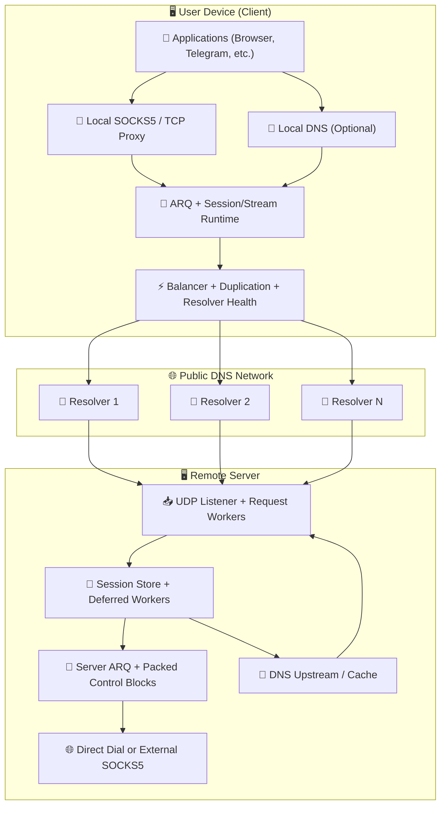
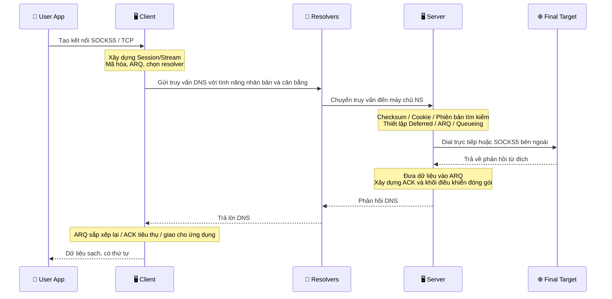

# Dự án MasterDnsVPN 🔐

## | [نسخه فارسی](https://github.com/masterking32/MasterDnsVPN/blob/main/README_FA.MD) | [English Version](https://github.com/masterking32/MasterDnsVPN/blob/main/README.MD) | [Русская версия](https://github.com/masterking32/MasterDnsVPN/blob/main/README_RU.MD) |

**MasterDnsVPN** là một dự án định hướng nghiên cứu và khoa học nhằm truyền tải lưu lượng TCP thông qua các truy vấn và phản hồi DNS. Về mục tiêu tổng quát, nó tương tự như các dự án như DNSTT hoặc SlipStream, nhưng tuân theo một cấu trúc và cách tiếp cận triển khai hoàn toàn khác.
Hệ thống này được thiết kế dựa trên khả năng tương thích với nhiều hành vi của resolver và các điều kiện mạng khắc nghiệt, với mục tiêu duy trì sự ổn định và khả năng truyền tải dữ liệu cao nhất có thể ngay cả trong những trường hợp tồi tệ nhất.

[](https://deepwiki.com/masterking32/MasterDnsVPN) [](https://oosmetrics.com/repo/masterking32/MasterDnsVPN)

<a href="https://trendshift.io/repositories/23688" target="_blank"></a>

### 📊 So sánh MasterDnsVPN với các dự án tương tự

| Tính năng | SlipStream | DNSTT | MasterDnsVPN |
| :--- | :--- | :--- | :--- |
| Loại giao thức | DNS tunnel nâng cao | DNS tunnel cổ điển | DNS tunnel nâng cao / VPN |
| Giao thức truyền tải | QUIC | KCP + Noise | Giao thức tùy chỉnh + ARQ |
| Chi phí header truyền tải | 🟠 ~24B | 🔴 ~59B | 🟢 ~5–7B<br>Thấp hơn ≈88% so với DNSTT<br>Thấp hơn ≈71% so với SlipStream |
| Kiểu mã hóa | TLS 1.3 (bên trong QUIC) | Noise (Curve25519) | AES / ChaCha20 / XOR (nếu dùng XOR: nhẹ, bảo mật thấp hơn và không có chi phí bổ sung) |
| Kiến trúc | Thống nhất (QUIC xử lý mọi thứ) | Đa tầng (KCP + SMUX + Noise) | 🟢 Thiết kế tùy chỉnh nhẹ, tối ưu hóa cho DNS |
| Tốc độ | 🟡 Cao (nhanh hơn đến ~5 lần so với DNSTT) | 🔴 Trung bình | 🟢 Nhanh hơn các dự án khác<br>Nhanh hơn đến ~9 lần so với DNSTT<br>Nhanh hơn đến ~3.6 lần so với SlipStream |
| Độ ổn định khi mất gói tin | 🟡 Tốt | 🟠 Trung bình | 🟢 Rất cao (Multipath + ARQ) |
| Hỗ trợ nhiều resolver | Có (multipath) | ❌ | Có — nâng cao (multi-resolver + nhân bản) |
| Khả năng phục hồi dưới kiểm duyệt gắt gao | Tốt | Trung bình | Rất mạnh mẽ (mục tiêu cốt lõi của dự án) |
| Độ phức tạp khi cài đặt | Trung bình | Đơn giản | Cài đặt dễ dàng hơn<br>Chỉ phức tạp hơn nếu bạn tùy chỉnh sâu các thiết lập nâng cao |
| Hỗ trợ SOCKS5 | Có | Có | Tối ưu hóa cho SOCKS5 / SOCKS4 với chi phí SOCKS giảm thiểu |
| Hỗ trợ Shadowsocks | ✅ | ❌ | Gián tiếp: Chế độ TCP Forwarding có thể truyền tải các giao thức dựa trên TCP<br>ví dụ: Shadowsocks, VLESS/VMess, v.v. |
| Multipath thực sự | Có (QUIC multipath) | ❌ | Có (multi-resolver + nhân bản) |
| Định tuyến thích ứng | Hạn chế | ❌ | Nâng cao (dựa trên độ trễ/mất gói) |
| Mục tiêu thiết kế | Tốc độ và hiệu quả cao | Sự đơn giản và ổn định | Sống sót trong các mạng lưới khắc nghiệt nhất — ổn định, tốc độ và hiệu quả |
| Ngôn ngữ triển khai | Rust | Go | Phiên bản chính là Go<br>Cũng có phiên bản Python cũ |
| Tích hợp bộ cân bằng tải | 🔴 | ❌ | 🟢 (8 chế độ cân bằng tải tích hợp) |
| Hệ thống nhân bản (Duplication) | ❌ | ❌ | Có — tăng lưu lượng để cải thiện độ tin cậy (có thể cấu hình hoặc vô hiệu hóa) |
| Khả năng chịu đựng MTU | Tốt hơn DNSTT | - | Hoạt động ngay cả với MTU rất nhỏ vì chi phí giao thức rất thấp |
| Hệ thống chuyển đổi dự phòng (Failover) | ❌ | ❌ | ✅ |
| Tốc độ tải xuống 10MB (Local) | 🟡 0.978s | 🔴 2.492s | 🟢 0.270s |
| Tốc độ tải lên 10MB (Local) | 🟡 3.249s | 🔴 16.207s | 🟢 1.746s |
| Kiểm tra tình trạng resolver và tự động vô hiệu hóa | ❌ | ❌ | ✅ |
| Kích hoạt lại ngầm các resolver khỏe mạnh | ❌ | ❌ | ✅ |
| Dịch vụ DNS cục bộ trên máy khách (giảm thiểu tấn công DNS hijacking) | ❌ | ❌ | ✅ (với bộ nhớ đệm DNS mạnh mẽ) |
| Phân giải DNS thông qua SOCKS5 | ❌ | ❌ | ✅ (với bộ nhớ đệm DNS) |
| Cấu hình chuyên nghiệp chi tiết | 🟠 | 🟠 | 🟢 Hầu như mọi hệ thống con đều có thể cấu hình |
| Yêu cầu phần mềm trợ giúp bên ngoài | ❌ | ❌ | 🟢 Không yêu cầu phần mềm bổ sung; nếu cần, bạn vẫn có thể kết hợp nó với SOCKS hoặc các công cụ như Shadowsocks hoặc OpenVPN |

---

### ❌ Tuyên bố miễn trừ trách nhiệm

MasterDnsVPN chỉ được cung cấp như một dự án giáo dục và nghiên cứu.

- **Được cung cấp không có bảo hành:** Phần mềm này được cung cấp "NGUYÊN TRẠNG", không có bất kỳ bảo đảm rõ ràng hay ngụ ý nào, bao gồm khả năng thương mại, sự phù hợp cho một mục đích cụ thể, hoặc không vi phạm.
- **Giới hạn trách nhiệm:** Các nhà phát triển và những người đóng góp cho dự án này không chịu trách nhiệm cho bất kỳ thiệt hại trực tiếp, gián tiếp, ngẫu nhiên, hệ quả, hoặc các thiệt hại khác phát sinh từ việc sử dụng phần mềm này hoặc không thể sử dụng nó.
- **Trách nhiệm của người dùng:** Sử dụng dự án này ngoài môi trường thử nghiệm có thể làm gián đoạn hoặc làm hỏng hành vi mạng. Người dùng hoàn toàn chịu trách nhiệm cho tất cả hậu quả của việc cài đặt, cấu hình và sử dụng.
- **Tuân thủ pháp luật:** Sử dụng dự án này để vượt qua luật pháp địa phương có thể dẫn đến các hậu quả dân sự hoặc hình sự. Vui lòng xem xét các luật và quy định của quốc gia bạn trước khi sử dụng. Các nhà phát triển không chịu trách nhiệm cho các vi phạm luật pháp địa phương, quốc gia, hoặc quốc tế của người dùng.
- **Điều khoản cấp phép:** Việc sử dụng, sao chép, phân phối hoặc sửa đổi phần mềm này được điều chỉnh bởi giấy phép trong tệp `LICENSE` của kho lưu trữ này. Bất kỳ việc sử dụng nào ngoài các điều khoản đó đều bị nghiêm cấm.

---

## Kênh Thông báo và Hỗ trợ 📢

Để nhận tin tức mới nhất, các bản phát hành và cập nhật dự án, hãy theo dõi kênh Telegram của chúng tôi: [Kênh Telegram](https://t.me/masterdnsvpn)

---

### Nếu bạn thích dự án này, vui lòng ủng hộ nó bằng cách thả sao (star) trên GitHub (⭐). Điều đó giúp dự án được khám phá nhiều hơn.

---

### Hỗ trợ tài chính tùy chọn 💸

- Mạng TON:

`masterking32.ton`

- Các mạng tương thích EVM (ETH và các chuỗi tương thích):

`0x517f07305D6ED781A089322B6cD93d1461bF8652`

- Mạng TRC20 (TRON):

`TLApdY8APWkFHHoxebxGY8JhMeChiETqFH`

Mọi đóng góp và mọi phản hồi đều được trân trọng. Sự hỗ trợ trực tiếp giúp ích cho quá trình phát triển và cải tiến không ngừng.

---

## Các tính năng và ưu điểm chính ✨

Dưới đây là tóm tắt ngắn gọn về các khả năng chính của MasterDnsVPN:

- **Khả năng chống kiểm duyệt và khả năng sống sót trong mạng khắc nghiệt:** 🛡️ Được thiết kế để hoạt động trên các mạng bị lọc, các liên kết không ổn định và các môi trường có MTU nghiêm ngặt.
- **Giao thức tùy chỉnh nhẹ:** 🔄 Sử dụng một giao thức tùy chỉnh với logic truyền lại để giảm thiểu chi phí và tăng payload DNS có thể sử dụng.
- **Multipath và nhân bản gói tin:** 📡 Gửi lưu lượng qua nhiều đường dẫn và hỗ trợ nhân bản có chọn lọc để tăng xác suất gửi thành công trên các mạng không ổn định.
- **Lựa chọn resolver thông minh và kiểm tra tình trạng:** ⚡ Lựa chọn các resolver dựa trên chất lượng và tình trạng sức khỏe, đồng thời tự động quản lý các resolver có vấn đề.
- **Khám phá và đồng bộ MTU:** 🧰 Phát hiện MTU thực tế của các đường dẫn hoạt động và căn chỉnh theo đó để giảm thiểu phân mảnh và cải thiện độ ổn định.
- **Hỗ trợ và tối ưu hóa SOCKS5 / SOCKS4:** 🧦 Tối ưu hóa xử lý proxy cục bộ cho các ứng dụng phổ biến.
- **Khối điều khiển được đóng gói và chi phí điều khiển thấp hơn:** 📦 Nhóm các lưu lượng ACK/điều khiển lại với nhau để giảm nhiễu điều khiển.
- **Nén và đóng gói yêu cầu (tùy chọn):** 🗜️ Giảm số lượng yêu cầu và cải thiện hiệu quả trong các điều kiện MTU nhỏ.
- **Mã hóa linh hoạt:** 🔐 Hỗ trợ nhiều phương pháp mã hóa để cân bằng giữa tốc độ và bảo mật.
- **Tùy chọn DNS cục bộ phía máy khách và bộ nhớ đệm:** 📛 Có thể mở dịch vụ DNS cục bộ, giảm độ trễ và hạn chế cơ hội tấn công DNS hijacking.
- **Kiểm soát tài nguyên có thể mở rộng:** ⚙️ Có thể chạy trên các máy chủ nhỏ hoặc được tinh chỉnh cho các tải nặng hơn.

Danh sách này chỉ là tóm tắt ở mức độ cao. Các phần liên quan bên dưới giải thích chi tiết hơn về từng khía cạnh.

---

## 🌐 Được thử nghiệm thực chiến trong đợt cắt đứt Internet toàn diện

MasterDnsVPN không chỉ là một dự án lý thuyết. Nó đã được thử nghiệm thực chiến và chứng minh hoạt động tốt trong các môi trường mà kết nối internet toàn cầu bị cắt đứt hoàn toàn.

Gần đây, trong đợt cắt đứt internet kéo dài 88 ngày ở Iran, các nhà chức trách không chỉ chặn VPN hoặc lọc các trang web—họ đã cắt đứt hoàn toàn băng thông quốc tế. Với 99% kết nối với thế giới bên ngoài bị cắt đứt vật lý, người dùng bị mắc kẹt bên trong một mạng intranet cục bộ và khép kín.

Các công cụ vượt tường lửa tiêu chuẩn trở nên vô dụng khi không có internet quốc tế để kết nối tới. Tuy nhiên, trong đợt ngắt kết nối quy mô lớn này, MasterDnsVPN nổi bật như một trong số rất ít phao cứu sinh thực sự giúp người dùng duy trì kết nối với web toàn cầu.

**Làm thế nào nó sống sót sau một cuộc ngắt kết nối toàn diện?**
Thay vì hoạt động như một VPN tiêu chuẩn, MasterDnsVPN dựa vào các kỹ thuật DNS tunneling thông minh để xuyên qua lớp phong tỏa:
* **Nhiều Resolver:** Nó định tuyến lưu lượng qua nhiều DNS resolver khác nhau, đảm bảo kết nối không bao giờ phụ thuộc vào một đường dẫn duy nhất, dễ bị chặn.
* **Mã hóa & Chia nhỏ Dữ liệu:** Nó mã hóa dữ liệu của bạn và chia nhỏ thành các mảnh nhỏ, rải rác.
* **Ngụy trang thành Lưu lượng Hợp pháp:** Nó bọc các phần dữ liệu này bên trong các truy vấn DNS tiêu chuẩn, hoàn toàn bình thường.
* **Vượt qua Các bẫy Cục bộ:** Vì lưu lượng trông giống hệt như các yêu cầu DNS cơ bản, hàng ngày, tường lửa sẽ cho phép nó đi qua. Dữ liệu được phân giải và đến thế giới bên ngoài—ngay cả khi mạng buộc bạn phải sử dụng các resolver cục bộ hạn chế, do chính phủ kiểm soát của riêng họ.

Sự kết hợp chính xác này là điều đã cho phép MasterDnsVPN duy trì một kết nối ổn định khi thế giới bên ngoài bị chặn hoàn toàn.

---

# Cài đặt và Bắt đầu 🧑‍💻

## Phần 1: 🖥️ Thiết lập Máy chủ

### Phần 1.1: 🌐 Thiết lập và Chuẩn bị Tên miền (Điều kiện tiên quyết)

Để nhận trực tiếp các yêu cầu DNS trên máy chủ của bạn, bạn phải ủy quyền một tên miền phụ (subdomain) cho nó. Nói ngắn gọn, hãy tạo hai bản ghi: một bản ghi `A` trỏ đến IP máy chủ của bạn, và một bản ghi `NS` ủy quyền tên miền phụ đường hầm cho bản ghi A đó.

#### Bước 1.1.1: 🅰️ Tạo một Bản ghi A (Địa chỉ Máy chủ)

- **Loại:** `A`
- **Tên:** một tên ngắn chẳng hạn như `ns`
- **Giá trị:** địa chỉ IPv4 máy chủ của bạn

> Ví dụ: `ns.example.com -> 1.2.3.4`

> Lưu ý với Cloudflare: nếu tên miền sử dụng Cloudflare, hãy mở trang `DNS` và nhấp vào biểu tượng đám mây bên cạnh bản ghi `A` để nó chuyển sang màu xám (`DNS only` - Chỉ DNS). Nó không được phép bật proxy.

#### Bước 1.1.2: 🏷️ Tạo một Bản ghi NS (Ủy quyền Tên miền phụ)

- **Loại:** `NS`
- **Tên:** tên miền phụ đường hầm, ví dụ `v`
- **Giá trị / Đích:** `ns.example.com`

> Ví dụ: `v.example.com -> ns.example.com`

> Lưu ý với Cloudflare: thêm bản ghi `NS` một cách bình thường. Cloudflare không proxy các bản ghi NS, nhưng hãy đảm bảo rằng bản ghi A `ns` đã được thiết lập thành `DNS only`.

#### Phần 1.1.3: 💡 Một Lưu ý Ngắn về MTU

Tên miền ngắn hơn sẽ để lại nhiều không gian hơn cho dữ liệu thực tế bên trong mỗi yêu cầu DNS. Để có thông lượng tốt hơn, hãy giữ các tên ngắn gọn. Nếu bạn sử dụng Cloudflare, vẫn phải giữ các bản ghi liên quan ở chế độ `DNS only`.

---

### Phần 1.2: 🐧 Cài đặt Máy chủ Linux Nhanh

#### Bước 1.2.1: Cài đặt Tự động (Script)

Nếu bạn muốn triển khai máy chủ trên Linux, phương pháp dễ nhất là dùng script cài đặt tự động. Chạy lệnh này trên máy chủ:

```bash
bash <(curl -Ls https://raw.githubusercontent.com/masterking32/MasterDnsVPN/main/server_linux_install.sh)
```

Script sẽ xử lý cài đặt và cấu hình tự động. Khi hoàn thành, máy chủ sẽ khởi động và **khóa mã hóa (encryption key)** được hiển thị trong nhật ký terminal, đồng thời được ghi vào tệp `encrypt_key.txt` nằm cạnh tệp thực thi. Hãy giữ an toàn khóa này.

#### Bước 1.2.2: Các Lưu ý Quan trọng Sau khi Cài đặt

- Trong quá trình cài đặt, bạn sẽ được hỏi về một tên miền. Nó phải là cùng tên miền phụ được ủy quyền mà bạn đã cấu hình trong bản ghi `NS`, ví dụ `v.example.com`.
- Sau khi tạo các bản ghi DNS, hãy đợi quá trình lan truyền (propagation). Điều này có thể mất từ vài phút đến vài giờ, và trong một số trường hợp lên đến 48 giờ tùy thuộc vào TTL và nhà cung cấp DNS.
- Để xác minh thiết lập DNS, bạn có thể sử dụng các công cụ như `dig` hoặc `nslookup`, ví dụ `dig v.example.com NS` hoặc `nslookup -type=ns v.example.com`. Để truy vấn trực tiếp đến nameserver mới: `dig @ns.example.com v.example.com A`.
- Nếu tường lửa của máy chủ được bật, hãy cho phép cổng UDP 53. Ví dụ đối với `ufw`:

```bash
sudo ufw allow 53/udp
sudo ufw reload
```

Đối với `firewalld`:

```bash
sudo firewall-cmd --add-port=53/udp --permanent
sudo firewall-cmd --reload
```

- Nếu cổng `53` đã bị chiếm dụng bởi một dịch vụ khác, chẳng hạn như `systemd-resolved`, hãy xem phần khắc phục sự cố "Fixing Port 53 Already in Use".
- Khóa mã hóa (`encrypt_key.txt`) được hiển thị sau khi cài đặt. Sao chép và lưu trữ an toàn vì máy khách cần nó để kết nối.

---

## Phần 2: 🚀 Cài đặt và Khởi chạy (Máy khách và Máy chủ)

Bạn có thể cài đặt và chạy dự án này theo hai cách:

1. Sử dụng các bản dựng sẵn (được khuyến nghị cho hầu hết người dùng)
2. Chạy trực tiếp từ mã nguồn bằng **Go** (được khuyến nghị cho các nhà phát triển)

---

### Phần 2.1: Sử dụng Bản phát hành Dựng sẵn (✅ Khuyến nghị)

Để thuận tiện, các tệp nhị phân máy khách và máy chủ được biên dịch sẵn đã được phát hành trên trang release. Hãy tải xuống tệp lưu trữ chính xác cho hệ điều hành của bạn và giải nén nó.

> 💡 **Lưu ý:** Các tệp lưu trữ phát hành thường bao gồm tệp nhị phân cộng với các tệp cấu hình mẫu.

#### Liên kết Tải xuống Máy khách 📥

| Hệ điều hành | Kiến trúc | Phù hợp cho | Tải xuống Trực tiếp |
| :--- | :--- | :--- | :--- |
| Windows 🪟 | `AMD64` (64-bit) | Windows 10 và 11 | [Tải xuống Client Windows ⬇️](https://github.com/masterking32/MasterDnsVPN/releases/latest/download/MasterDnsVPN_Client_Windows_AMD64.zip) |
| Windows 🪟 | `x86` (32-bit) | Hệ thống Windows 32-bit cũ | [Tải xuống Client Windows x86 ⬇️](https://github.com/masterking32/MasterDnsVPN/releases/latest/download/MasterDnsVPN_Client_Windows_X86.zip) |
| Windows 🪟 | `ARM64` | Windows trên thiết bị ARM | [Tải xuống Client Windows ARM64 ⬇️](https://github.com/masterking32/MasterDnsVPN/releases/latest/download/MasterDnsVPN_Client_Windows_ARM64.zip) |
| macOS 🍎 | `ARM64` | Mac Apple Silicon (M1 / M2 / M3) | [Tải xuống Client macOS ⬇️](https://github.com/masterking32/MasterDnsVPN/releases/latest/download/MasterDnsVPN_Client_MacOS_ARM64.zip) |
| macOS 🍎 | `AMD64` | Mac Intel | [Tải xuống Client macOS Intel ⬇️](https://github.com/masterking32/MasterDnsVPN/releases/latest/download/MasterDnsVPN_Client_MacOS_AMD64.zip) |
| Linux 🐧 | `AMD64` (64-bit) | Các bản phân phối hiện đại (Ubuntu 22.04+, Debian 12+) | [Tải xuống Client Linux ⬇️](https://github.com/masterking32/MasterDnsVPN/releases/latest/download/MasterDnsVPN_Client_Linux_AMD64.zip) |
| Linux 🐧 | `x86` (32-bit) | Hệ thống Linux 32-bit cũ | [Tải xuống Client Linux x86 ⬇️](https://github.com/masterking32/MasterDnsVPN/releases/latest/download/MasterDnsVPN_Client_Linux_X86.zip) |
| Linux (Cũ) 🐧 | `AMD64` (64-bit) | Các bản phân phối cũ hơn (Ubuntu 20.04, Debian 11) | [Tải xuống Client Linux Legacy ⬇️](https://github.com/masterking32/MasterDnsVPN/releases/latest/download/MasterDnsVPN_Client_Linux-Legacy_AMD64.zip) |
| Linux (Cũ) 🐧 | `ARM64` | Hệ thống Linux ARM64 cũ cần tính tương thích rộng hơn | [Tải xuống Client Linux Legacy ARM64 ⬇️](https://github.com/masterking32/MasterDnsVPN/releases/latest/download/MasterDnsVPN_Client_Linux-Legacy_ARM64.zip) |
| Linux (ARM) 🐧 | `ARM64` | Máy chủ ARM, Raspberry Pi, và bo mạch tương tự | [Tải xuống Client Linux ARM ⬇️](https://github.com/masterking32/MasterDnsVPN/releases/latest/download/MasterDnsVPN_Client_Linux_ARM64.zip) |
| Linux (ARM) 🐧 | `ARMv7` | Bo mạch ARM 32-bit và thiết bị Linux nhúng cũ | [Tải xuống Client Linux ARMv7 ⬇️](https://github.com/masterking32/MasterDnsVPN/releases/latest/download/MasterDnsVPN_Client_Linux_ARMV7.zip) |
| Linux (ARM) 🐧 | `ARMv6` | Bo mạch ARM cũ hơn và thiết bị Linux nhẹ | [Tải xuống Client Linux ARMv6 ⬇️](https://github.com/masterking32/MasterDnsVPN/releases/latest/download/MasterDnsVPN_Client_Linux_ARMV6.zip) |
| Linux (ARM) 🐧 | `ARMv5` | Thiết bị ARM rất cũ và hệ thống Linux nhúng | [Tải xuống Client Linux ARMv5 ⬇️](https://github.com/masterking32/MasterDnsVPN/releases/latest/download/MasterDnsVPN_Client_Linux_ARMV5.zip) |
| Linux 🐧 | `RISCV64` | Bo mạch và máy chủ Linux RISC-V | [Tải xuống Client Linux RISCV64 ⬇️](https://github.com/masterking32/MasterDnsVPN/releases/latest/download/MasterDnsVPN_Client_Linux_RISCV64.zip) |
| Linux (MIPS) 🐧 | `MIPS` | Nền tảng Linux MIPS và router Big-endian | [Tải xuống Client Linux MIPS ⬇️](https://github.com/masterking32/MasterDnsVPN/releases/latest/download/MasterDnsVPN_Client_Linux_MIPS.zip) |
| Linux (MIPS) 🐧 | `MIPSLE` | Nền tảng Linux MIPS và router Little-endian | [Tải xuống Client Linux MIPSLE ⬇️](https://github.com/masterking32/MasterDnsVPN/releases/latest/download/MasterDnsVPN_Client_Linux_MIPSLE.zip) |
| Linux (MIPS) 🐧 | `MIPS64` | Hệ thống Linux MIPS big-endian 64-bit | [Tải xuống Client Linux MIPS64 ⬇️](https://github.com/masterking32/MasterDnsVPN/releases/latest/download/MasterDnsVPN_Client_Linux_MIPS64.zip) |
| Linux (MIPS) 🐧 | `MIPS64LE` | Hệ thống Linux MIPS little-endian 64-bit | [Tải xuống Client Linux MIPS64LE ⬇️](https://github.com/masterking32/MasterDnsVPN/releases/latest/download/MasterDnsVPN_Client_Linux_MIPS64LE.zip) |
| Termux / Android 📱 | `ARM64` | Điện thoại Android hiện đại chạy Termux | [Tải xuống Client Termux ARM64 ⬇️](https://github.com/masterking32/MasterDnsVPN/releases/latest/download/MasterDnsVPN_Client_Termux_ARM64.zip) |
| Termux / Android 📱 | `ARMv7` | Điện thoại Android cũ chạy môi trường Termux 32-bit | [Tải xuống Client Termux ARMv7 ⬇️](https://github.com/masterking32/MasterDnsVPN/releases/latest/download/MasterDnsVPN_Client_Termux_ARMV7.zip) |

#### Liên kết Tải xuống Máy chủ 📤

*(Sử dụng các liên kết này nếu bạn không muốn dùng trình cài đặt tự động trên Linux.)*

| Hệ điều hành | Kiến trúc | Phù hợp cho | Tải xuống Trực tiếp |
| :--- | :--- | :--- | :--- |
| Windows 🪟 | `AMD64` (64-bit) | Windows Server, Windows 10 và 11 | [Tải xuống Server Windows ⬇️](https://github.com/masterking32/MasterDnsVPN/releases/latest/download/MasterDnsVPN_Server_Windows_AMD64.zip) |
| Windows 🪟 | `x86` (32-bit) | Hệ thống Windows 32-bit cũ | [Tải xuống Server Windows x86 ⬇️](https://github.com/masterking32/MasterDnsVPN/releases/latest/download/MasterDnsVPN_Server_Windows_X86.zip) |
| Windows 🪟 | `ARM64` | Windows trên thiết bị ARM | [Tải xuống Server Windows ARM64 ⬇️](https://github.com/masterking32/MasterDnsVPN/releases/latest/download/MasterDnsVPN_Server_Windows_ARM64.zip) |
| Linux 🐧 | `AMD64` (64-bit) | Máy chủ Ubuntu 22.04+, Debian 12+ | [Tải xuống Server Linux ⬇️](https://github.com/masterking32/MasterDnsVPN/releases/latest/download/MasterDnsVPN_Server_Linux_AMD64.zip) |
| Linux 🐧 | `x86` (32-bit) | Hệ thống Linux 32-bit cũ | [Tải xuống Server Linux x86 ⬇️](https://github.com/masterking32/MasterDnsVPN/releases/latest/download/MasterDnsVPN_Server_Linux_X86.zip) |
| Linux (Cũ) 🐧 | `AMD64` (64-bit) | Máy chủ cũ hơn (Ubuntu 20.04, Debian 11) | [Tải xuống Server Linux Legacy ⬇️](https://github.com/masterking32/MasterDnsVPN/releases/latest/download/MasterDnsVPN_Server_Linux-Legacy_AMD64.zip) |
| Linux (Cũ) 🐧 | `ARM64` | Hệ thống Linux ARM64 cũ cần tính tương thích rộng hơn | [Tải xuống Server Linux Legacy ARM64 ⬇️](https://github.com/masterking32/MasterDnsVPN/releases/latest/download/MasterDnsVPN_Server_Linux-Legacy_ARM64.zip) |
| Linux (ARM) 🐧 | `ARM64` | Máy chủ ARM | [Tải xuống Server Linux ARM ⬇️](https://github.com/masterking32/MasterDnsVPN/releases/latest/download/MasterDnsVPN_Server_Linux_ARM64.zip) |
| Linux (ARM) 🐧 | `ARMv7` | Máy chủ ARM 32-bit và thiết bị Linux nhúng | [Tải xuống Server Linux ARMv7 ⬇️](https://github.com/masterking32/MasterDnsVPN/releases/latest/download/MasterDnsVPN_Server_Linux_ARMV7.zip) |
| Linux (ARM) 🐧 | `ARMv6` | Bo mạch ARM cũ hơn và thiết bị Linux nhẹ | [Tải xuống Server Linux ARMv6 ⬇️](https://github.com/masterking32/MasterDnsVPN/releases/latest/download/MasterDnsVPN_Server_Linux_ARMV6.zip) |
| Linux (ARM) 🐧 | `ARMv5` | Thiết bị ARM rất cũ và hệ thống Linux nhúng | [Tải xuống Server Linux ARMv5 ⬇️](https://github.com/masterking32/MasterDnsVPN/releases/latest/download/MasterDnsVPN_Server_Linux_ARMV5.zip) |
| Linux 🐧 | `RISCV64` | Bo mạch và máy chủ Linux RISC-V | [Tải xuống Server Linux RISCV64 ⬇️](https://github.com/masterking32/MasterDnsVPN/releases/latest/download/MasterDnsVPN_Server_Linux_RISCV64.zip) |
| Linux (MIPS) 🐧 | `MIPS` | Nền tảng Linux MIPS và router Big-endian | [Tải xuống Server Linux MIPS ⬇️](https://github.com/masterking32/MasterDnsVPN/releases/latest/download/MasterDnsVPN_Server_Linux_MIPS.zip) |
| Linux (MIPS) 🐧 | `MIPSLE` | Nền tảng Linux MIPS và router Little-endian | [Tải xuống Server Linux MIPSLE ⬇️](https://github.com/masterking32/MasterDnsVPN/releases/latest/download/MasterDnsVPN_Server_Linux_MIPSLE.zip) |
| Linux (MIPS) 🐧 | `MIPS64` | Hệ thống Linux MIPS big-endian 64-bit | [Tải xuống Server Linux MIPS64 ⬇️](https://github.com/masterking32/MasterDnsVPN/releases/latest/download/MasterDnsVPN_Server_Linux_MIPS64.zip) |
| Linux (MIPS) 🐧 | `MIPS64LE` | Hệ thống Linux MIPS little-endian 64-bit | [Tải xuống Server Linux MIPS64LE ⬇️](https://github.com/masterking32/MasterDnsVPN/releases/latest/download/MasterDnsVPN_Server_Linux_MIPS64LE.zip) |
| macOS 🍎 | `ARM64` | Mac Apple Silicon | [Tải xuống Server macOS ⬇️](https://github.com/masterking32/MasterDnsVPN/releases/latest/download/MasterDnsVPN_Server_MacOS_ARM64.zip) |
| macOS 🍎 | `AMD64` | Mac Intel | [Tải xuống Server macOS Intel ⬇️](https://github.com/masterking32/MasterDnsVPN/releases/latest/download/MasterDnsVPN_Server_MacOS_AMD64.zip) |
| Termux / Android 📱 | `ARM64` | Môi trường Android / Termux hiện đại | [Tải xuống Server Termux ARM64 ⬇️](https://github.com/masterking32/MasterDnsVPN/releases/latest/download/MasterDnsVPN_Server_Termux_ARM64.zip) |
| Termux / Android 📱 | `ARMv7` | Môi trường Android cũ / Termux 32-bit | [Tải xuống Server Termux ARMv7 ⬇️](https://github.com/masterking32/MasterDnsVPN/releases/latest/download/MasterDnsVPN_Server_Termux_ARMV7.zip) |

---

### Phần 2.2: 📦 Hình ảnh Docker MasterDnsVPN

---

#### Phần 2.2.1: ⚠️ Tổng quan

Hình ảnh Docker này chạy máy chủ MasterDnsVPN trong một môi trường được container hóa và hỗ trợ các bản dựng đa kiến trúc.

Nó sẽ tự động:

* Khởi động một cấu hình mặc định nếu chưa có
* Tiêm (inject) tên miền của bạn vào lần khởi động đầu tiên
* Lưu trữ dữ liệu liên tục trong `/data`

---

#### Phần 2.2.2: 🖥 Các Kiến trúc được Hỗ trợ

* linux/amd64
* linux/arm/v5
* linux/arm/v7
* linux/arm64/v8
* linux/mips64le

---

#### Phần 2.2.3: 🚀 Bắt đầu Nhanh

Chạy container bằng Docker:

```bash
docker run -d \
  --name masterdnsvpn \
  --restart unless-stopped \
  -e DOMAIN=v.example.com \
  -v $(pwd)/data:/data \
  -p 53:53/tcp \
  -p 53:53/udp \
  ghcr.io/masterking32/masterdnsvpn:latest
```

---

#### Phần 2.2.4: 🧪 Ví dụ với docker-compose

```yaml
services:
  masterdnsvpn:
    image: ghcr.io/masterking32/masterdnsvpn:latest
    restart: unless-stopped
    environment:
      - DOMAIN=v.example.com
    volumes:
      - ./data:/data
    ports:
      - "53:53/tcp"
      - "53:53/udp"
```

---

#### Phần 2.2.5: ⚙️ Các Biến Môi trường Bắt buộc

| Biến | Mô tả                             |
| -------- | --------------------------------------- |
| DOMAIN   | Tên miền DNS của bạn (bắt buộc ở lần chạy đầu tiên) |

> ⚠️ Nếu `DOMAIN` không được đặt vào lần khởi động đầu tiên, container sẽ dừng lại kèm theo lỗi.

---

#### Phần 2.2.6: 📁 Dữ liệu Liên tục

Được lưu trữ trong `/data`:

* `server_config.toml`
* `encrypt_key.txt`

Bạn có thể gắn nó làm volume:

```bash
-v ./data:/data
```

---

#### Phần 2.2.7: 🔧 Cách sử dụng trên MikroTik / RouterOS

Đối với các container MikroTik:

* Sử dụng MikroTik RouterOS v7 mới nhất
* NAT Đích (Destination NAT) cổng UDP/TCP 53 tới container của bạn
* Hướng dẫn thiết lập container MikroTik đầy đủ: https://help.mikrotik.com/docs/spaces/ROS/pages/84901929/Container

Ví dụ:

```bash
/container mounts
add dst=/data list=MasterDnsVPN src=/containers/mounts/MasterDnsVPN

/container envs
add key=DOMAIN list=MasterDnsVPN value=v.example.com

/container add check-certificate=no dns=1.1.1.1 envlists=MasterDnsVPN hostname=MasterDnsVPN interface=MasterDnsVPN layer-dir="" mountlists=MasterDnsVPN name=MasterDnsVPN remote-image=ghcr.io/masterking32/masterdnsvpn:latest root-dir=/containers/data/MasterDnsVPN start-on-boot=yes
```

---

#### Phần 2.2.8: 📌 Ghi chú

* Cổng DNS `53` là bắt buộc (UDP/TCP)
* KHÔNG chạy một dịch vụ DNS khác trên cùng một máy chủ
* Được thiết kế cho việc sử dụng trong môi trường sản xuất (production) nhưng vẫn nhẹ nhàng
* Không yêu cầu sửa đổi systemd hoặc máy chủ (host)

---

### Phần 2.3: 🪟 Chuẩn bị và Chạy Máy khách trên Windows

- Sau khi tải xuống gói Windows, hãy giải nén nó.
- Mở `client_config.toml` bằng một trình soạn thảo văn bản chẳng hạn như Notepad.
- Thay thế các giá trị mặc định bằng tên miền thực của bạn, khóa mã hóa và danh sách resolver.
- Chạy tệp thực thi máy khách.
- Cấu hình trình duyệt hoặc ứng dụng của bạn để sử dụng proxy SOCKS5 cục bộ tại `127.0.0.1:18000` trừ khi bạn đã thay đổi cấu hình mặc định.

---

### Phần 2.4: 🐧 Chuẩn bị và Chạy trên Linux / macOS

Sau khi tải xuống gói trên Linux:

```bash
sudo apt update
sudo apt install unzip nano
```

Giải nén tệp lưu trữ:

```bash
unzip MasterDnsVPN_Client_Linux_AMD64.zip
ls
```

Cấp quyền thực thi nếu cần:

```bash
chmod +x MasterDnsVPN_Client_Linux_AMD64
chmod +x MasterDnsVPN_Server_Linux_AMD64
```

Chỉnh sửa cấu hình:

```bash
nano client_config.toml
nano server_config.toml
```

Sau đó chạy:

```bash
./MasterDnsVPN_Client_Linux_AMD64
./MasterDnsVPN_Server_Linux_AMD64
```

---

### Phần 2.5: 🧑‍💻 Chạy Trực tiếp từ Mã nguồn (Go)

> ⚠️ Phần này dành cho các nhà phát triển hoặc những người dùng muốn chạy trực tiếp mã nguồn Go hiện tại.

#### Điều kiện tiên quyết

- Go `1.24` hoặc mới hơn

#### Xây dựng từ mã nguồn

```bash
git clone https://github.com/masterking32/MasterDnsVPN.git
cd MasterDnsVPN

go build -o masterdnsvpn-client ./cmd/client
go build -o masterdnsvpn-server ./cmd/server
```

Trên Windows:

```powershell
git clone https://github.com/masterking32/MasterDnsVPN.git
cd MasterDnsVPN

go build -o masterdnsvpn-client.exe .\cmd\client
go build -o masterdnsvpn-server.exe .\cmd\server
```

#### Tạo tệp cấu hình

Trên Linux và macOS:

```bash
cp client_config.toml.simple client_config.toml
cp server_config.toml.simple server_config.toml
cp client_resolvers.simple client_resolvers.txt
```

Trên Windows:

```powershell
Copy-Item client_config.toml.simple client_config.toml
Copy-Item server_config.toml.simple server_config.toml
Copy-Item client_resolvers.simple client_resolvers.txt
```

#### Chạy máy chủ và máy khách

```bash
./masterdnsvpn-server -config server_config.toml
./masterdnsvpn-client -config client_config.toml
```

Trên Windows:

```powershell
.\masterdnsvpn-server.exe -config server_config.toml
.\masterdnsvpn-client.exe -config client_config.toml
```

#### Tham số dòng lệnh

Cả hai tệp nhị phân đều hỗ trợ các đối số sau:

| Tham số | Mô tả |
| :--- | :--- |
| `-config` | Đường dẫn đến tệp cấu hình |
| `-log` | Đường dẫn tùy chọn đến một tệp nhật ký |
| `-version` | In ra phiên bản và thoát |

Ví dụ:

```bash
./masterdnsvpn-server -config server_config.toml -log server.log
./masterdnsvpn-client -config client_config.toml -log client.log
```


---

# Phần 3: Tệp Cấu hình và Cấu trúc 🛠️

## Phần 3.1: Các Tệp Dự án Quan trọng 📂

| Tệp | Mục đích |
| :--- | :--- |
| `client_config.toml` | Cấu hình máy khách chính |
| `server_config.toml` | Cấu hình máy chủ chính |
| `client_resolvers.txt` | Danh sách resolver |
| `encrypt_key.txt` | Khóa mã hóa phía máy chủ được chia sẻ |
| `client_config.toml.simple` | Cấu hình mẫu đầy đủ của máy khách cho phiên bản Go hiện tại |
| `server_config.toml.simple` | Cấu hình mẫu đầy đủ của máy chủ cho phiên bản Go hiện tại |

Các định dạng được chấp nhận trong `client_resolvers.txt`:

- `IP`
- `IP:PORT`
- `CIDR`
- `CIDR:PORT`

Ví dụ:

```text
8.8.8.8
1.1.1.1:53
9.9.9.0/24
208.67.222.0/24:5353
```

---

## Phần 3.2: Danh sách Kiểm tra Nhanh Máy khách 🚀

Các mục này là bắt buộc trên máy khách:

1. **`ENCRYPTION_KEY`** phải khớp với nội dung của tệp `encrypt_key.txt` trên máy chủ
2. **`DOMAINS`** phải khớp với tên miền của máy chủ
3. **`client_resolvers.txt`** phải chứa các resolver đang hoạt động
4. Để sử dụng bình thường, hãy giữ **`PROTOCOL_TYPE = "SOCKS5"`**

---

## Phần 3.3: Danh sách Kiểm tra Nhanh Máy chủ ⚙️

Các thiết lập này rất quan trọng trên máy chủ:

1. Đặt **`DOMAIN`** thành tên miền đường hầm được ủy quyền của bạn
2. **`DATA_ENCRYPTION_METHOD`** phải khớp với máy khách
3. **`ENCRYPTION_KEY_FILE`** định nghĩa đường dẫn đến tệp khóa máy chủ
4. Nếu bạn muốn kết nối ra ngoài trực tiếp, hãy giữ **`USE_EXTERNAL_SOCKS5 = false`**
5. Nếu bạn muốn nối kết qua một proxy SOCKS5 upstream, hãy đặt `USE_EXTERNAL_SOCKS5 = true` và điền vào `FORWARD_IP` / `FORWARD_PORT`

---

## Phần 3.4: 📘 Các Biến Cấu hình Máy khách (`client_config.toml`)

### 3.4.1) 🧭 Danh tính và Bảo mật Đường hầm

| Tham số | Giá trị mẫu | Giá trị cho phép / Hành vi thực tế | Giải thích đầy đủ |
| :--- | :--- | :--- | :--- |
| `PROTOCOL_TYPE` | `"SOCKS5"` | `"SOCKS5"` hoặc `"TCP"` | Chọn chế độ dịch vụ cục bộ do máy khách mở ra.<br>`SOCKS5` là chế độ mặc định và được khuyến nghị cho sử dụng thông thường.<br>`TCP` hữu ích khi bạn muốn chuyển tiếp lưu lượng đến một đích từ xa cố định thay vì cung cấp cho các ứng dụng một proxy SOCKS. |
| `DOMAINS` | `["v.example.com"]` | Danh sách chuỗi không rỗng | Đây là các tên miền đường hầm được sử dụng để xây dựng các yêu cầu DNS.<br>Mọi tên miền ở đây phải thuộc cùng một đường hầm mà bạn đã cấu hình trên máy chủ.<br>Nếu danh sách này sai, máy khách có thể xây dựng các truy vấn DNS hợp lệ nhưng máy chủ sẽ bỏ qua. |
| `DATA_ENCRYPTION_METHOD` | `1` | `0..5` | Phải khớp với máy chủ.<br>`0=None`, `1=XOR`, `2=ChaCha20`, `3=AES-128-GCM`, `4=AES-192-GCM`, `5=AES-256-GCM`.<br>XOR nhẹ nhưng yếu hơn. Chế độ AEAD mạnh hơn nhưng có nhiều chi phí (overhead) hơn. |
| `ENCRYPTION_KEY` | `""` | Chuỗi | Bí mật chia sẻ được sử dụng bởi bộ mã hóa của máy khách.<br>Mục này phải hoàn toàn giống với khóa mã hóa phía máy chủ.<br>Nếu khóa bị sai, các gói có thể bị phân tích cú pháp thành rác và đường hầm sẽ không hoạt động. |

### 3.4.2) 🧦 Proxy Cục bộ

| Tham số | Giá trị mẫu | Giá trị cho phép / Hành vi thực tế | Giải thích đầy đủ |
| :--- | :--- | :--- | :--- |
| `LISTEN_IP` | `"127.0.0.1"` | Chuỗi IP hợp lệ | Địa chỉ nơi máy khách lắng nghe người dùng proxy cục bộ.<br>Sử dụng `127.0.0.1` để sử dụng cục bộ thông thường.<br>Nếu một số ứng dụng ưu tiên IPv6 localhost trên hệ thống của bạn, sử dụng `localhost` có thể là lựa chọn tốt hơn cho mạng cục bộ.<br>Sử dụng `0.0.0.0` chỉ khi bạn muốn chia sẻ proxy trên mạng và hiểu rõ các hệ quả bảo mật. |
| `LISTEN_PORT` | `18000` | `0..65535` | Cổng cho proxy cục bộ.<br>Các ứng dụng của bạn phải sử dụng cổng này để gửi lưu lượng vào đường hầm. |
| `SOCKS5_AUTH` | `false` | `true/false` | Cho phép xác thực tên người dùng/mật khẩu trên proxy SOCKS5 cục bộ.<br>Nếu bạn liên kết với `0.0.0.0`, việc bật tính năng này được đặc biệt khuyến nghị. |
| `SOCKS5_USER` | `"master_dns_vpn"` | Tối đa 255 byte | Tên người dùng cho proxy SOCKS5 cục bộ.<br>Chỉ được sử dụng nếu `SOCKS5_AUTH=true`. |
| `SOCKS5_PASS` | `"master_dns_vpn"` | Tối đa 255 byte | Mật khẩu cho proxy SOCKS5 cục bộ.<br>Chỉ được sử dụng nếu `SOCKS5_AUTH=true`. |

### 3.4.3) 📛 DNS Cục bộ

| Tham số | Giá trị mẫu | Giá trị cho phép / Hành vi thực tế | Giải thích đầy đủ |
| :--- | :--- | :--- | :--- |
| `LOCAL_DNS_ENABLED` | `false` | `true/false` | Nếu được bật, máy khách sẽ mở một dịch vụ DNS cục bộ và có thể phân giải DNS qua đường hầm.<br>Điều này hữu ích để giảm thiểu tình trạng DNS hijacking hoặc khi bạn muốn ứng dụng sử dụng đường hầm cho cả DNS. |
| `LOCAL_DNS_IP` | `"127.0.0.1"` | Chuỗi IP hợp lệ | Địa chỉ liên kết cho bộ lắng nghe DNS cục bộ. |
| `LOCAL_DNS_PORT` | `53` | `0..65535` | Cổng của dịch vụ DNS cục bộ.<br>Cổng `53` là tiêu chuẩn, nhưng trên một số hệ thống nó có thể đã được một dịch vụ khác sử dụng. |
| `LOCAL_DNS_CACHE_MAX_RECORDS` | `5000` | Nếu `<1`, áp dụng mặc định | Số lượng bản ghi bộ nhớ đệm DNS cục bộ tối đa.<br>Giá trị lớn hơn giúp giảm tra cứu DNS lặp lại nhưng tốn nhiều bộ nhớ hơn. |
| `LOCAL_DNS_CACHE_TTL_SECONDS` | `28800.0` | Nếu `<=0`, áp dụng mặc định | Thời gian bản ghi DNS thành công lưu trong bộ nhớ đệm cục bộ. |
| `LOCAL_DNS_PENDING_TIMEOUT_SECONDS` | `300.0` | Nếu `<=0`, áp dụng mặc định | Nếu truy vấn DNS cục bộ đang diễn ra, các truy vấn theo sau có thể đợi nó thay vì khởi chạy một yêu cầu upstream khác.<br>Giá trị này xác định thời gian chúng có thể đợi. |
| `LOCAL_DNS_CACHE_PERSIST_TO_FILE` | `true` | `true/false` | Nếu được bật, bộ nhớ đệm DNS cục bộ có thể được ghi vào đĩa để sử dụng lại giữa các lần chạy. |
| `LOCAL_DNS_CACHE_FLUSH_INTERVAL_SECONDS` | `60.0` | Nếu `<=0`, áp dụng mặc định | Tần suất xả bộ đệm DNS cục bộ đã lưu trữ xuống đĩa. |
| `DNS_RESPONSE_FRAGMENT_TIMEOUT_SECONDS` | `10.0` | Nếu `<=0`, áp dụng mặc định | Thời gian máy khách đợi các phân mảnh phản hồi đường hầm DNS bị thiếu trước khi từ bỏ. |

### 3.4.4) ⚡ Lựa chọn Resolver, Nhân bản, Tình trạng và Dự phòng

| Tham số | Giá trị mẫu | Giá trị cho phép / Hành vi thực tế | Giải thích đầy đủ |
| :--- | :--- | :--- | :--- |
| `RESOLVER_BALANCING_STRATEGY` | `2` | `0..8` | Chọn cách các resolver được chọn.<br>`0/2` = Round Robin, `1` = Ngẫu nhiên, `3` = Ít mất gói nhất, `4` = Độ trễ thấp nhất, `5` = Điểm kết hợp (Hybrid Score), `6` = Mất gói sau đó là Độ trễ, `7` = Ngẫu nhiên trên nhóm Ít mất gói nhất, `8` = Round Robin trên nhóm Ít mất gói nhất.<br>Chế độ kết hợp sử dụng một điểm số kết hợp có trọng số. Chế độ mất-sau-đó-độ-trễ lọc danh sách theo mức độ mất gói trước, sau đó ưu tiên độ trễ thấp hơn trong cấp độ đó và luân phiên giữa các ứng cử viên hàng đầu gần bằng nhau. Chế độ ngẫu nhiên hàng đầu chọn ngẫu nhiên từ cấp độ mất gói tốt nhất để tải không bám vào một resolver. Chế độ round robin hàng đầu xoay vòng qua cùng cấp độ mất gói tốt nhất với sự luân phiên có tính quyết định. |
| `PACKET_DUPLICATION_COUNT` | `2` | kẹp trong khoảng hợp lệ của mã | Số lượng nhân bản gói tin ra bình thường.<br>Các giá trị cao hơn làm tăng chi phí lưu lượng nhưng cải thiện khả năng sống sót trên các liên kết yếu. |
| `SETUP_PACKET_DUPLICATION_COUNT` | `2` | kẹp trong khoảng hợp lệ của mã | Tương tự như `PACKET_DUPLICATION_COUNT`, nhưng được sử dụng cho các gói nhạy cảm với thiết lập như tạo stream và các sự kiện điều khiển quan trọng khác. |
| `STREAM_RESOLVER_FAILOVER_RESEND_THRESHOLD` | `2` | Nếu `<1`, áp dụng mặc định | Nếu một stream tích lũy áp lực gửi lại lặp đi lặp lại trên cùng một resolver ưu tiên, máy khách có thể chuyển stream đó sang resolver khác.<br>Ngưỡng này kiểm soát tốc độ điều đó xảy ra. |
| `STREAM_RESOLVER_FAILOVER_COOLDOWN` | `2.5` | Nếu `<=0`, áp dụng mặc định | Độ trễ tối thiểu giữa hai lần chuyển đổi dự phòng cho cùng một stream.<br>Điều này ngăn chặn sự dao động không ổn định giữa các resolver. |
| `RECHECK_INACTIVE_SERVERS_ENABLED` | `true` | `true/false` | Cho phép kiểm tra lại trong nền đối với các resolver hiện đang bị vô hiệu hóa hoặc không khỏe mạnh.<br>Nếu bị tắt, một khi resolver trở nên không sử dụng được, nó sẽ bị vô hiệu hóa cho đến khi khởi động lại hoặc xây dựng lại thủ công. |
| `AUTO_DISABLE_TIMEOUT_SERVERS` | `true` | `true/false` | Cho phép tự động vô hiệu hóa các resolver liên tục bị hết thời gian (timeout) và không có hoạt động thành công nào. |
| `AUTO_DISABLE_TIMEOUT_WINDOW_SECONDS` | `30.0` | Nếu `<=0`, áp dụng mặc định | Khoảng thời gian được sử dụng để quyết định xem một resolver có chỉ bị timeout hay không.<br>Nếu tất cả các quan sát trong khoảng thời gian này là timeout, nó có thể bị vô hiệu hóa. |
| `BASE_ENCODE_DATA` | `false` | `true/false` | Nếu được bật, các payload được mã hóa ở định dạng base-safe trước khi vào đường hầm.<br>Điều này thường làm giảm hiệu quả của payload, nhưng có thể giúp ích trong các môi trường resolver nghiêm ngặt. |

### 3.4.5) 🗜️ Nén

| Tham số | Giá trị mẫu | Giá trị cho phép / Hành vi thực tế | Giải thích đầy đủ |
| :--- | :--- | :--- | :--- |
| `UPLOAD_COMPRESSION_TYPE` | `0` | `0..3` | `0=OFF`, `1=ZSTD`, `2=LZ4`, `3=ZLIB`.<br>Kiểm soát nén phía máy khách cho các payload ra. |
| `DOWNLOAD_COMPRESSION_TYPE` | `0` | `0..3` | Loại nén được mong đợi hoặc ưu tiên cho các payload từ máy chủ đến máy khách. |
| `COMPRESSION_MIN_SIZE` | `120` | Nếu không hợp lệ, áp dụng mặc định | Kích thước payload tối thiểu trước khi thử nén.<br>Các gói rất nhỏ thường lớn lên thay vì thu nhỏ lại, vì vậy điều này tránh công việc nén vô nghĩa. |

### 3.4.6) 🧪 Khám phá và Kiểm tra MTU Ban đầu

| Tham số | Giá trị mẫu | Giá trị cho phép / Hành vi thực tế | Giải thích đầy đủ |
| :--- | :--- | :--- | :--- |
| `MIN_UPLOAD_MTU` | `38` | số nguyên dương | MTU tải lên nhỏ nhất mà máy khách chấp nhận trong quá trình kiểm tra resolver. Tối thiểu được thực thi là kích thước payload khởi tạo phiên (10). |
| `MIN_DOWNLOAD_MTU` | `100` | số nguyên dương | MTU tải xuống nhỏ nhất mà máy khách chấp nhận trong quá trình kiểm tra resolver. Tối thiểu được thực thi là kích thước payload chấp nhận phiên (20). |
| `MAX_UPLOAD_MTU` | `150` | số nguyên dương | Ranh giới trên cho thử nghiệm MTU tải lên. |
| `MAX_DOWNLOAD_MTU` | `500` | số nguyên dương | Ranh giới trên cho thử nghiệm MTU tải xuống. |
| `MTU_TEST_RETRIES` | `2` | nếu không hợp lệ, áp dụng mặc định | Số lần thử lại cho mỗi lần dò MTU. |
| `MTU_TEST_TIMEOUT` | `2.0` | nếu không hợp lệ, áp dụng mặc định | Thời gian chờ (timeout) cho một lần dò MTU đơn lẻ. |
| `MTU_TEST_PARALLELISM` | `16` | nếu không hợp lệ, áp dụng mặc định | Số lượng resolver được kiểm tra song song trong quá trình quét MTU.<br>Các giá trị cao hơn quét nhanh hơn nhưng sử dụng nhiều CPU/mạng hơn và có thể tạo ra nhiều lỗi nhiễu hơn. |
| `SAVE_MTU_SERVERS_TO_FILE` | `false` | `true/false` | Nếu được bật, kết quả resolver thành công sẽ được ghi vào một tệp đầu ra. |
| `MTU_SERVERS_FILE_NAME` | `"masterdnsvpn_success_test_{time}.log"` | chuỗi | Mẫu tên tệp đầu ra cho các resolver đã vượt qua thử nghiệm MTU thành công. |
| `MTU_SERVERS_FILE_FORMAT` | `"{IP} ({DOMAIN}) - UP: {UP_MTU} DOWN: {DOWN-MTU}"` | chuỗi | Định dạng đầu ra được sử dụng trong tệp kết quả MTU. |
| `MTU_USING_SECTION_SEPARATOR_TEXT` | `""` | chuỗi | Văn bản phân tách tùy chọn được chèn vào tệp đầu ra MTU. |
| `MTU_REMOVED_SERVER_LOG_FORMAT` | `"Resolver {IP} ({DOMAIN}) removed at {TIME} due to {CAUSE}"` | chuỗi | Định dạng nhật ký/đầu ra khi một resolver bị xóa khỏi tập hợp hợp lệ. |
| `MTU_ADDED_SERVER_LOG_FORMAT` | `"Resolver {IP} ({DOMAIN}) added back at {TIME} (UP {UP_MTU}, DOWN {DOWN_MTU})"` | chuỗi | Định dạng nhật ký/đầu ra khi một resolver được khôi phục. |
| `MTU_REACTIVE_ADDED_SERVER_LOG_FORMAT` | `"Resolver {IP} ({DOMAIN}) added back at {TIME} after reactive recheck (UP {UP_MTU}, DOWN {DOWN_MTU})"` | chuỗi | Định dạng nhật ký/đầu ra khi một resolver được khôi phục nhờ các kiểm tra tình trạng trong nền. |

### 3.4.7) 🧵 Worker Thời gian chạy, Hàng đợi và Bộ định thời

| Tham số | Giá trị mẫu | Giá trị cho phép / Hành vi thực tế | Giải thích đầy đủ |
| :--- | :--- | :--- | :--- |
| `RX_TX_WORKERS` | `4` | nếu không hợp lệ, áp dụng mặc định | Số lượng worker thời gian chạy dùng chung cho cả đọc và ghi đường hầm UDP. |
| `TUNNEL_PROCESS_WORKERS` | `6` | nếu không hợp lệ, áp dụng mặc định | Số lượng worker xử lý các gói đường hầm sau khi đọc. |
| `TUNNEL_PACKET_TIMEOUT_SECONDS` | `10.0` | nếu không hợp lệ, áp dụng mặc định | Tổng thời gian chờ (timeout) cho việc xử lý gói đường hầm. |
| `DISPATCHER_IDLE_POLL_INTERVAL_SECONDS` | `0.020` | nếu không hợp lệ, áp dụng mặc định | Khi không có gì để gửi, bộ điều phối ngủ trong khoảng thời gian này trước khi thăm dò lại. |
| `RX_CHANNEL_SIZE` | `4096` | nếu không hợp lệ, áp dụng mặc định | Sức chứa của kênh tiếp nhận gói đường hầm đến. |
| `SOCKS_UDP_ASSOCIATE_READ_TIMEOUT_SECONDS` | `30.0` | nếu không hợp lệ, áp dụng mặc định | Thời gian chờ đọc (read timeout) cho chế độ UDP associate SOCKS. |
| `CLIENT_TERMINAL_STREAM_RETENTION_SECONDS` | `45.0` | nếu không hợp lệ, áp dụng mặc định | Khoảng thời gian các stream kết thúc nằm lại trong hệ thống quản lý của máy khách trước khi dọn dẹp hoàn toàn. |
| `CLIENT_CANCELLED_SETUP_RETENTION_SECONDS` | `120.0` | nếu không hợp lệ, áp dụng mặc định | Thời gian lưu giữ cho các luồng thiết lập bị hủy trước khi hoàn tất. |
| `SESSION_INIT_RETRY_BASE_SECONDS` | `1.0` | nếu không hợp lệ, áp dụng mặc định | Độ trễ cơ sở cho số lần thử lại session-init. |
| `SESSION_INIT_RETRY_STEP_SECONDS` | `1.0` | nếu không hợp lệ, áp dụng mặc định | Mức gia tăng bước được sử dụng trong lịch biểu thử lại. |
| `SESSION_INIT_RETRY_LINEAR_AFTER` | `5` | nếu không hợp lệ, áp dụng mặc định | Sau chừng này lần thử lại, cơ chế lùi thời gian thử lại sẽ trở nên tuyến tính hơn. |
| `SESSION_INIT_RETRY_MAX_SECONDS` | `60.0` | nếu không hợp lệ, áp dụng mặc định | Độ trễ thử lại tối đa cho việc khởi tạo phiên. |
| `SESSION_INIT_BUSY_RETRY_INTERVAL_SECONDS` | `60.0` | nếu không hợp lệ, áp dụng mặc định | Độ trễ thử lại khi máy chủ trả lời rõ ràng bằng `SESSION_BUSY`. |

### 3.4.8) 📡 Ping / Keepalive

| Tham số | Giá trị mẫu | Giá trị cho phép / Hành vi thực tế | Giải thích đầy đủ |
| :--- | :--- | :--- | :--- |
| `PING_AGGRESSIVE_INTERVAL_SECONDS` | `0.100` | số dương | Khoảng thời gian ping nhanh nhất được sử dụng trong trạng thái hoạt động nóng nhất. |
| `PING_LAZY_INTERVAL_SECONDS` | `0.750` | số dương | Khoảng thời gian ping hoạt động bình thường. |
| `PING_COOLDOWN_INTERVAL_SECONDS` | `2.0` | số dương | Khoảng thời gian ping trong quá trình hồi chiêu (cooldown). |
| `PING_COLD_INTERVAL_SECONDS` | `15.0` | số dương | Khoảng thời gian ping khi phiên ở trạng thái lạnh/gần như nhàn rỗi. |
| `PING_WARM_THRESHOLD_SECONDS` | `8.0` | số dương | Ngưỡng sau đó phiên được xử lý là ấm (warm). |
| `PING_COOL_THRESHOLD_SECONDS` | `20.0` | số dương | Ngưỡng sau đó phiên được xử lý là đang nguội đi (cooling down). |
| `PING_COLD_THRESHOLD_SECONDS` | `30.0` | số dương | Ngưỡng sau đó phiên được xử lý là lạnh (cold). |

### 3.4.9) 🔄 ARQ và Đóng gói Gói tin

| Tham số | Giá trị mẫu | Giá trị cho phép / Hành vi thực tế | Giải thích đầy đủ |
| :--- | :--- | :--- | :--- |
| `MAX_PACKETS_PER_BATCH` | `8` | nếu không hợp lệ, áp dụng mặc định | Số lượng tối đa các mục điều khiển máy khách cố gắng gộp trong một lượt gói. |
| `ARQ_WINDOW_SIZE` | `600` | dải số dương hợp lệ | Kích thước cửa sổ gửi/nhận ARQ mỗi stream. |
| `ARQ_INITIAL_RTO_SECONDS` | `1.0` | kẹp trong mã | Thời gian chờ truyền lại ban đầu cho các gói dữ liệu. |
| `ARQ_MAX_RTO_SECONDS` | `5.0` | kẹp trong mã | Thời gian chờ truyền lại tối đa cho các gói dữ liệu. |
| `ARQ_CONTROL_INITIAL_RTO_SECONDS` | `0.5` | kẹp trong mã | Thời gian chờ truyền lại ban đầu cho các gói điều khiển. |
| `ARQ_CONTROL_MAX_RTO_SECONDS` | `3.0` | kẹp trong mã | Thời gian chờ truyền lại tối đa cho các gói điều khiển. |
| `ARQ_MAX_CONTROL_RETRIES` | `400` | kẹp trong mã | Số lần thử lại tối đa cho các gói điều khiển. |
| `ARQ_INACTIVITY_TIMEOUT_SECONDS` | `1800.0` | kẹp trong mã | Thời gian chờ do không hoạt động (inactivity timeout) của stream. |
| `ARQ_DATA_PACKET_TTL_SECONDS` | `2400.0` | kẹp trong mã | TTL (Time To Live) cho các gói dữ liệu trước khi chúng bị loại bỏ. |
| `ARQ_CONTROL_PACKET_TTL_SECONDS` | `1200.0` | kẹp trong mã | TTL cho các gói điều khiển. |
| `ARQ_MAX_DATA_RETRIES` | `1200` | kẹp trong mã | Số lần thử lại tối đa cho các gói dữ liệu. |
| `ARQ_DATA_NACK_MAX_GAP` | `16` | kẹp trong mã | Kích thước khoảng cách tối đa để tạo NACK khi các gói đến không theo thứ tự. |
| `ARQ_DATA_NACK_INITIAL_DELAY_SECONDS` | `0.1` | kẹp trong mã | Độ trễ ban đầu trước khi gửi một NACK cho các gói dữ liệu bị thiếu. Kiểm soát mức độ thiết tha mà hệ thống yêu cầu truyền lại. |
| `ARQ_DATA_NACK_REPEAT_SECONDS` | `1.0` | kẹp trong mã | Khoảng thời gian tối thiểu trước khi lặp lại NACK cho cùng một chuỗi bị thiếu. |
| `ARQ_TERMINAL_DRAIN_TIMEOUT_SECONDS` | `120.0` | kẹp trong mã | Sau khi một stream trở thành dạng kết thúc (terminal), máy khách sẽ đợi bao lâu cho việc làm trống hàng đợi (queue drain). |
| `ARQ_TERMINAL_ACK_WAIT_TIMEOUT_SECONDS` | `90.0` | kẹp trong mã | Máy khách sẽ đợi bao lâu cho việc ACK kết thúc cuối cùng. |

### 3.4.10) 🪵 Ghi nhật ký (Logging)

| Tham số | Giá trị mẫu | Giá trị cho phép / Hành vi thực tế | Giải thích đầy đủ |
| :--- | :--- | :--- | :--- |
| `LOG_LEVEL` | `"INFO"` | thường là `DEBUG`, `INFO`, `WARN`, `ERROR` | Kiểm soát mức độ chi tiết của nhật ký máy khách.<br>`INFO` thường là đủ cho hoạt động bình thường.<br>Sử dụng `DEBUG` khi điều tra về tình trạng resolver, khả năng chuyển đổi dự phòng, ARQ hoặc các đường truyền gói tin. |

---

## Phần 3.5: 📖 Cấu hình Máy chủ (`server_config.toml`)

> ℹ️ Lưu ý: tệp cấu hình máy chủ mẫu chứa một khóa tên là `CONFIG_VERSION`, nhưng mã Go hiện tại không đọc nó vào `ServerConfig`. Vì lý do đó, nó không được đưa vào bảng dưới đây và không có ảnh hưởng gì đến hành vi thực tế của máy chủ.

### 3.5.1) 🌐 Chính sách Đường hầm và Chấp nhận Giao thức

| Tham số | Giá trị mẫu trong `server_config.toml.simple` | Giá trị cho phép / Hành vi thực tế | Giải thích đầy đủ |
| :--- | :--- | :--- | :--- |
| `DOMAIN` | `["v.domain.com"]` | danh sách các chuỗi | Tên miền hoặc các tên miền mà máy chủ này coi là thuộc về đường hầm của nó.<br>Chúng phải khớp với các `DOMAINS` của máy khách, nếu không các gói đường hầm sẽ không được nhận diện chính xác. |
| `PROTOCOL_TYPE` | `"SOCKS5"` | chỉ `"SOCKS5"` hoặc `"TCP"` | Xác định loại thiết lập mà máy chủ chấp nhận cho các stream mới.<br>Trong chế độ `SOCKS5`, máy chủ mong đợi `PACKET_SOCKS5_SYN` và lấy đích từ payload của máy khách.<br>Trong chế độ `TCP`, việc thiết lập diễn ra thông qua `PACKET_STREAM_SYN` và máy chủ kết nối với `FORWARD_IP:FORWARD_PORT`. |
| `MIN_VPN_LABEL_LENGTH` | không hiển thị trong mẫu | nếu `<=0`, áp dụng mặc định là `3` | Chiều dài tối thiểu của nhãn dữ liệu đường hầm.<br>Điều này giúp tránh nhầm lẫn các truy vấn DNS thông thường với các truy vấn đường hầm.<br>Nếu tham số này bị thiếu trong README hoặc cấu hình cũ của bạn, rất đáng để thêm vào vì mã nguồn có hỗ trợ. |
| `SUPPORTED_UPLOAD_COMPRESSION_TYPES` | `[0, 1, 2, 3]` | chỉ các ID nén hợp lệ | Các chế độ nén mà máy chủ cho phép máy khách sử dụng đối với tải lên. |
| `SUPPORTED_DOWNLOAD_COMPRESSION_TYPES` | `[0, 1, 2, 3]` | chỉ các ID nén hợp lệ | Các chế độ nén mà máy chủ sẵn sàng sử dụng đối với tải xuống cho máy khách. |

### 3.5.2) 🔐 Mã hóa

| Tham số | Giá trị mẫu | Giá trị cho phép / Hành vi thực tế | Giải thích đầy đủ |
| :--- | :--- | :--- | :--- |
| `ENCRYPTION_KEY_FILE` | `"encrypt_key.txt"` | đường dẫn tệp hợp lệ | Nơi lưu trữ khóa mã hóa dùng chung.<br>Nếu tệp không tồn tại trong quá trình khởi động, máy chủ sẽ tạo một tệp mới và in ra. |
| `DATA_ENCRYPTION_METHOD` | `1` | `0..5` | Phương pháp mã hóa.<br>Phải khớp với máy khách.<br>Xem thiết lập máy khách để biết các giá trị hợp lệ. |

### 3.5.3) 🧦 Định tuyến Upstream

| Tham số | Giá trị mẫu | Giá trị cho phép / Hành vi thực tế | Giải thích đầy đủ |
| :--- | :--- | :--- | :--- |
| `USE_EXTERNAL_SOCKS5` | `false` | `true/false` | Nếu `true`, tất cả các yêu cầu kết nối từ đường hầm sẽ được định tuyến thông qua proxy `FORWARD_IP:FORWARD_PORT` được cung cấp thay vì kết nối mạng ra trực tiếp. |
| `FORWARD_IP` | `"127.0.0.1"` | IP hợp lệ | Máy chủ / proxy đích (nếu `USE_EXTERNAL_SOCKS5=true` hoặc `PROTOCOL_TYPE=TCP`). |
| `FORWARD_PORT` | `1080` | `1..65535` | Cổng đích (nếu `USE_EXTERNAL_SOCKS5=true` hoặc `PROTOCOL_TYPE=TCP`). |

### 3.5.4) 📛 Máy chủ DNS

| Tham số | Giá trị mẫu | Giá trị cho phép / Hành vi thực tế | Giải thích đầy đủ |
| :--- | :--- | :--- | :--- |
| `BIND_IP` | `"0.0.0.0"` | IP hợp lệ | Địa chỉ nơi bộ lắng nghe đường hầm UDP liên kết. `0.0.0.0` lắng nghe trên tất cả các giao diện. |
| `BIND_PORT` | `53` | `1..65535` | Cổng DNS chính (UDP). Thông thường phải là `53` để các resolver công cộng giao tiếp với nó. |
| `UPSTREAM_DNS_SERVER` | `"1.1.1.1:53"` | IP:Cổng | Nếu một truy vấn DNS phi đường hầm bình thường đến máy chủ này, nó có thể tùy chọn chuyển tiếp nó đến upstream này.<br>Đây không phải là mục đích chính của dự án. |
| `UPSTREAM_DNS_TIMEOUT_SECONDS` | `5.0` | nếu `<=0`, áp dụng mặc định | Thời gian chờ (timeout) cho các truy vấn upstream. |
| `DNS_CACHE_TTL_SECONDS` | `300.0` | nếu `<=0`, áp dụng mặc định | TTL nội bộ của máy chủ (bộ nhớ đệm upstream). |
| `DNS_CACHE_MAX_RECORDS` | `1000` | nếu `<1`, áp dụng mặc định | Kích thước bộ đệm upstream. |

### 3.5.5) 🧵 Worker Thời gian chạy, Bộ định thời, và Phiên bản

| Tham số | Giá trị mẫu | Giá trị cho phép / Hành vi thực tế | Giải thích đầy đủ |
| :--- | :--- | :--- | :--- |
| `RX_TX_WORKERS` | `4` | nếu không hợp lệ, áp dụng mặc định | Số lượng goroutines đọc và phân tích gói UDP đến. |
| `TUNNEL_PROCESS_WORKERS` | `6` | nếu không hợp lệ, áp dụng mặc định | Số lượng worker xử lý các kiện hàng đường hầm sau khi được đọc ở cấp độ UDP. |
| `TUNNEL_PACKET_TIMEOUT_SECONDS` | `10.0` | nếu không hợp lệ, áp dụng mặc định | Thời gian tối đa hệ thống cố gắng xử lý một gói trước khi rớt nó. |
| `DISPATCHER_IDLE_POLL_INTERVAL_SECONDS` | `0.020` | nếu không hợp lệ, áp dụng mặc định | Khoảng thời gian ngủ của bộ điều phối gói ra khi nó không có việc gì làm. |
| `RX_CHANNEL_SIZE` | `4096` | nếu không hợp lệ, áp dụng mặc định | Sức chứa của hàng đợi nhận UDP. |
| `TARGET_CONNECTION_TIMEOUT_SECONDS` | `10.0` | nếu không hợp lệ, áp dụng mặc định | Giới hạn thời gian máy chủ cố gắng thiết lập kết nối (trực tiếp hoặc SOCKS) tới mục tiêu cuối cùng trước khi hủy bỏ. |
| `MAX_ACTIVE_SESSIONS` | `200` | nếu không hợp lệ, áp dụng mặc định | Số lượng tối đa các phiên máy khách đồng thời (sessions). |
| `SESSION_TIMEOUT_SECONDS` | `3600.0` | nếu không hợp lệ, áp dụng mặc định | Hết thời gian chờ cấp độ phiên cho việc dọn dẹp các máy khách chết hoàn toàn. |
| `DEFERRED_SESSION_WORKERS` | `8` | nếu không hợp lệ, áp dụng mặc định | Số lượng worker xử lý các tác vụ có thứ tự như thiết lập stream, các thao tác DNS upstream. |
| `DEFERRED_QUEUE_SIZE` | `4096` | nếu không hợp lệ, áp dụng mặc định | Hàng đợi cho hệ thống worker bị trì hoãn (deferred). |

### 3.5.6) ⚖️ Chính sách Đồng bộ Phiên bản (Máy chủ gửi cho Máy khách)

| Tham số | Giá trị mẫu | Giá trị cho phép / Hành vi thực tế | Giải thích đầy đủ |
| :--- | :--- | :--- | :--- |
| `MAX_STREAMS_PER_SESSION` | `50` | kẹp vào `1..500` | Số lượng stream tối đa một máy khách có thể có. Điều này được áp dụng nghiêm ngặt thông qua Khối chính sách đồng bộ. |
| `MAX_SESSION_UPLOAD_MTU` | `200` | kẹp vào `40..250` | MTU Tải lên tối đa được phép. Khối chính sách đồng bộ ép máy khách không được vượt quá giá trị này. |
| `MAX_SESSION_DOWNLOAD_MTU` | `500` | kẹp vào `40..1000` | MTU Tải xuống tối đa được phép. |
| `MAX_PACKETS_PER_BATCH` | `8` | kẹp vào `1..32` | Ép cấu hình batch tối đa lên máy khách. |

### 3.5.7) 📦 Khối lượng Kiểm soát, Đóng gói, và Dọn dẹp

| Tham số | Giá trị mẫu | Giá trị cho phép / Hành vi thực tế | Giải thích đầy đủ |
| :--- | :--- | :--- | :--- |
| `SESSION_ACCEPT_RETENTION_SECONDS` | `10.0` | kẹp trong mã | Trong quá trình thiết lập mới, máy chủ ghi nhớ payload chấp nhận (accept) này bao lâu để có thể gửi lại một cách nhanh chóng nếu máy khách thực hiện thử lại khởi tạo. |
| `REPEAT_PACKED_CONTROL_BLOCKS` | `false` | `true/false` | Nếu đúng, máy chủ gửi lại khối điều khiển được đóng gói cuối cùng trong các lượt ping tiếp theo để đảm bảo các gói điều khiển hoặc ACK bị mất có thể đến được. |
| `REPEAT_PACKED_CONTROL_TURNS` | `3` | nếu `<1`, áp dụng mặc định | Số lượng lượt lặp lại nếu tính năng trên được bật. |

### 3.5.8) 🔄 ARQ (Bên Máy chủ)

| Tham số | Giá trị mẫu | Giá trị cho phép / Hành vi thực tế | Giải thích đầy đủ |
| :--- | :--- | :--- | :--- |
| `ARQ_WINDOW_SIZE` | `600` | kẹp trong mã | Kích thước cửa sổ nhận/gửi. |
| `ARQ_INITIAL_RTO_SECONDS` | `1.0` | kẹp trong mã | RTO ban đầu cho các gói dữ liệu. |
| `ARQ_MAX_RTO_SECONDS` | `5.0` | kẹp trong mã | RTO tối đa cho các gói dữ liệu. |
| `ARQ_CONTROL_INITIAL_RTO_SECONDS` | `0.5` | kẹp trong mã | RTO ban đầu cho các gói điều khiển. |
| `ARQ_CONTROL_MAX_RTO_SECONDS` | `3.0` | kẹp trong mã | RTO tối đa cho các gói điều khiển. |
| `ARQ_MAX_CONTROL_RETRIES` | `400` | kẹp trong mã | Lượt thử tối đa cho các gói điều khiển. |
| `ARQ_INACTIVITY_TIMEOUT_SECONDS` | `1800.0` | kẹp trong mã | Thời gian do không hoạt động (inactivity timeout) trước khi stream bị xóa bỏ. |
| `ARQ_DATA_PACKET_TTL_SECONDS` | `2400.0` | kẹp vào `60..86400` | Thời gian sống cho các gói dữ liệu trong bộ nhớ. |
| `ARQ_CONTROL_PACKET_TTL_SECONDS` | `1200.0` | kẹp vào `60..86400` | Thời gian sống cho các gói điều khiển trong bộ nhớ. |

| `ARQ_MAX_DATA_RETRIES` | `1200` | kẹp vào `60..100000` | Số lần thử lại tối đa cho các gói dữ liệu. |
| `ARQ_DATA_NACK_MAX_GAP` | `16` | kẹp vào `0..255` | Nếu các gói đến không theo thứ tự, điều này kiểm soát khoảng trống thiếu hụt lớn nhất có thể được báo cáo bằng NACK. |
| `ARQ_DATA_NACK_INITIAL_DELAY_SECONDS` | `0.3` | kẹp trong mã | Độ trễ ban đầu trước khi gửi một NACK cho các gói dữ liệu bị thiếu. Kiểm soát mức độ thiết tha mà hệ thống yêu cầu truyền lại. |
| `ARQ_DATA_NACK_REPEAT_SECONDS` | `1.0` | kẹp vào `0.1..30` giây | Đối với một chuỗi bị thiếu, điều này định nghĩa bao lâu một NACK lặp lại có thể được phát hành lại. |
| `ARQ_TERMINAL_DRAIN_TIMEOUT_SECONDS` | `120.0` | kẹp vào `10..3600` giây | Sau khi một stream trở thành terminal (kết thúc), máy chủ đợi bao lâu để làm trống các hàng đợi (drain). |
| `ARQ_TERMINAL_ACK_WAIT_TIMEOUT_SECONDS` | `90.0` | kẹp vào `5..3600` giây | Sau khi đóng terminal, máy chủ đợi bao lâu cho một ACK cuối cùng. |

### 3.5.9) 🪵 Ghi nhật ký (Logging)

| Tham số | Giá trị mẫu | Giá trị cho phép / Hành vi thực tế | Giải thích đầy đủ |
| :--- | :--- | :--- | :--- |
| `LOG_LEVEL` | `"INFO"` | thường là `DEBUG`, `INFO`, `WARN`, `ERROR` | Cấp độ nhật ký của máy chủ.<br>Cho việc sử dụng production bình thường, `INFO` thường là đủ.<br>Để điều tra sâu vào các phiên, worker bị trì hoãn, hoặc hành vi ARQ, tạm thời sử dụng `DEBUG`. |

### 3.5.10) Đồng bộ Chính sách Phiên bản (Session Policy Sync)

Trong quá trình `SESSION_INIT`, máy chủ có thể nối một khối chính sách nhỏ gọn vào `SESSION_ACCEPT`.
Máy khách áp dụng các giới hạn này ngay lập tức trước khi thời gian chạy bình thường (runtime) bắt đầu.

- Các giá trị `max` được máy chủ thực thi sẽ giảm máy khách chỉ khi giá trị yêu cầu cao hơn.
- Các giá trị `min` được máy chủ thực thi sẽ tăng máy khách chỉ khi giá trị yêu cầu thấp hơn.
- Giới hạn MTU được thực thi ở cả hai phía:
  - Máy chủ kẹp chặt MTU của phiên bản được chấp nhận trong quá trình init.
  - Máy khách cũng kẹp chặt các thiết lập thời gian chạy cục bộ sau khi giải mã.
- Các trạng thái bắt nguồn từ runtime như số lượng worker, hàng đợi, kho lưu trữ phân mảnh và kích thước khối đóng gói được xây dựng lại từ các giá trị đồng bộ đã có hiệu lực.
- Các máy chủ cũ (legacy) mà vẫn gửi payload `SESSION_ACCEPT` 7-byte cũ vẫn được tương thích; việc đồng bộ chính sách đơn giản là bị bỏ qua.

---

## Phần 3.6: 🧪 Kiểm tra, Tìm kiếm và Quét Resolver

Tìm kiếm các resolver phù hợp là một trong những phần quan trọng nhất của bất kỳ dự án DNS tunnel nào. Trong dự án này, máy khách có thể tự động tìm các resolver khỏe mạnh và kiểm tra MTU của chúng.
Bạn có thể sử dụng tính năng này của máy khách để khám phá các resolver khỏe mạnh, kiểm tra các resolver của riêng bạn, hoặc quét các dải resolver.
Chỉ cần đặt tất cả các IP theo từng dòng vào `client_resolvers.txt`.

Sau đó sao lưu tệp `client_config.toml` hiện tại của bạn, mở nó bằng trình soạn thảo văn bản và thay thế các giá trị sau bằng những giá trị được đề xuất:

- Giảm trần MTU để bạn có thể tìm thấy tất cả các máy chủ thực sự hoạt động như máy chủ DNS, và làm cho Min và Max bằng nhau để tăng tốc quá trình quét bằng cách tránh việc thăm dò tự động kiểu tìm kiếm nhị phân.

```toml
MIN_UPLOAD_MTU=30
MIN_DOWNLOAD_MTU=40
MAX_UPLOAD_MTU=30
MAX_DOWNLOAD_MTU=40
```

- Tăng số lượng kiểm tra resolver song song:

```toml
MTU_TEST_PARALLELISM = 200
```

- Lưu kết quả resolver khỏe mạnh vào tệp văn bản để xem lại sau:

```toml
SAVE_MTU_SERVERS_TO_FILE = true
```

- Thay đổi định dạng đầu ra để chỉ ghi IP, giúp việc tái sử dụng dễ dàng hơn:

```toml
MTU_SERVERS_FILE_FORMAT = "{IP}"
```

- Giảm số lần thử lại và thời gian chờ để quét nhanh hơn. Với các thiết lập này, bạn có thể bỏ lỡ một số resolver chậm hơn một chút nhưng vẫn khỏe mạnh, do đó hãy tăng chúng lên nếu bạn muốn kết quả chính xác hơn.

```toml
MTU_TEST_RETRIES = 1
MTU_TEST_TIMEOUT = 1.0
```

> ⚠️ **Lưu ý quan trọng:** Bạn phải có một máy chủ đang chạy và phải đặt khóa cũng như tên miền của nó vào `client_config.toml` trước khi thực hiện việc này. Nếu không, máy khách không thể thực hiện các bài kiểm tra MTU chính xác và có khả năng đánh dấu tất cả các resolver là không hợp lệ.

Bây giờ hãy chạy chương trình và đợi các bài kiểm tra kết thúc. Sau khi quy trình hoàn tất, đóng chương trình. Bạn sẽ tìm thấy danh sách resolver đã lưu trong một tệp `.txt` mới nằm cạnh tệp thực thi chính, và sau đó bạn có thể sử dụng nó làm `client_resolvers.txt` mới của mình.

Sau đó, quay trở lại các thiết lập trước đó và sử dụng các resolver khỏe mạnh bạn vừa khám phá để đạt được hiệu suất tốt nhất.

---

## Phần 3.7: ⚡ Hiểu hơn về MTU và Tinh chỉnh Nhanh trong Thực tế

Dự án này phụ thuộc rất nhiều vào một MTU phù hợp. Nếu bạn đặt MTU quá cao:

- nhiều resolver sẽ thất bại
- quá trình khởi động trở nên lâu hơn
- phân mảnh và rớt gói sẽ tăng lên

Nếu bạn đặt nó quá thấp:

- tốc độ giảm
- nhưng độ ổn định được cải thiện

### Đề xuất thực tế

1. Bắt đầu với cấu hình mẫu.
2. Để máy khách kiểm tra các resolver.
3. Xem lại kết quả MTU và số lượng resolver hợp lệ.
4. Nếu chất lượng kém, hãy hạ `MIN_UPLOAD_MTU` và `MIN_DOWNLOAD_MTU` xuống một chút.
5. Nếu bạn muốn khởi động nhanh hơn, thu hẹp dải MTU `MIN/MAX` và mang chúng lại gần nhau hơn.

---

## Phần 4: Hướng dẫn Sử dụng trên Thiết bị Di động (Android và iPhone) 📱

Vì hiện tại không có ứng dụng Android hoặc iOS chính thức nào được chúng tôi phát hành trực tiếp, bạn vẫn có thể sử dụng đường hầm trên điện thoại di động với một trong các phương pháp sau. Bạn cũng có thể sử dụng các ứng dụng khách Android do các nhà phát triển khác xây dựng được giới thiệu trong Phần 5.1.

### Phương pháp 1: Chia sẻ proxy từ máy tính của bạn 📶

1. Đặt `LISTEN_IP` thành `0.0.0.0`
2. Chạy máy khách trên máy tính của bạn
3. Đặt điện thoại và máy tính của bạn trên cùng một mạng
4. Cấu hình một proxy **SOCKS5** trên điện thoại sử dụng IP máy tính và `LISTEN_PORT`

### Phương pháp 2: Chạy máy khách trên một máy chủ trung gian 🏗️

1. Chạy máy chủ chính trên đích cuối cùng
2. Chạy máy khách trên một máy chủ trung gian
3. Đặt `LISTEN_IP` thành `0.0.0.0`
4. Kết nối điện thoại với proxy SOCKS5 trên máy chủ trung gian đó

### Phương pháp 3: Kết hợp với các panel hoặc dịch vụ khác 🛠️

Nếu bạn đã có một panel hoặc dịch vụ khác trên máy chủ, bạn có thể trỏ luồng ra (outbound) của nó đến SOCKS5 cục bộ của máy khách MasterDnsVPN và sử dụng nó làm lối ra.

### ⚠️ Các Lưu ý Bảo mật Quan trọng cho Di động

- Nếu `LISTEN_IP = "0.0.0.0"`, hãy bật tính năng xác thực SOCKS5 hoặc đảm bảo mạng của bạn đáng tin cậy. Nếu không, bất kỳ ai trên mạng đó đều có thể sử dụng đường hầm của bạn. Khuyến nghị đặc biệt nên sử dụng tên người dùng/mật khẩu trên SOCKS5 hướng ra Internet.
- Bạn cũng có thể thay đổi `LISTEN_PORT` mặc định để nó ít bị lộ trước các đợt quét tự động.
- Nếu thiết bị không thể kết nối, hãy kiểm tra tường lửa của hệ thống.

---

## Phần 5: Ghi chú Phụ và Thông tin Bổ sung 🖥️

### Phần 5.1: Các Dự án Cộng đồng Liên quan đến MasterDnsVPN 🧩

Trong phần này, chúng tôi xin giới thiệu một vài dự án liên quan đến MasterDnsVPN đã được phát triển bởi những người khác. Chúng có thể hữu ích cho việc sử dụng thực tế, tạo cảm hứng hoặc thử nghiệm. Xin lưu ý rằng các dự án này độc lập với bản thân MasterDnsVPN và có thể hoạt động khác hoặc bao gồm các tính năng bổ sung và thiết kế riêng của chúng.

Nếu bạn sử dụng các dự án này hoặc hưởng lợi từ các ý tưởng của họ, vui lòng xem xét ủng hộ các nhà phát triển của họ bằng cách thả sao (star) cho các kho lưu trữ GitHub tương ứng. Nếu bạn gặp sự cố hoặc có đề xuất, tốt nhất nên mở một Issue hoặc, nếu có thể, đóng góp bằng một pull request trực tiếp tới các dự án đó.

Bạn có thể xem lại các dự án liên quan tại đây:

- [MDV HN Edition Android Client](https://github.com/Hidden-Node/MasterDnsVPN-AndroidClient)
  Một ứng dụng Android xoay quanh MasterDnsVPN cho phép kết nối với các máy chủ MasterDnsVPN từ điện thoại. Dự án này được phát triển độc lập bởi Hidden Node.

- [MasterDnsVPN GG Android Client](https://github.com/RevocGG/MasterDnsVPN-AndroidGG)
  Một máy khách Android khác xoay quanh MasterDnsVPN. Dự án này được phát triển độc lập bởi RevocGG.

- [Persian Config Builder for MasterDnsVPN](https://github.com/datacoder-io/MasterDnsVPN-ConfigMaker) - [Web Config Builder](https://datacoder-io.github.io/MasterDnsVPN-ConfigMaker)
  Một công cụ hỗ trợ tạo các tệp cấu hình MasterDnsVPN với phần giải thích tiếng Ba Tư và một giao diện hướng dẫn. Dự án này được phát triển độc lập bởi datacoder-io.

- [MasterDnsWeb (Web Management Client)](https://github.com/abolix/MasterDnsWeb)
  Một máy khách quản lý trên nền web cho MasterDnsVPN, được thiết kế để dễ dàng quản lý một hoặc nhiều instance cùng một lúc. Phát triển độc lập bởi Abolix.

- [KevinNet DNS](https://github.com/kamalalhagh/kevinnet-dns)
  Một công cụ đồng hành cùng MasterDnsVPN dùng để khám phá và xác nhận các bộ giải mã (resolver) DNS đang hoạt động, đặc biệt cho người dùng ở Iran. Nó sinh ra các tệp cấu hình có thể sử dụng ngay lập tức và thực hiện xác minh đường hầm (tunnel) từ đầu cuối đến đầu cuối (end-to-end). Dự án này được phát triển độc lập bởi Kevin Haji.

---

### Phần 5.2: Khắc phục sự cố Cổng 53 Đang được Sử dụng (Máy chủ Linux) 🛑

Trên hầu hết các bản phân phối Linux, cổng `53` đã bị chiếm dụng bởi `systemd-resolved`. Nếu máy chủ không khởi động được:

```bash
sudo nano /etc/systemd/resolved.conf
```

Đặt giá trị này:

```text
DNSStubListener=no
```

Sau đó:

```bash
sudo systemctl restart systemd-resolved
```

> ⚠️ **Cảnh báo quan trọng:** Bạn không thể chạy nhiều dự án đường hầm DNS cùng một lúc trên cùng một máy chủ trên cổng `53`.

---

### Phần 5.3: Tích hợp với 3X-UI và sử dụng làm Outbound trong các panel khác 🧩

Bạn có thể sử dụng máy khách MasterDnsVPN như một proxy cục bộ bên trong các panel như 3X-UI hoặc bất kỳ hệ thống nào khác hỗ trợ outbound proxy cục bộ.
Làm theo các bước sau:

- Chạy máy khách MasterDnsVPN trên cùng máy chủ nơi panel của bạn đang chạy.
- Trong 3X-UI, đi tới **Inbound** và tạo một inbound mới (VLESS/VMess hoặc bất kỳ giao thức nào bạn muốn).
- Mở **Xray Configs**, sau đó đi đến tab **Outbound**.
- Nhấp vào **Add Outbound** để tạo một outbound mới.
- Cài đặt **Protocol** là **Socks**.
- Chọn một tag (ví dụ: `MasterDnsVPN-Out`).
- Trong **Address**, điền IP cục bộ của máy khách MasterDnsVPN (thường là `127.0.0.1`).
- Trong **Port**, điền vào `LISTEN_PORT` bạn đã đặt trong `client_config.toml` (ví dụ `18000`).
- Nếu xác thực SOCKS được bật trong MasterDnsVPN, hãy điền cùng tên người dùng/mật khẩu ở đây.
- Nhấp vào **Add Outbound** để lưu lại.
- Tới tab **Routing Rules** và nhấp vào **Add Rule**.
- Trong **Inbound Tags**, chọn inbound bạn đã tạo.
- Trong **Outbound Tags**, chọn tag `MasterDnsVPN-Out`.
- Nhấp vào **Save** và **Restart Xray**.

Bây giờ tất cả lưu lượng truy cập cho inbound đó sẽ đi qua MasterDnsVPN và thoát ra ngoài qua DNS tunnel của bạn.

---

## Phần 6: 🛠️ Kiến trúc Hệ thống và Cách Hoạt động

**MasterDnsVPN** kết hợp Multiplexing Phiên bản (Session Multiplexing), Cân bằng Resolver (Resolver Balancing), Nhân bản Gói (Packet Duplication), một lớp ARQ tùy chỉnh, và Thời gian chạy Phiên bản bị Trì hoãn (Deferred Session Runtime) bên trên UDP/DNS để tránh các giới hạn thông thường của các đường hầm bình thường.

### Phần 6.1: 🌐 Sơ đồ Kiến trúc Cấp cao



### Phần 6.2: 🔄 Vòng đời Gói tin và Luồng Dữ liệu



### Phần 6.3: 🧠 Các Khái niệm Cốt lõi của Hệ thống

| Khái niệm | Mô tả |
| :--- | :--- |
| **Session (Phiên bản)** | Một kết nối tổng thể giữa máy khách và máy chủ |
| **Stream (Luồng)** | Một kết nối logic độc lập mang bên trong một session |
| **Resolver Runtime** | Lựa chọn resolver, nhân bản, theo dõi tình trạng, tự động vô hiệu hóa, và kiểm tra lại |
| **ARQ** | Sắp xếp, ACK, truyền lại, timeout, và xử lý kết thúc |
| **Deferred Session Runtime** | Các tác vụ nhạy cảm về thứ tự như thiết lập, xử lý truy vấn DNS, và các luồng gói tin nhạy cảm |
| **Packed Control Blocks** | Nhiều gói ACK hoặc điều khiển nhỏ được đóng gói vào một khối |
| **Synced MTU** | MTU chung được chọn trong tập hợp các resolver khỏe mạnh |

---

## Phần 7: ⚙️ Ghi chú Kỹ thuật Nâng cao

- ⚡ **Kết nối trực tiếp hoặc SOCKS5 bên ngoài:** Nếu `USE_EXTERNAL_SOCKS5 = false`, máy chủ kết nối trực tiếp với mục tiêu. Nếu `true`, nó sẽ kết nối chuỗi thông qua một proxy SOCKS5 bên ngoài. Trong cách sử dụng thông thường, bạn thường không cần một máy chủ SOCKS5 bên ngoài, vì vậy nó có thể được vô hiệu hóa.
- 🧠 **Chuyển đổi dự phòng resolver theo luồng (Per-stream):** Nếu một luồng bị kẹt trên một resolver yếu, resolver ưu tiên của nó có thể chuyển sang một cái khác.
- 📦 **Lặp lại các khối điều khiển đóng gói:** Máy chủ có thể lặp lại khối điều khiển đóng gói cuối cùng cho các lượt bổ sung để các gói ACK/close quan trọng có cơ hội tốt hơn sống sót trên các liên kết mất mát.
- 🔒 **Tạo khóa phía máy chủ:** Nếu `encrypt_key.txt` không tồn tại, máy chủ sẽ tạo ra nó trong khi khởi động.

---

## 🤝 Đóng góp (Contributing)

Chúng tôi hoan nghênh tất cả các đóng góp. Nếu bạn có một ý tưởng, báo cáo lỗi (bug), hoặc muốn cải thiện hiệu suất, vui lòng mở một Issue hoặc Pull Request.

[Issues](https://github.com/masterking32/MasterDnsVPN/issues)

[Pull Requests](https://github.com/masterking32/MasterDnsVPN/pulls)

---

## 📄 Giấy phép (License)

Dự án này được công bố dưới giấy phép **MIT**. Để biết thêm chi tiết, hãy xem tệp `LICENSE`.

---

## 👨‍💻 Nhà phát triển

Được phát triển với ❤️ bởi: [**MasterkinG32**](https://github.com/masterking32)
