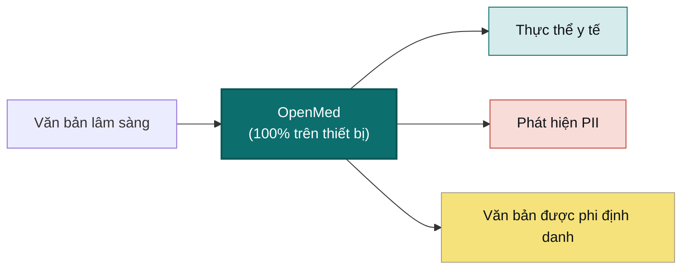

<div align="center">


<h3>AI y tế ưu tiên chạy trên thiết bị cục bộ, không bao giờ rời khỏi thiết bị</h3>

<p><b>Biến văn bản lâm sàng thành thông tin chi tiết có cấu trúc chỉ với một dòng mã.</b><br/>
Trích xuất thực thể, phi định danh PII và hơn 1.000 mô hình y tế chuyên biệt chạy hoàn toàn trên
phần cứng của riêng bạn — từ một dòng lệnh trong Python đến ứng dụng Swift gốc trên iPhone, được hỗ trợ bởi Apple MLX.
Không có đám mây. Không bị khóa bởi nhà cung cấp. Không có dữ liệu bệnh nhân nào rời khỏi mạng của bạn.</p>

<p>
  <a href="https://pypi.org/project/openmed/"></a>
  <a href="https://www.python.org/downloads/"></a>
  <a href="https://huggingface.co/OpenMed"></a>
  <a href="https://arxiv.org/abs/2508.01630"></a>
  <a href="LICENSE"></a>
  <a href="https://github.com/maziyarpanahi/openmed/stargazers"></a>
</p>

<p>
  <a href="swift/OpenMedKit"></a>
  <a href="docs/mlx-backend.md"></a>
  <a href="docs/swift-openmedkit.md"></a>
  <a href="https://openmed.life/docs"></a>
</p>

<p>
  <b>Hơn 1.000 mô hình</b> &nbsp;·&nbsp; <b>12 ngôn ngữ</b> &nbsp;·&nbsp; <b>247 trạm kiểm tra PII</b> &nbsp;·&nbsp; <b>100% trên thiết bị</b> &nbsp;·&nbsp; <b>Apache-2.0</b>
</p>

<p>
  <b>English</b> ·
  <a href="README.zh-CN.md">简体中文</a> ·
  <a href="README.es.md">Español</a> ·
  <a href="README.fr.md">Français</a> ·
  <a href="README.de.md">Deutsch</a> ·
  <a href="README.it.md">Italiano</a> ·
  <a href="README.pt.md">Português</a> ·
  <a href="README.nl.md">Nederlands</a> ·
  <a href="README.ar.md">العربية</a> ·
  <a href="README.hi.md">हिन्दी</a> ·
  <a href="README.te.md">తెలుగు</a> ·
  <a href="README.ja.md">日本語</a> ·
  <a href="README.tr.md">Türkçe</a> ·
  <a href="README.fa.md">فارسی</a>
</p>

</div>

---

## Xem thực tế

OpenMed chạy **hoàn toàn trên thiết bị** — văn bản lâm sàng không bao giờ rời khỏi đó. Đây là nó trên iPhone, hoàn toàn ngoại tuyến:

<div align="center">
  
  <br/>
  <sub><b>Trên iPhone thông qua <a href="swift/OpenMedKit">OpenMedKit</a></b> — quét một ghi chú lâm sàng, phi định danh nó và trích xuất các tín hiệu lâm sàng, tất cả đều cục bộ với Apple MLX. Không có gì được tải lên.</sub>
</div>

<br/>

<div align="center">
  
  <br/>
  <sub><b>Phi định danh PII theo thời gian thực</b> — Bộ lọc quyền riêng tư Nemotron biên tập tên, địa chỉ, ID và dữ liệu thanh toán từ gói xuất viện lâm sàng, hoàn toàn trên thiết bị. <i>(Tất cả các giá trị hiển thị đều là tổng hợp.)</i></sub>
</div>

---

## Ví dụ trong 30 giây

```python
from openmed import analyze_text

result = analyze_text(
    "Patient started on imatinib for chronic myeloid leukemia.",
    model_name="disease_detection_superclinical",
)

for entity in result.entities:
    print(f"{entity.label:<12} {entity.text:<28} {entity.confidence:.2f}")
# DISEASE      chronic myeloid leukemia     0.98
# DRUG         imatinib                     0.95
```

Một mô hình NER lâm sàng tiên tiến chạy cục bộ — không có khóa API, không có cuộc gọi mạng.

---

## Tại sao là OpenMed?

|                                       |       **OpenMed**        |   API y tế đám mây   |
| ------------------------------------- | :----------------------: | :--------------------: |
| Chạy trên thiết bị / máy chủ của bạn  |            ✅            |           ❌           |
| Dữ liệu bệnh nhân rời khỏi mạng của bạn|        **Không bao giờ**         |   Gửi cho nhà cung cấp   |
| Chi phí                               |    Miễn phí & mã nguồn mở    |    Định giá theo lần gọi    |
| Các mô hình y tế chuyên biệt          |          1.000+          |        Hạn chế         |
| Ngôn ngữ                              |           12+            |         Khác nhau         |
| Ngoại tuyến / air-gapped              |            ✅            |           ❌           |
| Tăng tốc Apple Silicon (MLX)          |            ✅            |          không áp dụng           |
| Ứng dụng iOS / macOS gốc              |   ✅ thông qua OpenMedKit      |           ❌           |
| Bị khóa bởi nhà cung cấp              |    Không — Apache-2.0     |          Có           |

- **Các mô hình chuyên biệt** — Hơn 1.000 mô hình y sinh & lâm sàng được tuyển chọn, nhiều mô hình vượt trội so với các hệ thống độc quyền.
- **Phi định danh nhận thức HIPAA** — tất cả 18 định danh Safe Harbor, hợp nhất thực thể thông minh, tạo dữ liệu giả bảo toàn định dạng.
- **Chạy mọi nơi** — CPU, CUDA, Apple Silicon (MLX) và nguyên bản trong các ứng dụng iOS/macOS thông qua OpenMedKit.
- **Triển khai trong một dòng** — API Python, dịch vụ REST được Dockerized hoặc luồng xử lý hàng loạt.
- **Không khóa (zero lock-in)** — Apache-2.0, cơ sở hạ tầng của bạn, dữ liệu của bạn.

---

## Trên thiết bị Apple — Swift, MLX & iOS

OpenMed được xây dựng để chạy ở nơi dữ liệu của bạn đã cư trú. Trên phần cứng của Apple, nó tăng tốc với **MLX**,
và nó được chuyển thẳng vào các ứng dụng iPhone, iPad và Mac thông qua **[OpenMedKit](swift/OpenMedKit)** — vì vậy
việc phát hiện PII và trích xuất lâm sàng diễn ra hoàn toàn ngoại tuyến, trên thiết bị.

```swift
// Thêm OpenMedKit vào ứng dụng của bạn
dependencies: [
    .package(url: "https://github.com/maziyarpanahi/openmed.git", from: "1.5.5"),
]
```

- **Runtime MLX** cho phân loại token PII, họ Privacy Filter (Bộ lọc Quyền riêng tư) và các tác vụ zero-shot họ GLiNER thử nghiệm — với đường dẫn dự phòng CoreML.
- **Một tên mô hình, mọi nền tảng** — tên mô hình MLX tự động dự phòng về checkpoint PyTorch phù hợp trên phần cứng không phải của Apple.
- **Python trên Apple Silicon** cũng vậy: `pip install "openmed[mlx]"`.

Hướng dẫn: [Backend MLX](docs/mlx-backend.md) · [OpenMedKit (Swift)](docs/swift-openmedkit.md) · [Xuất CoreML](docs/coreml-export.md)

<div align="center">
  
  <br/>
  <sub><b>MLX trên Apple Silicon: Nhanh hơn 24–33 lần so với CPU PyTorch</b> cho Bộ lọc Quyền riêng tư — độ trễ trung bình cho mỗi bước suy luận, thấp hơn là tốt hơn.</sub>
</div>

---

## Cách hoạt động



---

## Khởi đầu nhanh

```bash
# Core + Hugging Face runtime (Linux, macOS, Windows; CPU hoặc CUDA)
pip install "openmed[hf]"

# Thêm dịch vụ REST
pip install "openmed[hf,service]"

# Tăng tốc Apple Silicon (MLX)
pip install "openmed[mlx]"
```

<table>
<tr>
<td width="33%" valign="top">

**API Python**

```python
from openmed import analyze_text

analyze_text(
  "Patient received 75mg "
  "clopidogrel for NSTEMI.",
  model_name=
  "pharma_detection_superclinical",
)
```

</td>
<td width="33%" valign="top">

**Dịch vụ REST**

```bash
uvicorn openmed.service.app:app \
  --host 0.0.0.0 --port 8080
```

`GET /health`
`POST /analyze`
`POST /pii/extract`
`POST /pii/deidentify`

</td>
<td width="33%" valign="top">

**Xử lý hàng loạt**

```python
from openmed import BatchProcessor

p = BatchProcessor(
  model_name=
  "disease_detection_superclinical",
  group_entities=True,
)
p.process_texts([...])
```

</td>
</tr>
</table>

**Ngoại tuyến / air-gapped?** Trỏ `model_name` (hoặc `model_id`) vào thư mục cục bộ và OpenMed sẽ tải nó mà không cần liên hệ với Hugging Face Hub:

```python
from openmed import OpenMedConfig, analyze_text

result = analyze_text(
    "Patient presents with chronic myeloid leukemia and Type 2 diabetes.",
    model_id="./models/OpenMed-NER-DiseaseDetect-SuperClinical-434M",
    config=OpenMedConfig(device="cpu"),
)
```

---

## Các mô hình

Một sổ đăng ký được tuyển chọn của các mô hình NER y tế chuyên biệt — duyệt qua [danh mục đầy đủ](https://openmed.life/docs/model-registry).

| Mô hình | Chuyên môn | Các loại thực thể | Kích thước |
|-------|----------------|--------------|------|
| `disease_detection_superclinical` | Bệnh tật & tình trạng | DISEASE, CONDITION, DIAGNOSIS | 434M |
| `pharma_detection_superclinical`  | Thuốc & dược phẩm  | DRUG, MEDICATION, TREATMENT   | 434M |
| `pii_superclinical_large`     | PII & phi định danh | NAME, DATE, SSN, PHONE, EMAIL, ADDRESS | 434M |
| `anatomy_detection_electramed`    | Giải phẫu & bộ phận cơ thể | ANATOMY, ORGAN, BODY_PART     | 109M |
| `gene_detection_genecorpus`       | Gen & protein     | GENE, PROTEIN                 | 109M |

---

## Quyền riêng tư: Phát hiện & phi định danh PII

```python
from openmed import extract_pii, deidentify

text = "Patient: John Doe, DOB: 01/15/1970, SSN: 123-45-6789"

# Trích xuất PII với tính năng hợp nhất thông minh (ngăn ngừa sự phân mảnh token hóa)
result = extract_pii(text, model_name="pii_superclinical_large", use_smart_merging=True)

# Phi định danh với phương pháp bạn cần
deidentify(text, method="mask")     # [NAME], [DATE]
deidentify(text, method="replace")  # Các dữ liệu giả mạo từ Faker, nhận biết ngôn ngữ/vùng, bảo toàn định dạng
deidentify(text, method="hash")     # Băm mật mã
deidentify(text, method="shift_dates", date_shift_days=180)
```

- **Hợp nhất thực thể thông minh** giữ cho `01/15/1970` nguyên vẹn thay vì phân mảnh nó.
- **Mã hóa (Obfuscation) dựa trên Faker** với các nhà cung cấp ID lâm sàng tùy chỉnh (CPF, CNPJ, BSN, NIR, Codice Fiscale, NIE, Aadhaar, Steuer-ID, NPI).
- **HIPAA**: tất cả 18 mã định danh Safe Harbor, có thể cấu hình các ngưỡng độ tin cậy.
- **PII hàng loạt** (v1.5.5): trích xuất hoặc phi định danh trên nhiều tài liệu với `BatchProcessor(operation="extract_pii" | "deidentify", batch_size=16)`.

<div align="center">
  
  <br/>
  <sub><b>Xử lý hàng loạt</b> — thông lượng cao hơn tới <b>3,3 lần</b> trên CPU và <b>2,2 lần</b> trên MLX so với xử lý từng tài liệu một.</sub>
</div>

[Notebook PII hoàn chỉnh](examples/notebooks/PII_Detection_Complete_Guide.ipynb) · [Hợp nhất thông minh](docs/pii-smart-merging.md) · [Ẩn danh](docs/anonymization.md)

<details>
<summary><b>Họ Bộ lọc Quyền riêng tư (Privacy Filter)</b> — ba họ mô hình dựa trên kiến trúc Bộ lọc Quyền riêng tư của OpenAI</summary>

<br/>

Mã mô hình giống nhau (transformer sparse-MoE kiểu gpt-oss với attention cục bộ, token sink, RoPE+YaRN, tiktoken `o200k_base`), dữ liệu đào tạo khác nhau. Tất cả đều định tuyến qua **cùng một** API `extract_pii()` / `deidentify()` — chỉ có `model_name=` thay đổi.

| Biến thể | PyTorch (CPU + CUDA) | MLX (Apple Silicon) | MLX 8-bit |
| --- | --- | --- | --- |
| **OpenAI Privacy Filter** | [`openai/privacy-filter`](https://huggingface.co/openai/privacy-filter) | [`OpenMed/privacy-filter-mlx`](https://huggingface.co/OpenMed/privacy-filter-mlx) | [`…-mlx-8bit`](https://huggingface.co/OpenMed/privacy-filter-mlx-8bit) |
| **Nemotron-PII fine-tune** | [`OpenMed/privacy-filter-nemotron`](https://huggingface.co/OpenMed/privacy-filter-nemotron) | [`…-nemotron-mlx`](https://huggingface.co/OpenMed/privacy-filter-nemotron-mlx) | [`…-nemotron-mlx-8bit`](https://huggingface.co/OpenMed/privacy-filter-nemotron-mlx-8bit) |
| **OpenMed Multilingual** | [`OpenMed/privacy-filter-multilingual`](https://huggingface.co/OpenMed/privacy-filter-multilingual) | [`…-multilingual-mlx`](https://huggingface.co/OpenMed/privacy-filter-multilingual-mlx) | [`…-multilingual-mlx-8bit`](https://huggingface.co/OpenMed/privacy-filter-multilingual-mlx-8bit) |

```python
from openmed import extract_pii

text = "Patient Sarah Connor (DOB: 03/15/1985) at MRN 4471882."

extract_pii(text, model_name="openai/privacy-filter")              # PyTorch baseline
extract_pii(text, model_name="OpenMed/privacy-filter-nemotron")    # cùng mã, trọng số khác nhau
extract_pii(text, model_name="OpenMed/privacy-filter-mlx")         # Apple Silicon (MLX)
```

Trên các máy chủ không phải Apple-Silicon, tên mô hình MLX sẽ tự động được thay thế bằng checkpoint PyTorch tương ứng (với cảnh báo một lần) — phát hành một tên mô hình, chạy ở mọi nơi. Xem [Kiến trúc Bộ lọc Quyền riêng tư & định tuyến backend](docs/anonymization.md#privacy-filter-family).

</details>

---

## PII đa ngôn ngữ (12 ngôn ngữ)

Trích xuất và phi định danh trên `en`, `fr`, `de`, `it`, `es`, `nl`, `hi`, `te`, `pt`, `ar`, `ja`, và `tr` — tổng cộng **247 checkpoint PII**.

```bash
python -c "from openmed import extract_pii; print([(e.label, e.text) for e in extract_pii('Dr. Pedro Almeida, CPF: 123.456.789-09, email: pedro@hospital.pt', lang='pt').entities])"
```

<details>
<summary>Hiển thị các ví dụ theo từng ngôn ngữ (Tiếng Bồ Đào Nha, Tiếng Hà Lan, Tiếng Hindi, Tiếng Ả Rập, Tiếng Nhật, Tiếng Thổ Nhĩ Kỳ)</summary>

<br/>

```python
from openmed import extract_pii

portuguese = extract_pii("Paciente: Pedro Almeida, CPF: 123.456.789-09, telefone: +351 912 345 678", lang="pt", use_smart_merging=True)
dutch      = extract_pii("Patiënt: Eva de Vries, BSN: 123456782, telefoon: +31 6 12345678", lang="nl", use_smart_merging=True)
hindi      = extract_pii("रोगी: अनीता शर्मा, फोन: +91 9876543210, पता: नई दिल्ली 110001", lang="hi", use_smart_merging=True)
arabic     = extract_pii("المريضة ليلى حسن، الهاتف +20 10 1234 5678، الرقم القومي 29801011234567.", lang="ar", use_smart_merging=True)
japanese   = extract_pii("患者 佐藤 花子、電話 +81 90 1234 5678、マイナンバー 1234 5678 9012.", lang="ja", use_smart_merging=True)
turkish    = extract_pii("Hasta Ayşe Yılmaz, telefon +90 532 123 45 67, TCKN 10000000146.", lang="tr", use_smart_merging=True)

for r in (portuguese, dutch, hindi, arabic, japanese, turkish):
    print([(e.label, e.text) for e in r.entities])
```

</details>

---

## API REST

Một dịch vụ FastAPI thân thiện với Docker với khả năng xác thực yêu cầu, tải trước (preload) luồng chia sẻ và các thông báo lỗi thống nhất.

```bash
pip install "openmed[hf,service]"
uvicorn openmed.service.app:app --host 0.0.0.0 --port 8080

# hoặc với Docker
docker build -t openmed:1.5.5 .
docker run --rm -p 8080:8080 -e OPENMED_PROFILE=prod openmed:1.5.5
```

```bash
curl -X POST http://127.0.0.1:8080/pii/extract \
  -H "Content-Type: application/json" \
  -d '{"text":"Paciente: Maria Garcia, DNI: 12345678Z","lang":"es"}'
```

**Vòng đời mô hình (v1.5.5):** giải phóng bộ nhớ theo yêu cầu với `GET /models/loaded`, `POST /models/unload`, và một cửa sổ nhàn rỗi `keep_alive`:

```bash
OPENMED_SERVICE_KEEP_ALIVE=10m uvicorn openmed.service.app:app --host 0.0.0.0 --port 8080
curl -X POST http://127.0.0.1:8080/models/unload -H "Content-Type: application/json" -d '{"all":true}'
```

Xem toàn bộ [Hướng dẫn dịch vụ REST](docs/rest-service.md).

---

## Tài liệu

Toàn bộ hướng dẫn tại **[openmed.life/docs](https://openmed.life/docs/)**.

| | | |
|---|---|---|
| [Bắt đầu](https://openmed.life/docs/) | [Phân tích Văn bản](https://openmed.life/docs/analyze-text) | [Sổ đăng ký Mô hình](https://openmed.life/docs/model-registry) |
| [Hướng dẫn Phát hiện PII](examples/notebooks/PII_Detection_Complete_Guide.ipynb) | [Ẩn danh](docs/anonymization.md) | [Xử lý Hàng loạt](https://openmed.life/docs/batch-processing) |
| [Cấu hình Profiles](https://openmed.life/docs/profiles) | [Dịch vụ REST](docs/rest-service.md) | [Backend MLX](docs/mlx-backend.md) |

---

## Gặp gỡ linh vật


Người bảo vệ của OpenMed là một chú mèo Ba Tư lông xù được thiết kế giống như một **Avicenna (Ibn Sina)** thu nhỏ — vị thầy thuốc 
vĩ đại người Ba Tư có tác phẩm *Canon of Medicine* từng là văn bản y khoa tiêu chuẩn của thế giới trong khoảng 600 năm. Chú giám 
sát cuốn sách tri thức y khoa đang mở, trong một bảng màu được xây dựng xung quanh màu ngọc lam Ba Tư (*fīrūza*):
một người bảo vệ ưu tiên chạy cục bộ cho dữ liệu riêng tư nhất của bạn.

<br clear="left"/>

---

## Đóng góp

Rất hoan nghênh các đóng góp — báo cáo lỗi, yêu cầu tính năng, và các PR.

- [Mở một issue](https://github.com/maziyarpanahi/openmed/issues)
- **Hoan nghênh các bản dịch** — giúp hoàn thành các tệp README ngôn ngữ khác được liên kết trong bộ chuyển đổi ở trên cùng.

---

## Lời cảm ơn

OpenMed được xây dựng dựa trên các công trình nguồn mở xuất sắc — đặc biệt cảm ơn **OpenAI** (kiến trúc [Privacy Filter](https://huggingface.co/openai/privacy-filter)), **NVIDIA** (bộ dữ liệu [Nemotron PII](https://huggingface.co/datasets/nvidia/Nemotron-PII-v1)), **Hugging Face** (`transformers` & hệ sinh thái mô hình), **Apple** ([MLX](https://github.com/ml-explore/mlx)), và những người duy trì **[Faker](https://faker.readthedocs.io/)**.

## Giấy phép

Được phát hành theo [Giấy phép Apache-2.0](LICENSE).

## Trích dẫn

```bibtex
@misc{panahi2025openmedneropensourcedomainadapted,
      title={OpenMed NER: Open-Source, Domain-Adapted State-of-the-Art Transformers for Biomedical NER Across 12 Public Datasets},
      author={Maziyar Panahi},
      year={2025},
      eprint={2508.01630},
      archivePrefix={arXiv},
      primaryClass={cs.CL},
      url={https://arxiv.org/abs/2508.01630},
}
```

---

## Lịch sử Sao

Nếu OpenMed hữu ích cho bạn, một sao sẽ giúp những người khác khám phá ra nó.

<a href="https://star-history.com/#maziyarpanahi/openmed&Date">
  
</a>

---

<div align="center">

Được xây dựng bởi nhóm OpenMed

<a href="https://openmed.life">Trang web</a> ·
<a href="https://openmed.life/docs">Tài liệu</a> ·
<a href="https://x.com/openmed_ai">X / Twitter</a> ·
<a href="https://www.linkedin.com/company/openmed-ai/">LinkedIn</a>

</div>
